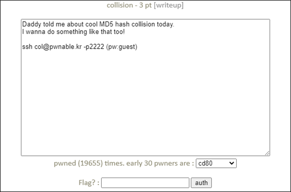
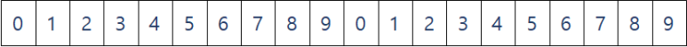
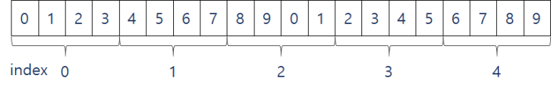

# [목차]
**1. [Description](#Description)**

**2. [Write-Up](#Write-Up)**

**3. [FLAG](#FLAG)**


***


# **Description**




# **Write-Up**

19line에서 argv[1]의 길이가 20byte인지 검사하고, 24line에서 hashcode(0x21DD09EC)와 check_password(argv[1])가 같아야 flag를 획득할 수 있다.

```cpp
#include <stdio.h>
#include <string.h>
unsigned long hashcode = 0x21DD09EC;
unsigned long check_password(const char* p){
    int* ip = (int*)p;
    int i;
    int res=0;
    for(i=0; i<5; i++){
        res += ip[i];
    }
    return res;
}
int main(int argc, char* argv[]){
    if(argc<2){
        printf("usage : %s [passcode]\n", argv[0]);
        return 0;
    }
    if(strlen(argv[1]) != 20){
        printf("passcode length should be 20 bytes\n");
        return 0;
    }
    if(hashcode == check_password( argv[1] )){
        system("/bin/cat flag");
        return 0;
    }
    else
        printf("wrong passcode.\n");
    return 0;
}
```

check_password함수를 확인하면 const char *형식을 int *형으로 바꾼다.

const char *p가 다음과 같다면



(int *)p는 다음과 같다. (char는 1byte, int는 4byte)



따라서 int[0] ~ int[3] = 0x6C5CEC8(113,626,824), int[4] = 0x6C5CECC(113,626,828)을 넣으면 된다.

다음과 같이 flag를 획득할 수 있다.

```shell
col@pwnable:~$ ./col $(python -c 'print "\xc8\xce\xc5\x06"*4+"\xcc\xce\xc5\x06"')
daddy! I just managed to create a hash collision :)
```


# **FLAG**

**daddy! I just managed to create a hash collision :)**