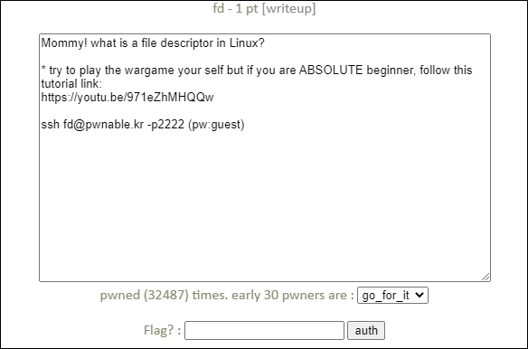

# [목차]
**1. [Description](#Description)**

**2. [Write-Up](#Write-Up)**

**3. [FLAG](#FLAG)**


***


# **Description**




# **Write-Up**

13line을 보면 buf가 LETMEWIN\n이여야 한다.

```c++
#include <stdio.h>
#include <stdlib.h>
#include <string.h>
char buf[32];
int main(int argc, char* argv[], char* envp[]){
    if(argc<2){
        printf("pass argv[1] a number\n");
        return 0;
    }
    int fd = atoi( argv[1] ) - 0x1234;
    int len = 0;
    len = read(fd, buf, 32);
    if(!strcmp("LETMEWIN\n", buf)){
        printf("good job :)\n");
        system("/bin/cat flag");
        exit(0);
    }
    printf("learn about Linux file IO\n");
    return 0;
}
```

buf에 값을 넣으려면 12line에서 fd를 0으로 만들어서 stdin으로 동작하게 하면 될 것같다.

> [stdin](https://pubs.opengroup.org/onlinepubs/009604599/functions/stdin.html)

fd는 argv[1]를 int형으로 변환하고 0x1234(4660)을 뺀 값이다.

다음과 같이 argv[1]에 4660을 입력 후 LETMEWIN을 입력하면 flag를 획득 할 수 있다.

```shell
fd@pwnable:~$ ./fd 4660
LETMEWIN
good job :)
mommy! I think I know what a file descriptor is!!
```

# **FLAG**

**mommy! I think I know what a file descriptor is!!**