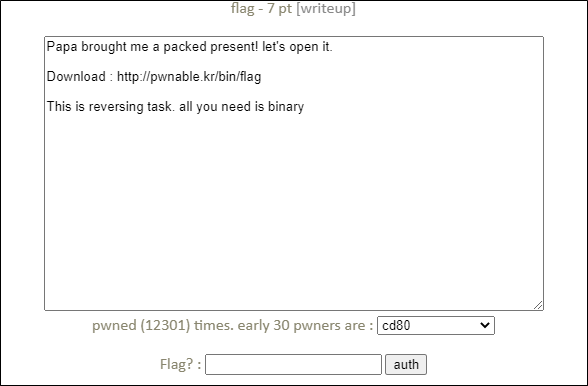
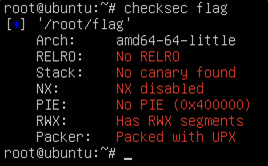
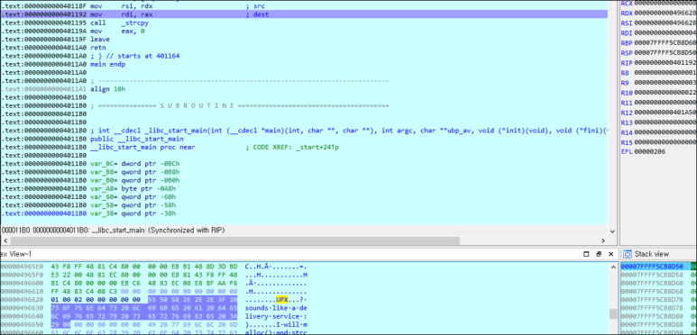

# [목차]
**1. [Description](#Description)**

**2. [Write-Up](#Write-Up)**

**3. [FLAG](#FLAG)**

***

# **Description**

# **Write-Up**

파일에 적용된 보호기법들을 살펴보니 UPX를 이용하여 패킹되어 있다.

UPX로 언패킹하여 ida로 까보면 malloc후 strcpy를 호출하는 것을 볼 수 있고 rdx를 보면 flag를 획득할 수 있다.

# **FLAG**

**UPX...? sounds like a delivery service :)**