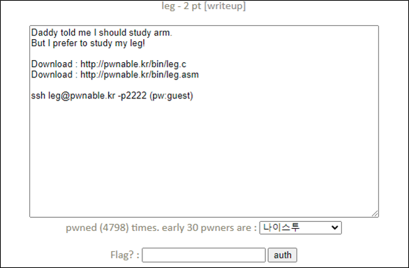

# [목차]
**1. [Description](#Description)**

**2. [Write-Up](#Write-Up)**

**3. [FLAG](#FLAG)**


***


# **Description**




# **Write-Up**

file은 다음과 같이 있다.

```sh
/ $ ls
bin      dev      flag     linuxrc  root     sys
boot     etc      leg      proc     sbin     usr
```

먼저 소스코드를 확인하면 내가 입력하는 값과 key1() + key2() + key3()값과 같아야 FLAG를 획득할 수 있다.

> [leg.c](http://pwnable.kr/bin/leg.c)

```cpp
#include <stdio.h>
#include <fcntl.h>
int key1(){
	asm("mov r3, pc\n");
}
int key2(){
	asm(
	"push	{r6}\n"
	"add	r6, pc, $1\n"
	"bx	r6\n"
	".code   16\n"
	"mov	r3, pc\n"
	"add	r3, $0x4\n"
	"push	{r3}\n"
	"pop	{pc}\n"
	".code	32\n"
	"pop	{r6}\n"
	);
}
int key3(){
	asm("mov r3, lr\n");
}
int main(){
	int key=0;
	printf("Daddy has very strong arm! : ");
	scanf("%d", &key);
	if( (key1()+key2()+key3()) == key ){
		printf("Congratz!\n");
		int fd = open("flag", O_RDONLY);
		char buf[100];
		int r = read(fd, buf, 100);
		write(0, buf, r);
	}
	else{
		printf("I have strong leg :P\n");
	}
	return 0;
}
```

문제에서 같이 주어지는 disassemble한 파일을 확인하자.

> [leg.asm](http://pwnable.kr/bin/leg.asm)

먼저 main에서 key1() + key2() + key3()은 모두 r0에서 가져와서 더하는 것을 알 수 있다.

```sh
   0x00008d68 <+44>:	bl	0x8cd4 <key1>
   0x00008d6c <+48>:	mov	r4, r0
   0x00008d70 <+52>:	bl	0x8cf0 <key2>
   0x00008d74 <+56>:	mov	r3, r0
   0x00008d78 <+60>:	add	r4, r4, r3
   0x00008d7c <+64>:	bl	0x8d20 <key3>
   0x00008d80 <+68>:	mov	r3, r0
   0x00008d84 <+72>:	add	r2, r4, r3
```

key1함수의 r0값을 보면 pc(program counter)값이 곧 r0임을 알 수 있다.

```sh
(gdb) disass key1
Dump of assembler code for function key1:
   0x00008cd4 <+0>:	    push	{r11}		; (str r11, [sp, #-4]!)
   0x00008cd8 <+4>:	    add	r11, sp, #0
   0x00008cdc <+8>:	    mov	r3, pc
   0x00008ce0 <+12>:	mov	r0, r3
   0x00008ce4 <+16>:	sub	sp, r11, #0
   0x00008ce8 <+20>:	pop	{r11}		; (ldr r11, [sp], #4)
   0x00008cec <+24>:	bx	lr
End of assembler dump.
```

cpu는하나의 명령을 수행할 때, fetch -> decode -> execute의 과정을 수행하고

pipe line에의해서 병렬적인 명령을 처리하는데, fetch를 수행하는 instruct의 주소가 pc에 담긴다.

즉 mov r3, pc가 execute 단계일 때, mov	r0, r3는 decode 단계이고, sub	sp, r11, #0는 fetch단계이다.

|fetch|decode|execute|
|:---:|:---:|:---:|
|sub	sp, r11, #0|mov	r0, r3|mov r3, pc|

따라서 key1()값은 0x00008ce4(=36,068)이다.

key2함수의 r0을 보면 pc + 4임을 알 수 있다.

```sh
(gdb) disass key2
Dump of assembler code for function key2:
   0x00008cf0 <+0>:	    push	{r11}		; (str r11, [sp, #-4]!)
   0x00008cf4 <+4>:	    add	r11, sp, #0
   0x00008cf8 <+8>:	    push	{r6}		; (str r6, [sp, #-4]!)
   0x00008cfc <+12>:	add	r6, pc, #1
   0x00008d00 <+16>:	bx	r6
   0x00008d04 <+20>:	mov	r3, pc
   0x00008d06 <+22>:	adds	r3, #4
   0x00008d08 <+24>:	push	{r3}
   0x00008d0a <+26>:	pop	{pc}
   0x00008d0c <+28>:	pop	{r6}		; (ldr r6, [sp], #4)
   0x00008d10 <+32>:	mov	r0, r3
   0x00008d14 <+36>:	sub	sp, r11, #0
   0x00008d18 <+40>:	pop	{r11}		; (ldr r11, [sp], #4)
   0x00008d1c <+44>:	bx	lr
End of assembler dump.
```

따라서 key2()값은 0x00008d0c(=36,108)이다.

key3함수의 r0을 보면 lr(link register)값이 곧 r0임을 알 수 있다.

```sh
(gdb) disass key3
Dump of assembler code for function key3:
   0x00008d20 <+0>:	    push	{r11}		; (str r11, [sp, #-4]!)
   0x00008d24 <+4>:	    add	r11, sp, #0
   0x00008d28 <+8>:	    mov	r3, lr
   0x00008d2c <+12>:	mov	r0, r3
   0x00008d30 <+16>:	sub	sp, r11, #0
   0x00008d34 <+20>:	pop	{r11}		; (ldr r11, [sp], #4)
   0x00008d38 <+24>:	bx	lr
End of assembler dump.
```

lr은함수 호출시 되돌아갈 함수의 주소가 저장된다.

main에서 key3함수를 호출하는 부분은 다음과 같다.

```sh
... 생략 ...
   0x00008d78 <+60>:	add	r4, r4, r3
   0x00008d7c <+64>:	bl	0x8d20 <key3>
   0x00008d80 <+68>:	mov	r3, r0
... 생략 ...
```

따라서 key3()값은 0x00008d80(=36,224)이다.

우리가 입력해야 하는 값은 36,068 + 36,108 + 36,224 = 108,400이다.

FLAG를 획득하자.

```sh
/ $ ./leg
Daddy has very strong arm! : 108400
Congratz!
My daddy has a lot of ARMv5te muscle!
```


# **FLAG**

**My daddy has a lot of ARMv5te muscle!**