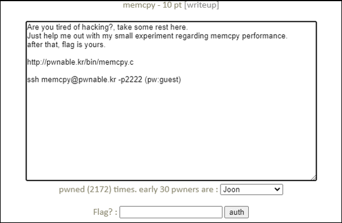

# [목차]
**1. [Description](#Description)**

**2. [Write-Up](#Write-Up)**

**3. [FLAG](#FLAG)**


***


# **Description**




# **Write-Up**

ssh 접속 후 readme를 읽어보자.

```sh
memcpy@pwnable:~$ cat readme
the compiled binary of "memcpy.c" source code (with real flag) will be executed under memcpy_pwn privilege if you connect to port 9022.
execute the binary by connecting to daemon(nc 0 9022).
```

pwnable.kr 9022로 접속하면 memcpy할 사이즈를 몇번 입력하고 난 뒤 연산을 한다.

```sh
... 생략 ...
specify the memcpy amount between 1024 ~ 2048 : 1024
specify the memcpy amount between 2048 ~ 4096 : 2048
specify the memcpy amount between 4096 ~ 8192 : 4096
ok, lets run the experiment with your configuration
experiment 1 : memcpy with buffer size 8
ellapsed CPU cycles for slow_memcpy : 5688
ellapsed CPU cycles for fast_memcpy : 466

experiment 2 : memcpy with buffer size 16
ellapsed CPU cycles for slow_memcpy : 606
ellapsed CPU cycles for fast_memcpy : 578

experiment 3 : memcpy with buffer size 32
ellapsed CPU cycles for slow_memcpy : 656
ellapsed CPU cycles for fast_memcpy : 848
... 생략 ...
```

소스를 확인하면 입력한 숫자만큼 메모리를 할당 후 slow_memcpy함수와 fase_memcpy함수를 호출 후 각각의 시간을 출력해준다.

```cpp
... 생략 ...
	// run experiment
	for(i=0; i<10; i++){
		size = sizes[i];
		printf("experiment %d : memcpy with buffer size %d\n", i+1, size);
		dest = malloc( size );

		memcpy(cache1, cache2, 0x4000);		// to eliminate cache effect
		t1 = rdtsc();
		slow_memcpy(dest, src, size);		// byte-to-byte memcpy
		t2 = rdtsc();
		printf("ellapsed CPU cycles for slow_memcpy : %llu\n", t2-t1);

		memcpy(cache1, cache2, 0x4000);		// to eliminate cache effect
		t1 = rdtsc();
		fast_memcpy(dest, src, size);		// block-to-block memcpy
		t2 = rdtsc();
		printf("ellapsed CPU cycles for fast_memcpy : %llu\n", t2-t1);
		printf("\n");
	}
... 생략 ...
```

사이즈를 모두 입력하면 experiment 5의 fast_memcpy가 출력이 안되고 죽는 것을 알 수 있는데, fast_memcpy의 함수를 살펴보면 movdqa 명령어를 사용하는데 movdqa dest 주소는 128bit로 정렬되어야 한다고 한다.

> [movdqa](http://www.jaist.ac.jp/iscenter-new/mpc/altix/altixdata/opt/intel/vtune/doc/users_guide/mergedProjects/analyzer_ec/mergedProjects/reference_olh/mergedProjects/instructions/instruct32_hh/vc183.htm)

```cpp
char* fast_memcpy(char* dest, const char* src, size_t len){
	size_t i;
	// 64-byte block fast copy
	if(len >= 64){
		i = len / 64;
		len &= (64-1);
		while(i-- > 0){
			__asm__ __volatile__ (
			"movdqa (%0), %%xmm0\n"
			"movdqa 16(%0), %%xmm1\n"
			"movdqa 32(%0), %%xmm2\n"
			"movdqa 48(%0), %%xmm3\n"
			"movntps %%xmm0, (%1)\n"
			"movntps %%xmm1, 16(%1)\n"
			"movntps %%xmm2, 32(%1)\n"
			"movntps %%xmm3, 48(%1)\n"
			::"r"(src),"r"(dest):"memory");
			dest += 64;
			src += 64;
		}
	}

	// byte-to-byte slow copy
	if(len) slow_memcpy(dest, src, len);
	return dest;
}
```

dest의 주소를 알아보기 위해 소스를 수정 후 컴파일 시켜주자.

```sh
memcpy@pwnable:~$ mkdir /tmp/2honrr
memcpy@pwnable:~$ cp memcpy.c /tmp/2honrr
memcpy@pwnable:~$ cd /tmp/2honrr
memcpy@pwnable:/tmp/2honrr$ vi memcpy.c
```

```cpp
... 생략 ...
                t1 = rdtsc();
                printf("dest %p\n", dest);
                fast_memcpy(dest, src, size);           // block-to-block memcpy
                t2 = rdtsc();

... 생략 ...
```

```sh
memcpy@pwnable:/tmp/2honrr$ gcc memcpy.c -o memcpy -m32 -lm
```

실행하면 dest의 사이즈가 64일때는 16byte로 나누어 떨어지는 데(0x8545460%16 = 0), 128일때는 8이 남는다.(0x85454A8%16 = 8)

```sh
memcpy@pwnable:/tmp/2honrr$ ./memcpy
Hey, I have a boring assignment for CS class.. :(
The assignment is simple.
... 생략 ...
experiment 4 : memcpy with buffer size 64
ellapsed CPU cycles for slow_memcpy : 520
dest 0x8545460
ellapsed CPU cycles for fast_memcpy : 3706

experiment 5 : memcpy with buffer size 128
ellapsed CPU cycles for slow_memcpy : 972
dest 0x85454a8
Segmentation fault (core dumped)
```

따라서 5번째 전인 64를 입력할 때 +8인 72를 입력하면 5번째를 통과할 수 있다.

```sh
... 생략 ...
experiment 4 : memcpy with buffer size 72
ellapsed CPU cycles for slow_memcpy : 1412
dest 0x8abd460
ellapsed CPU cycles for fast_memcpy : 12726

experiment 5 : memcpy with buffer size 128
ellapsed CPU cycles for slow_memcpy : 2194
dest 0x8abd4b0
ellapsed CPU cycles for fast_memcpy : 12374

experiment 6 : memcpy with buffer size 256
ellapsed CPU cycles for slow_memcpy : 4588
dest 0x8abd538
Segmentation fault (core dumped)
```

4번째부터 +8씩 더해주면 FLAG를 획득할 수 있다.

    (8, 16, 32, 72, 136, 264, 520, 1032, 2056, 4104)

```sh
... 생략
thanks for helping my experiment!
flag : 1_w4nn4_br34K_th3_m3m0ry_4lignm3nt
```


# **FLAG**

**1_w4nn4_br34K_th3_m3m0ry_4lignm3nt**