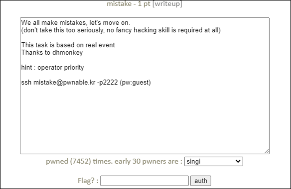

# [목차]
**1. [Description](#Description)**

**2. [Write-Up](#Write-Up)**

**3. [FLAG](#FLAG)**


***


# **Description**




# **Write-Up**

소스는 다음과 같다.

```cpp
#include <stdio.h>
#include <fcntl.h>

#define PW_LEN 10
#define XORKEY 1

void xor(char* s, int len){
        int i;
        for(i=0; i<len; i++){
                s[i] ^= XORKEY;
        }
}

int main(int argc, char* argv[]){

        int fd;
        if(fd=open("/home/mistake/password",O_RDONLY,0400) < 0){
                printf("can't open password %d\n", fd);
                return 0;
        }

        printf("do not bruteforce...\n");
        sleep(time(0)%20);

        char pw_buf[PW_LEN+1];
        int len;
        if(!(len=read(fd,pw_buf,PW_LEN) > 0)){
                printf("read error\n");
                close(fd);
                return 0;
        }

        char pw_buf2[PW_LEN+1];
        printf("input password : ");
        scanf("%10s", pw_buf2);

        // xor your input
        xor(pw_buf2, 10);

        if(!strncmp(pw_buf, pw_buf2, PW_LEN)){
                printf("Password OK\n");
                system("/bin/cat flag\n");
        }
        else{
                printf("Wrong Password\n");
        }

        close(fd);
        return 0;
}
```

연산자 우선순위를 보면 = 연산자보다 < 연산자가 우선순위를 가진다. 따라서 open("/home/mistake/password", O_RDONLY, 0400)는 password파일이 있기 때문에 양수이고, 양수 < 0은 false이기에 fd에는 0이 들어간다.

> [연산자 우선 순위](https://dojang.io/mod/page/view.php?id=188)

```cpp
fd=open("/home/mistake/password",O_RDONLY,0400) < 0
```

read(fd, pw_buf, PW_LEN)에서 fd는 0이고 이는 stdin(표준 입력)에 해당하기 때문에 직접 입력할 수 있다. 따라서 pw_buf2에 10자리의 문자^1=pw_buf이면 flag를 획득할 수 있으므로, 다음과 같이 입력하면 flag를 획득할 수 있다.

```sh
mistake@pwnable:~$ ./mistake
do not bruteforce...
0000000000
input password : 1111111111
Password OK
Mommy, the operator priority always confuses me :(
```


# **FLAG**

**Mommy, the operator priority always confuses me :(**