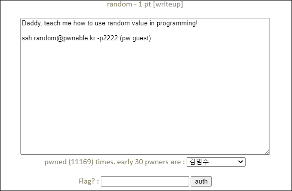
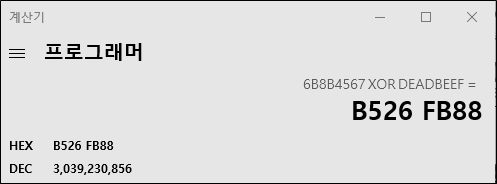

# [목차]
**1. [Description](#Description)**

**2. [Write-Up](#Write-Up)**

**3. [FLAG](#FLAG)**


***


# **Description**




# **Write-Up**

소스는 다음과 같다.

```cpp
#include <stdio.h>

int main(){
        unsigned int random;
        random = rand();        // random value!

        unsigned int key=0;
        scanf("%d", &key);

        if( (key ^ random) == 0xdeadbeef ){
                printf("Good!\n");
                system("/bin/cat flag");
                return 0;
        }

        printf("Wrong, maybe you should try 2^32 cases.\n");
        return 0;
}
```

srand함수를 통해 시드값을 변경하지 않으면 rand함수는 프로그램 실행 시 마다 항상 같은 값을 반환하므로 random값을 gdb를 통해 확인해보면 0x6b8b4567임을 알 수 있다.

    (gdb) b *main+18
    Breakpoint 1 at 0x400606
    (gdb) r
    Starting program: /home/random/random

    Breakpoint 1, 0x0000000000400606 in main ()
    (gdb) info reg
    rax            0x6b8b4567       1804289383

flag를 획득하려면 key xor random 값이 0xdeadbeef이여야 하므로 key는 random xor 0xdeadbeef로 구할 수 있다. 따라서 key는 3039230856이다.



3039230856을 입력하면 flag를 획득할 수 있다.

```sh
random@pwnable:~$ ./random
3039230856
Good!
Mommy, I thought libc random is unpredictable...
```


# **FLAG**

**Mommy, I thought libc random is unpredictable...**