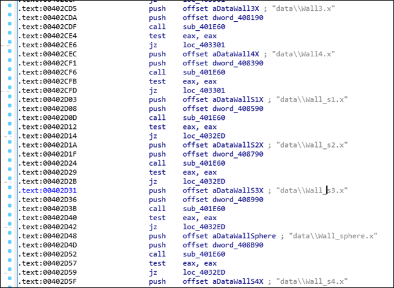

# [목차]
**1. [Description](#Description)**

**2. [Write-Up](#Write-Up)**

**3. [FLAG](#FLAG)**


***


# **Description**


# **Write-Up**

파일 정보는 다음과 같다.


실행시키면 벽과 이상한 것들이 돌아다니고 쏴서 없애야 하는 듯 하다.


벽을 그리는 부분이 있다. 이부분에 nop을 취해서 벽을 없애보자.



잘 죽지도 않고, 양도 많다.


Game Over쪽에 보면 0과 어떤 데이터랑 비교하여 차이가 없다면 Game Over가 되는데 그 값이 0A인 것으로 보아 플레이어 구조체인 듯 하다.


이상한 것과 부딪히면 HP가 2감소하는데 이부분인듯 하다.


0x403435에서 총을 쏘면 -2감소하는 부분이 있는 것 같다.


해당 부분에서 jg인데 jl로 바꾸어 한대만 맞춰도 없앨 수 있게 하자.


모두 죽여도 FLAG같은건 나오지 않는다.


그렇다면 Player 구조체를 봐보자.

Password가 잘린다. 뒤의 0xF0과 0xA9는 수동으로 해야하나 보다.


먼저 아무거나 쏘면 함수에서 첫번째로 나오는 함수로부터 개체 번호를 반환받고, 맞추지 못했다면 0xFFFFFFFF일 것이다. (여기서는 0x17 = 23)


그리고 개체 번호 * 0x210을 한 값에 0x4994190의 데이터를 얻어온다. 이 값이 개체의 HP이다.


그리고 해당 개체의 데이터를 가져와서 플레이어의 문자열과 XOR연산한다. (0x5C = 92)


다른 개체들도 맞춰보면서 보면, 50마리의 개체가 있고, 원본 암호화된 데이터와 개체 번호 * 4와 XOR연산을 하여 FLAG를 내뱉는다.

FLAG를 획득하자.

```python
Encrypted_FLAG = b'\x43\x6B\x66\x6B\x62\x75\x6C\x69\x4C\x45\x5C\x45\x5F\x5A\x46\x1C\x07\x25\x25\x29\x70\x17\x34\x39\x01\x16\x49\x4C\x20\x15\x0B\x0F\xF7\xEB\xFA\xE8\xB0\xFD\xEB\xBC\xF4\xCC\xDA\x9F\xF5\xF0\xE8\xCE\xF0\xA9'

for i in range(50): print(chr(Encrypted_FLAG[i]^(i*4)), end='')
```

# **FLAG**

**Thr3EDPr0m**