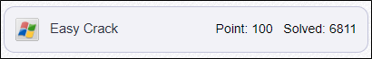
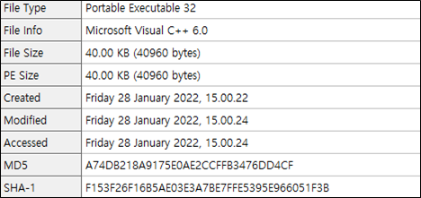
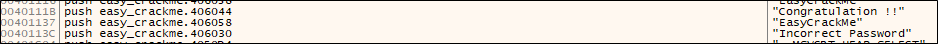
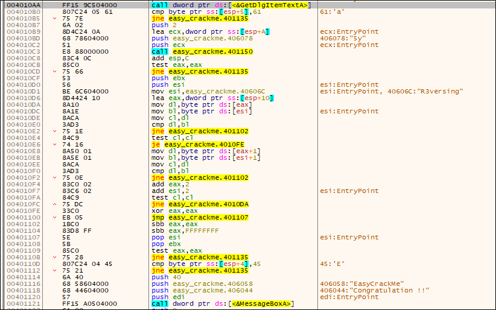
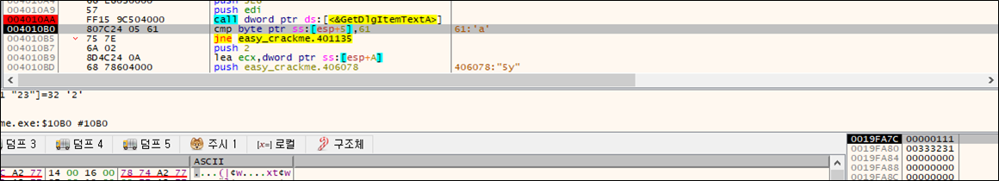
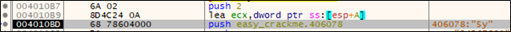
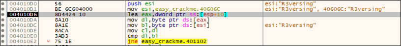
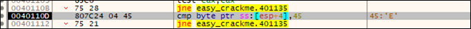
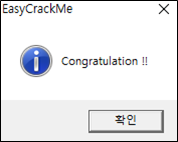

# [목차]
**1. [Description](#Description)**

**2. [Write-Up](#Write-Up)**

**3. [FLAG](#FLAG)**

***

# **Description**

# **Write-Up**

파일 정보를 확인하자.

문자열에 "Congratulation !!"와 "Incorrect Password"가 있다.

해당 부분을 보면 GetDlgItemTextA이후 분기문들이 존재한다.

입력 후 스택을 보면 esp + 4부터 들어간다. 즉, esp + 5와 0x61이 같아야 하므로 2번째 글자는 a가 되어야 한다.

다음으로, push이후 esp + 0xA이기 때문에 3번째 글자부터와 5y랑 비교한다.

다음으로, 5글자 부터 R3versing과 비교한다.

마지막으로 첫번째 글자와 E랑 비교한다.

따라서, Password는 Ea5yR3versing이다.

# **FLAG**

**Ea5yR3versing**