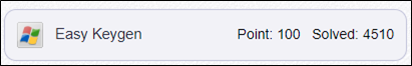
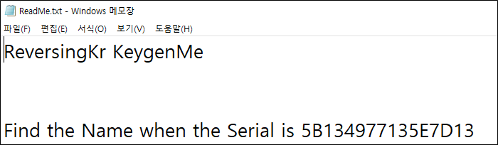
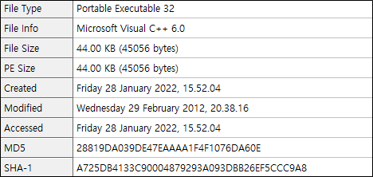
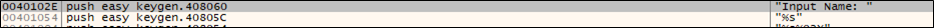
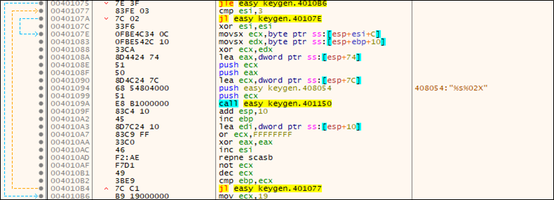
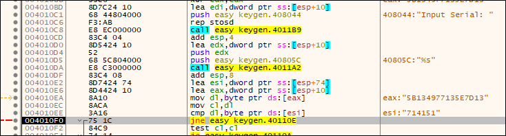

# [목차]
**1. [Description](#Description)**

**2. [Write-Up](#Write-Up)**

**3. [FLAG](#FLAG)**


***


# **Description**




# **Write-Up**

ReadMe.txt가 주어진다.



파일 정보는 다음과 같다.



Input Name을 기점으로 확인해보자.



Input Name을 입력하면 입력한 값과 0x10, 0x20, 0x30을 xor하여 저장한다.



그리고 Serial을 입력받아, Input Name의 연산결과와 비교한다.



Xor 성질을 이용하여 ReadMe.txt에 적힌 Serial에 맞는 Input Name값을 뽑아내자.

```python
SERIAL_NUMBER   = b'\x5B\x13\x49\x77\x13\x5E\x7D\x13'
DATA            = b'\x10\x20\x30'
i               = 0

for S in SERIAL_NUMBER:
    if i == 3: i = 0
    print(chr(S^DATA[i]), end='')
    i += 1
```

얻은 Input Name값을 입력하면 "Correct!"가 출력된다.

```
Input Name: K3yg3nm3
Input Serial: 5B134977135E7D13
Correct!
```


# **FLAG**

**K3yg3nm3**