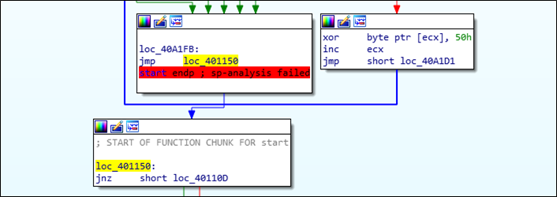

# [목차]
**1. [Description](#Description)**

**2. [Write-Up](#Write-Up)**

**3. [FLAG](#FLAG)**

***

# **Description**

# **Write-Up**

ReadMe.txt에서 OEP를 찾으라고 한다.

* OEP : Original Entry Point

문제 이름에서 알 수 있지만, 패킹되어 있을 것이다.

파일 정보를 확인하자.

PEiD로 확인하면 UPX로는 패킹된 것이 아닌것 같다. 실제로 upx로도 언패킹이 불가능하다.

0x401150이 유력하다.

x32dbg가 아닌 ollydbg로 bp를 잡고 실행하자.

Analyse Code(Ctrl+A)를 실행하면, OEP임을 알 수 있다.

# **FLAG**

**00401150**