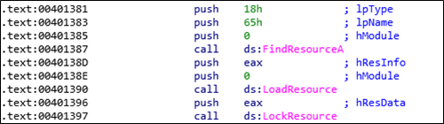
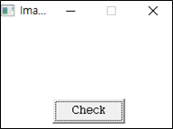

# [목차]
**1. [Description](#Description)**

**2. [Write-Up](#Write-Up)**

**3. [FLAG](#FLAG)**

***

# **Description**

# **Write-Up**

파일 정보를 확인하자.

Wrong이 나오는 구간위에 비교문이 존재한다.

그 근처에 Resource를 찾고 로드한다.

FindResourceA가 성공하면 리소스의 정보 블록에 대한 핸들을 반환한다.

> [FindResourceA](https://docs.microsoft.com/en-us/windows/win32/api/winbase/nf-winbase-findresourceas)

먼저 PEView에서 리소스를 확인할 수 있는데 lpType가 일치함을 알 수 있다.

lpName도 일치함을 알 수 있다.

LoadResource는 FindResourceA의 반환값(eax)인 핸들을 통해 리소스를 로드한다.

> [LoadResource](https://docs.microsoft.com/en-us/windows/win32/api/libloaderapi/nf-libloaderapi-loadresource)

LockResource는 LoadResource의 반환값(eax)인 핸들을 통해 리소스 데이터의 첫 번째 바이트 주소를 리턴한다.

> [LockResource](https://docs.microsoft.com/en-us/windows/win32/api/libloaderapi/nf-libloaderapi-lockresource)

이 리소스와 내가 그린 그림과 비교하다가 틀리면 Wrong으로 가는 로직이다.

입력해야하는 그림판과 같은 곳은 CreateCompatibleBitmap에 의해 사이즈가 정해지는 듯 하다.

> [CreateCompatibleBitmap](https://docs.microsoft.com/en-us/windows/win32/api/wingdi/nf-wingdi-createcompatiblebitmap)

하지만, 리소스는 중간 중간 0x00들이 들어있어서 Wrong이 뜰 수 밖에 없다.

0x00을 0xFF로 바꾸고 저장 후 Check눌러도 반응이 없고, Exception이 뜨는 듯 했다.

그렇다면 반대로 리소스를 가져와서 bitmap이미지에 데이터를 붙혀넣자. 빈 bitmap을 생성하기 위해 bitcount를 알아내자.

이미지를 확인하자.

# **FLAG**

**GOT**