# [목차]
**1. [Description](#Description)**

**2. [Write-Up](#Write-Up)**

**3. [FLAG](#FLAG)**

***

# **Description**

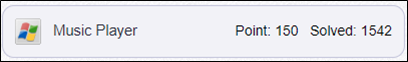

# **Write-Up**

ReadMe.txt를 보면 1분마다 체크하는 로직이 있고, 이를 우회하면 FLAG를 얻을 수 있다고 한다.

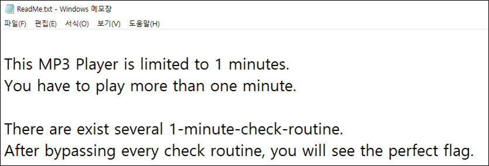

DLL 파일 정보를 확인해보자.

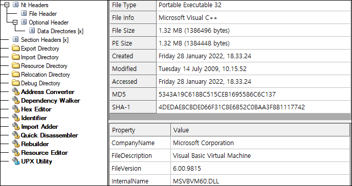

EXE 파일 정보를 확인해보자.

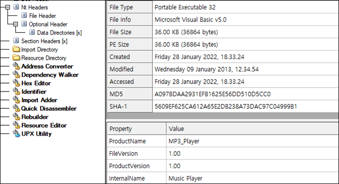

1분대에 미리 듣기 제한이라는 메세지 박스가 출력된다.

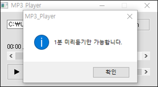

EXE 주소상에 rtcMSgBox가 4개가 존재한다.

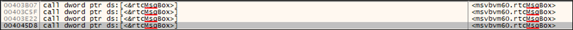

mp3가 00:59초가 지날 때, 0x4045D8에 bp가 걸린다.

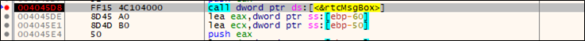

그 위를 보면 eax와 60,000과 비교하는데 이는 ms로 보고 1분과 같다. 즉, 1분이 찾을때 이 분기문을 우회하자.

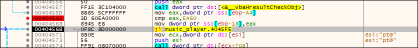

jl을 jmp로 바꾸어 진행하면 Runtime error라는 메세지 팝업창이 뜬다.

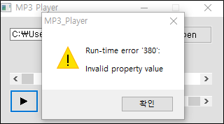

vbaHresultCheckObj에서 발생하고, 위의 jge를 jmp로 바꾸어서 우회하자.

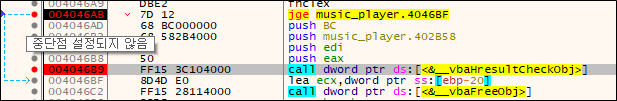

이후 계속 진행하면, title이 FLAG로 변경된다.

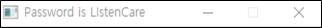

# **FLAG**

**LIstenCare**