# [목차]
**1. [Description](#Description)**

**2. [Write-Up](#Write-Up)**

**3. [FLAG](#FLAG)**


***


# **Description**

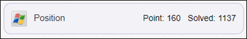


# **Write-Up**

파일 정보는 다음과 같다.

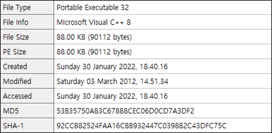

또 ReadMe.txt가 있다.

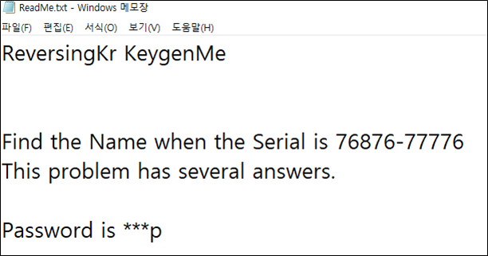

Wrong위에 조건문이 있다.

test는 and연산이기 때문에 0xb81740의 결과가 0이면 ZF가 1이 되어서 Wrong된다. 즉, 0xb81740의 결과가 0이 아니여야 한다.

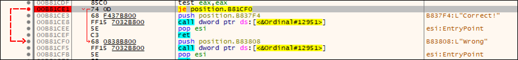

0xB8179F에서 Name에 입력한 길이와 4랑 비교하여 분기가 이루어진다.

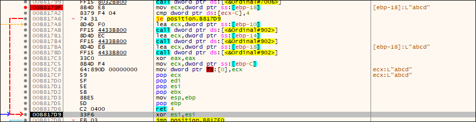

입력한 Name에 대하여 소문자인지 검사한다. (0x61 <= x <= 0x7a)

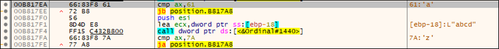

그리고 중복되는 문자가 있는 지 검사한다.

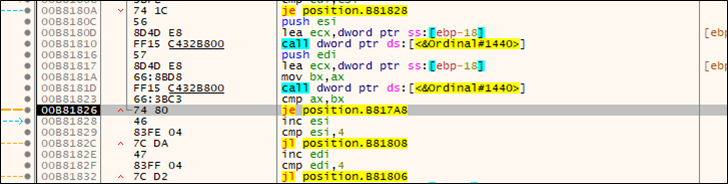

검사에 이상이 없다면, Serial을 검사하는데 길이는 11자이고, 0부터 시작해서 5번째 인덱스가 '-'(45)임을 검사한다.

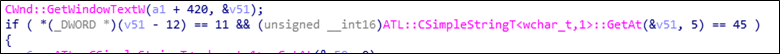

Name의 0번째 인덱스와 1첫번째 인덱스로 여러가지 연산을 수행한다.

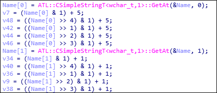

이후 연산과정 중 생성된 변수 두개의 합과 serial 0번째 인덱스와 비교한다.

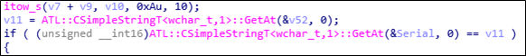

위와 같이 Name과 Serial을 비교하여 조건이 맞다면, 1을 반환한다.

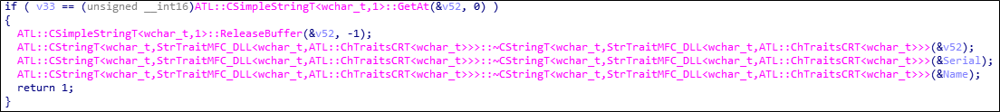

조건에 만족하는 Name을 찾자.

```python
import itertools
import string

SERIAL  = '76876-77776'
NAMES   = list(itertools.permutations(string.ascii_lowercase, 4))
for NAME in NAMES:
    NAME    = ''.join(NAME)
    v7      = (ord(NAME[0]) & 1) + 5;
    v48     = ((ord(NAME[0]) >> 4) & 1) + 5;
    v42     = ((ord(NAME[0]) >> 1) & 1) + 5;
    v44     = ((ord(NAME[0]) >> 2) & 1) + 5;
    v46     = ((ord(NAME[0]) >> 3) & 1) + 5;

    v34     = (ord(NAME[1]) & 1) + 1;
    v40     = ((ord(NAME[1]) >> 4) & 1) + 1;
    v36     = ((ord(NAME[1]) >> 1) & 1) + 1;
    v9      = ((ord(NAME[1]) >> 2) & 1) + 1;
    v38     = ((ord(NAME[1]) >> 3) & 1) + 1;

    if v7 + v9 == int(SERIAL[0]):
        if v46 + v38 == int(SERIAL[1]):
            if v42 + v40 == int(SERIAL[2]):
                if v44 + v34 == int(SERIAL[3]):
                    if v48 + v36 == int(SERIAL[4]):
                        v21 = (ord(NAME[2]) & 1) + 5;
                        v49 = ((ord(NAME[2]) >> 4) & 1) + 5;
                        v43 = ((ord(NAME[2]) >> 1) & 1) + 5;
                        v45 = ((ord(NAME[2]) >> 2) & 1) + 5;
                        v47 = ((ord(NAME[2]) >> 3) & 1) + 5;

                        v35 = (ord(NAME[3]) & 1) + 1;
                        v41 = ((ord(NAME[3]) >> 4) & 1) + 1;
                        v37 = ((ord(NAME[3]) >> 1) & 1) + 1;
                        v23 = ((ord(NAME[3]) >> 2) & 1) + 1;
                        v39 = ((ord(NAME[3]) >> 3) & 1) + 1;

                        if v21 + v23 == int(SERIAL[6]):
                            if v47 + v39 == int(SERIAL[7]):
                                if v43 + v41 == int(SERIAL[8]):
                                    if v45 + v35 == int(SERIAL[9]):
                                        if v49 + v37 == int(SERIAL[10]):
                                            if NAME[-1] == 'p': print('NAME\t{}'.format(NAME))
```

Name은 bump, cqmp, ftmp가 나오지만, FLAG로 인증되는 것은 bump밖에 없다.

# **FLAG**

**bump**