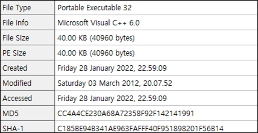
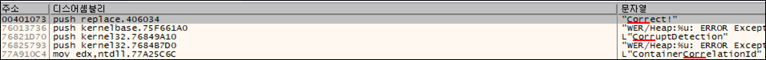
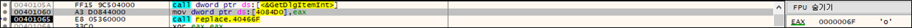
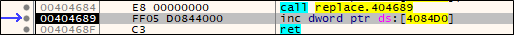
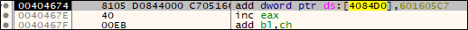
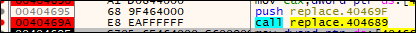
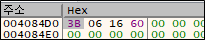
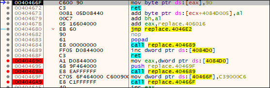
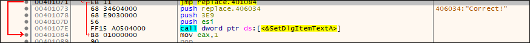
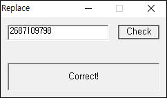

# [목차]
**1. [Description](#Description)**

**2. [Write-Up](#Write-Up)**

**3. [FLAG](#FLAG)**


***


# **Description**


# **Write-Up**

파일 정보는 다음과 같다.



"Correct!"라는 메세지를 발견했다.



0x401060에서 eax는 입력한 값(111)이였고, 이를 0x4084D0에 저장한다.



그 후, 0x40466F에 들어가고, 다시 0x40467A로 들어가고, 0x404689에 들어가면 입력 값에 +2를 한다.



그 후, 0x601605C7을 더한다.



그 후, 다시 0x404689를 호출하여 +2를 한뒤, 0x40469A에서 다시 0x404689를 호출하는데, 이때는 +1만 한다.



즉, 입력 값 + 0x601605CC를 한다. (0x6F + 0x601605CC = 0x6016063B)



0x4046A9에서 0x40466F를 호출하는데 eax 값에 nop을 취한다. 이때 eax는 입력 값 + 0x601605CC - 1이다.



마지막에 jmp 0x401071하는데 0x401071에서는 다시 jmp를 통해 Correct로 텍스트를 바꾸는 로직을 넘어가므로 여기에 nop을 취하면 될 듯하다.



입력 값 + 0x601605CC - 1 = 0x401071이 되어야 하고, "-"를 입력할 수 없고, unsigned 형이라서 underflow를 이용하여 2687109798를 입력해주자.

```cpp
#include <stdio.h>

int main()
{
    unsigned int test = 0x401071 - 0x601605CC + 1;
    printf("%u\n", test);

    return 0;
}
```

> [Online C compiler](https://www.onlinegdb.com/online_c_compiler)

검증해보자.




# **FLAG**

**2687109798**