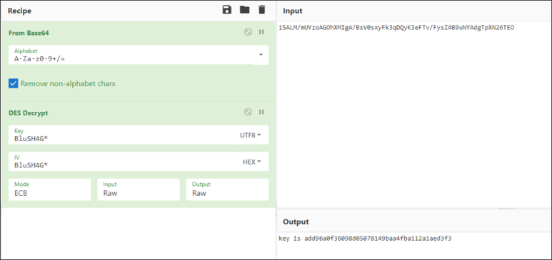

# [목차]
**1. [Description](#Description)**

**2. [Write-Up](#Write-Up)**

**3. [FLAG](#FLAG)**


***


# **Description**


# **Write-Up**

패스워드를 찾으라고 한다. 일단 다운받자.


파일의 기본적인 정보를 확인하고, 해쉬값도 일치한다.


.Net으로 작성된 프로그램이니, dotPeek으로 디컴파일 후 Main을 본다.

> [dotPeek](https://www.jetbrains.com/ko-kr/decompiler/download/download-thanks.html?platform=windowsWeb)


Main을 보면 name과 password를 Console을 통해 입력받고, name이 "BluSH4G"이고, myCmp함수의 결과가 참이여야 성공 메세지가 출력된다.

```C#
private static void Main(string[] args)
{
    Console.Write("Input your name : ");
    string name = Console.ReadLine();
    Console.Write("Password : ");
    string s1 = Program.myEncrypt(Console.ReadLine(), name);
    if (name == "BluSH4G" && Program.myCmp(s1, Program.getps(name)))
    Console.WriteLine("\n::Congratulation xD ::\n");
    else
    Console.WriteLine("\n:: WTF AUTH FAILED ::\n");
}
```

위에서부터 myEncrypt함수를 보면 다음과 같다.

1. Console로 입력받은 값을 DES 블록 알고리즘으로 암호화

2. 블록 암호 운용 방식은 ECB 모드 (IV가 필요없음)

3. 암호화 대상 데이터의 패딩 방식은 PKCS7

4. 키 값은 mPadding함수를 거친 name변수 값

5. 암호화한 데이터를 base64로 인코딩

```C#
private static string myEncrypt(string strKey, string name)
{
    DESCryptoServiceProvider cryptoServiceProvider = new DESCryptoServiceProvider();
    cryptoServiceProvider.Mode = CipherMode.ECB;
    cryptoServiceProvider.Padding = PaddingMode.PKCS7;
    byte[] bytes1 = Encoding.ASCII.GetBytes(Program.mPadding(name));
    cryptoServiceProvider.Key = bytes1;
    cryptoServiceProvider.IV = bytes1;
    MemoryStream memoryStream = new MemoryStream();
    CryptoStream cryptoStream = new CryptoStream((Stream) memoryStream, cryptoServiceProvider.CreateEncryptor(), CryptoStreamMode.Write);
    byte[] bytes2 = Encoding.UTF8.GetBytes(strKey.ToCharArray());
    cryptoStream.Write(bytes2, 0, bytes2.Length);
    cryptoStream.FlushFinalBlock();
    return Convert.ToBase64String(memoryStream.ToArray());
}
```

mPadding함수를 보면 인자 값의 길이가 DES의 블록 사이즈인 8미만이면 "*"을 더 붙히고, 초과이면 앞에서부터 잘라낸다.

```C#
private static string mPadding(string s)
{
    int length = s.Length;
    if (length == 8)
    return s;
    if (length > 8)
    return s.Substring(length - 8);
    for (int index = 0; index < 8 - length; ++index)
    s += "*";
    return s;
}
```

다시 Main으로 돌아와 myCmp함수를 보면 넘겨받은 2개의 인자가 서로 같으면 참을 아니면 거짓을 반환한다.

```C#
private static bool myCmp(string s1, string s2) => s1.Length == s2.Length && !(s1 != s2);
```

이제 마지막으로 getps함수를 보면 name값을 http://wargame.kr:8084/prob/28/ps.php의 n에 GET method로 전달하고, 이에 대한 응답값을 반환한다.

```C#
public static string getps(string name)
{
    WebRequest webRequest = WebRequest.Create("http://wargame.kr:8084/prob/28/ps.php?n=" + name);
    webRequest.Credentials = CredentialCache.DefaultCredentials;
    HttpWebResponse response = (HttpWebResponse) webRequest.GetResponse();
    Stream responseStream = response.GetResponseStream();
    StreamReader streamReader = new StreamReader(responseStream);
    string end = streamReader.ReadToEnd();
    streamReader.Close();
    responseStream.Close();
    response.Close();
    return end;
}
```

즉, 우리는 ps.php에 n에다가 이름을 전달하고 반환된 값을 base64로 디코딩 후 복호화한 뒤, 언패딩처리해주면 Password를 알 수 있다.

우선, n에 BluSH4G를 전달하였을 때, 암호화된 데이터를 확인하자.


CyberChef를 이용하여 빠르고, 편하게 복호화하면, FLAG를 얻을 수 있다.

> [CyberChef](https://gchq.github.io/CyberChef/)



Python script로도 가능하다. CTF에서 블록 암호 알고리즘은 종종 나오기때문에 틀을 미리 만들어두어서 재사용하면 좋다.

```python
import urllib
import urllib.request
import sys

name    = 'BluSH4G'
url     = 'http://wargame.kr:8084/prob/28/ps.php?n='+name
headers = {'User-Agent': 'Mozilla/5.0 (Windows NT 6.1; Win64; x64)', 'Content-Type': 'application/json; charset=utf-8'}
request = urllib.request.Request(url, headers = headers)
cipher_text = ''

try:
    response    = urllib.request.urlopen(request)
    cipher_text = response.read().decode()
except Exception as e:
    print(e)
    sys.exit(1)


from Cryptodome.Cipher import DES
import base64

def PKCS_Padding(m):
    padding = chr(DES.block_size - len(m) % DES.block_size) * (DES.block_size - len(m) % DES.block_size)
    if type(m) is bytes: return m + padding.encode()
    else: return (m + padding).encode()

def PKCS_UnPadding(m): return m[:-m[-1]]
    
def mPadding(s):
    key_len = len(s)
    if key_len == DES.block_size: return s
    elif key_len > DES.block_size: return s[key_len - DES.block_size:]
    else:
        for i in range(DES.block_size - key_len): s += '*'
        return s

key     = mPadding(name).encode()
data    = base64.b64decode(cipher_text)
cipher  = DES.new(key, DES.MODE_ECB)

decrypted_data = cipher.decrypt(data)
decrypted_data = PKCS_UnPadding(decrypted_data)
print("Decrypt\t: "+decrypted_data.decode())

encrypted_data = cipher.encrypt(PKCS_Padding(decrypted_data))
encoded_encrypted_data = base64.b64encode(encrypted_data)
if encoded_encrypted_data.decode() == cipher_text: print("Verify\t: Success")
else: print("Verify\t: Fail")
```

필요는 없지만, 프로그램에서 성공메세지 보기

```shell
> 22c2661e5ee99feeaab31f926ab0dacf.exe
Input your name : BluSH4G
Password : key is add96a0f36098d05078149baa4fba112a1aed3f3

::Congratulation xD ::
```

# **FLAG**

**add96a0f36098d05078149baa4fba112a1aed3f3**