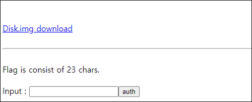
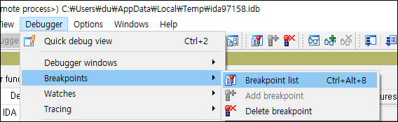
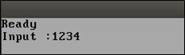
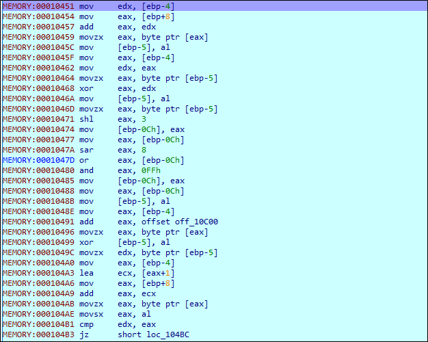

# [목차]
**1. [Description](#Description)**

**2. [Write-Up](#Write-Up)**

**3. [FLAG](#FLAG)**


***


# **Description**


# **Write-Up**

파일 하나를 다운받아 보자.



qemu-system-i386 -fda Disk.img로 Disk.img로 부팅한 가상 이미지는 띄워본다.

```shell
root@ubuntu:~# apt-get -y install qemu-system-x86
root@ubuntu:~# qemu-system-i386 -fda Disk.img
```

* -fda 옵션은 floppy disk를 사용한다는 옵션이다.


패스워드 같이 비교문인것같은데, ida를 이용하여 원격 GDB로 붙혀본다.

```shell
root@ubuntu:~# qemu-system-i386 -fda Disk.img -s -S
```

* -s 옵션은 원격에서 gdb 디버깅을 할 수 있도록 하는 옵션이다. (default port : 1234)
* -S 옵션은 cpu freeze 옵션이다.


입력 파일이 없기 때문에, Go를 클릭한다.


상단의 Debugger->Attach->Remote GDB debugger를 클릭한다.


qemu로 가상 이미지 띄운 서버의 IP와 -s옵션에 의해서 바인딩된 1234포트를 입력한다.


모든 경고문, 선택 창등 OK를 누른다.


Debugger->Breakpoints->Add breakpoint를 클릭한다.


BIOS가 MBR을 로드하는 주소인 0x7C00로 BP를 건다.

> [Bootloader](https://www.glamenv-septzen.net/en/view/6)


F9를 눌러 Run한다.


F8을 누르면 점점 흰색 네모칸이 채워진다.

* 중간 중간 메세지 팝업은 그냥 OK버튼 클릭


계속 진행하다가 0x10451에 Input에 대한 연산이 들어가는 곳이 있다. (삽질 방지용 스포)

Debugger->Breakpoints->Breakpoint list를 클릭한다.



우클릭->Insert를 클릭한다.


0x10451를 넣는다.


다시 IDA View-EIP로 돌아와 F9를 누르면 Please wait이라고 뜬다.


Input 값을 기다리는 거기 때문에 Input을 넣고 엔터를 처보자.



전체 로직이다.



0x10459는 입력한 값이 들어온다. (첫번째 loop이므로 1(=0x31))


0x10468에서 현재 반복문 변수(첫번째 loop이므로 0(=0x00))와 입력한 값(0x31)과 xor연산을 한다.


0x10471에서 이전 단계의 결과(0x31^0x00)에 shl 3연산을 한다.((0x31^0x00) << 0x03 = 0x188)


0x1047A에서 이전 단계의 결과(0x188)에 sar 8연산을 한다.(0x188 >> 8 = 0x01)


0x1047D에서 이전 두 단계의 결과(0x188, 0x01)에 대하여 or 연산을 한다.(0x188 | 0x01 = 0x189)


0x10480에서 이전 단계의 결과(0x189)에 0xFF와 and 연산을 한다.(0x189 & 0xFF = 0x89)


0x10496에서 10C00의 주소에서 값을 가져온다.


해당 위치에 데이터를 보면 {0x12,0xd6,0x93,0xe3,0xf4,0xdd,0x86,0x33,0x60,0x56,0x25,0xda,0x9b,0x9f,0x9e,0xc9,0x9f,0xf0,0x4c,0xaF,0xc6,0xf5,0x49} 임을 알 수 있다. 즉, 저만큼을 loop할 것임을 예측해볼 수 있다.


0x10499에서 이전 단계의 0번째 인덱스인 0x12와 전전단계에서 연산한 결과(0x89)와 xor 연산을 한다.(0x12^0x89 = 0x9B)


그리고 loop 카운트를 늘린다. 이는 나중에 edx값이 된다.


0x104B1에서 edx와 eax를 비교하는데 eax는 1234를 입력했을 때, 현재+1인 2(0x32)값과 여태까지 연산한 값(0x9B)과 비교하여 일치하면 다음 루프로 진행하게 된다.


Input은 키보드 자판으로 입력하는 것이므로, 0x20(space) ~ 0x7A(z)까지 모든 경우의 수를 구해 printable한 값이 패스워드가 될 것이다.

다음과 같은 C++ 코드로 모든 경우의 수를 구한다.

```c++
#include <iostream>
#include <vector>

unsigned int func(unsigned int x, unsigned int y, unsigned int n)
{
    unsigned int original = x, shl_value, sar_value;
    x = x ^ n;
    shl_value = x << 0x3;
    sar_value = shl_value >> 0x08;
    x = shl_value | sar_value;
    x = x & 0xFF;
    x = x^y;
    return x;
}

int main(int argc, char *argv[])
{
    unsigned int key[23] = {0x12,0xd6,0x93,0xe3,0xf4,0xdd,0x86,0x33,0x60,0x56,0x25,0xda,0x9b,0x9f,0x9e,0xc9,0x9f,0xf0,0x4c,0xaF,0xc6,0xf5,0x49};
    for (unsigned int x = 0x20; x < 0x7B; x++)
    {
        std::vector<unsigned int> data;
        data.push_back(x);
        for(int y = 0; y < sizeof(key) / sizeof(key[0]); y++)
        {
            data.push_back(func(data.back(), key[y], y));
        }
        printf("[%c] ", x);
        for(int i = 0; i < data.size(); i++) printf("%c", data[i]);
        printf("\n");
    }
    return 0;
}

[Output]
... 생략 ...
[B] B�uPVG�o[�S;.�Mu�B%O'�
[C] �w@�C�nS��*�L}�@5�#�
[D] D0_y0U_LikE_x86_KERNEL?
[E] E8{ �[lhc]h�2JMLU�
... 생략 ...
```

파이선 버전의 코딩이다.

```python
def func(x, y, z):
    x = x ^ z
    b = x << 0x03
    c = b >> 0x08
    d = b | c
    e = d & 0xFF
    f = e ^ y
    return f

data = [0x12, 0xD6, 0x93, 0xE3, 0xF4, 0xDD, 0x86, 0x33, 0x60, 0x56, 0x25, 0xDA, 0x9B, 0x9F, 0x9E, 0xC9, 0x9F, 0xF0, 0x4C, 0xAF, 0xC6, 0xF5, 0x49]

for k in range(0x20, 0x7C):
    result = [k]
    for i, d in enumerate(data): result.append(func(result[-1], d, i))

    print('[{}] '.format(chr(k)), end='')
    for r in result: print('{}'.format(chr(r)), end='')
    print('\n'+'='*50)
```

D0_y0U_LikE_x86_KERNEL?가 패스워드 일 것이다. 이를 문제 페이지에 입력하면 FLAG를 획득할 수 있다.


# **FLAG**

**93828bcf384133c6ef5fd4af45eb0ea957c52349**