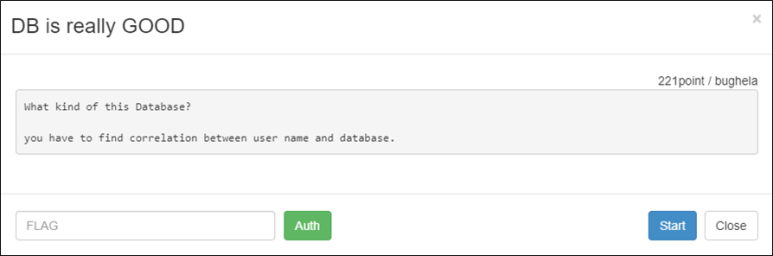
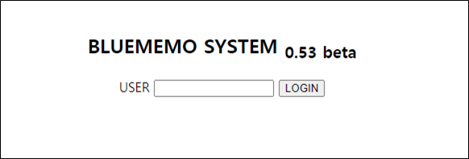
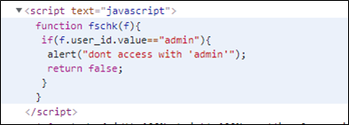
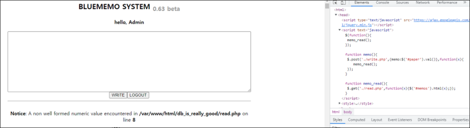
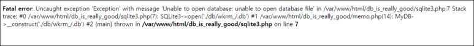
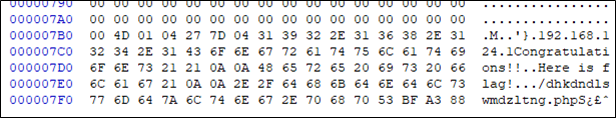
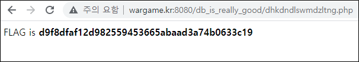

# [목차]
**1. [Description](#Description)**

**2. [Write-Up](#Write-Up)**

**3. [FLAG](#FLAG)**

***

# **Description**

# **Write-Up**

USER를 입력하라고 나온다.

javascript를 확인하면 admin으로는 하지 말라고 한다.

Admin으로 입력하면 들어가지지만, 딱히 중요한건 없다.

USER를 / 로 입력하면 다음과 같이 db/wkrm_/.db를 찾을 수 없다고 에러가 출력된다.

http://wargame.kr:8080/db_is_really_good/db/wkrm_admin.db으로 들어가면 wkrm_admin.db파일이 다운로드 되고, 이를 열어보면 flag위치를 알려준다.

dhkdndlswmdzltng.php로 가면 FLAG를 획득할 수 있다.

# **FLAG**

**d9f8dfaf12d982559453665abaad3a74b0633c19**