# [목차]
**1. [Description](#Description)**

**2. [Write-Up](#Write-Up)**

**3. [FLAG](#FLAG)**

***

# **Description**

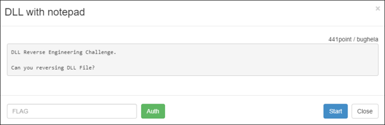

# **Write-Up**

파일을 다운로드할 수 있다.

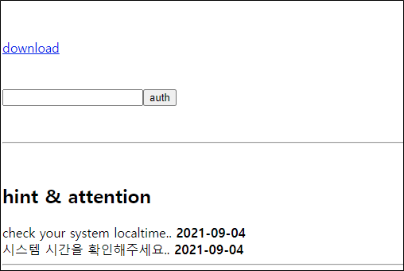

blueh4g13.dll을 IDA로 디컴파일해보자. main은 뭐가 없다. start라는 함수를 호출하는데 그쪽을 봐야 겠다.

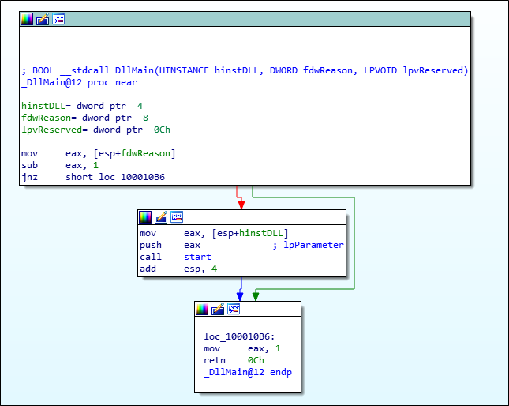

Thread를 생성한다. 함수인 StartAddress로 들어가야겠다.

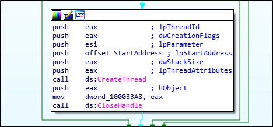

sub_100010C0함수 호출 후 무엇인가를 하고 strcmp로 dword_10003388이라는 변수와 string값을 비교한다.

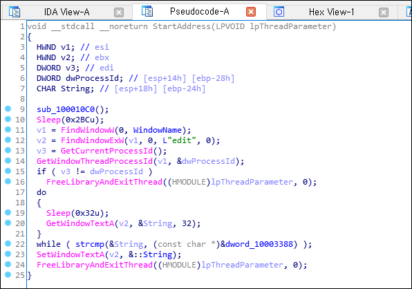

sub_100010C0함수로 들어가면 oh! handome guy!라는 문자열이 있고 어떠한 연산을 한다.

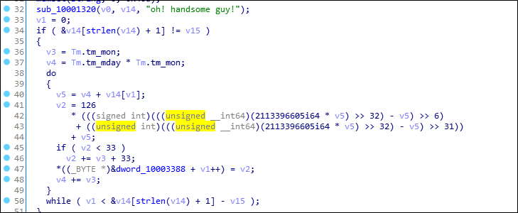

어떤 연산을 하는 지 모르니 동적 분석을 시도한다. 먼저 oh! handsome guy!문자열을 찾는다.

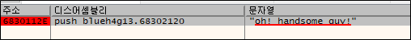

*((_BYTE *)&dword_10003388 + v1++) = v2;에 해당하는 곳에 bp를 걸고 Run한다.

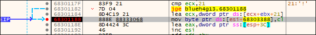

0x68303388에 cl값을 넣으니 해당 주소로 가본다.

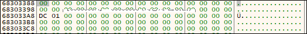

그리고 while이 끝나는 지점에 bp를 걸고, 0x68301188은 bp를 해제해보자.

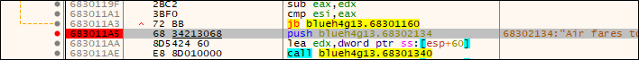

while이 끝나면 0x68303388에 :;QX*+@>UY__"q2>C라는 데이터가 씌여졌다.

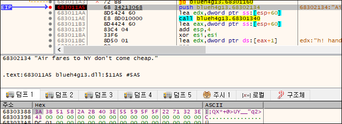

인증 시도해보았지만, 안맞는다고 한다.

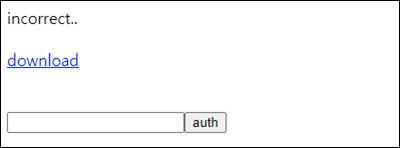

밑에 또 유사한 Air fares to NY don't come cheap이라는 문자열을 이용한 while문이 존재한다.

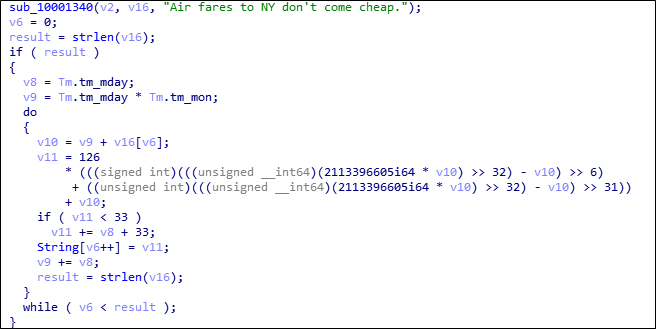

똑같은 방법으로 ds의 주소로 간다.

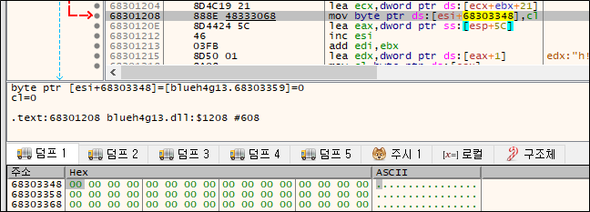

while문이 끝나는 지점에 bp를 걸고 Run하면 a4AL=<,#5d>=p$3|FUX:f;]mok*qz{{5P라는 또다른 데이터가 씌여지는 것을 확인할 수 있다.

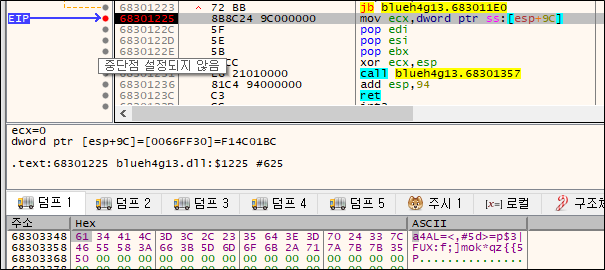

해당 데이터를 인증하였더니 FLAG를 획득할 수 있었다.

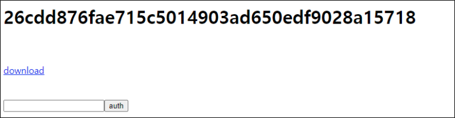

# **FLAG**

**26cdd876fae715c5014903ad650edf9028a15718**