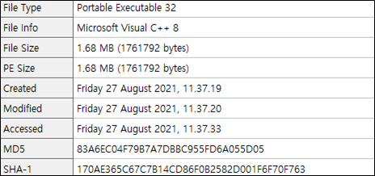
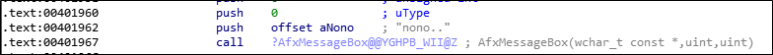

# [목차]
**1. [Description](#Description)**

**2. [Write-Up](#Write-Up)**

**3. [FLAG](#FLAG)**


***


# **Description**


# **Write-Up**

pe파일 하나 던져주고 Password를 찾으라고 한다.


실행해보자. Password를 입력하는 것 같다.


아무거나 입력해보면 nono라고 메세지 팝업창이 뜬다.


기본적인 정보를 확인하면 32bit 파일이란 것을 알 수 있다.



IDA32로 main을 찾는다.


Shift+F12를 눌러 Strings window로 이동한다음 설정을 클릭한다.


nono를 찾기위해 Minimal string length를 4로 하고, 모든 체크박스에 체크를 해보자.


ctrl+F를 누르고 nono의 주소를 찾는다.


String열의 nono..를 더블클릭하면 해당 주소로 이동한다.


이 데이터는 sub_4016C0+2A2(=41962)에서 사용하였으므로, sub_4016C0+2A2로 하늘색 색칠된 글자를 더블클릭하면, 해당 주소로 이동된다.



마찬가지로 어떤 조건에 의해서 nono로 왔으므로 그 조건을 찾기위해 참조한 주소를 더블클릭하여 이동한다.


아무거나 입력 시 어떤 연산이 이루어지고, esi가 0xE 이상이거나 bl이 0이면 nono로 jmp함을 알 수 있다.


Tab을 눌러 Pseudocode를 확인하면 조건들을 알 수 있다.


첫번째 if의 v4의 값이 12이하면 v2가 0이되고, 마지막 if문을 보면 FLAG를 획득하는 루틴인데, 이 if문을 들어가기 위해서는 v4의 값이 14미만이고, v2가 true여야한다.

즉, v4는 13이여야하고, v2는 1이여야한다. 이를 전 사진과 비교하면 v4는 esi고, bl이 v2이다.

그렇다면 v4는 어떻게 연산이 되는지 보면, 입력한 Password의 길이를 다르게하면서 디버깅하면 문자열의 길이임을 알 수 있다.


두번째 if문은 wcsstr함수를 통해 "_my_b"라는 문자열이 있는지 검색한다. 해당 문자열이 있다면 찾은 index부터의 문자열을 반환한다.

> [wcsstr](https://docs.microsoft.com/en-us/previous-versions/windows/embedded/ms860459(v=msdn.10))

세번째 if문은 wtoi함수를 통해 1114가 반환되는지 확인한다. wtoi는 atoi와 문자열 셋만 다르고 사용법과 결과는 같다. 또한 "숫자+문자열"이면 앞의 숫자를 인식하여 그 숫자를 반환한다.

> [wtoi](https://docs.microsoft.com/ko-kr/cpp/c-runtime-library/reference/atoi-atoi-l-wtoi-wtoi-l?view=msvc-160)

```c
[Input]
#include <stdio.h>
#include <string.h>
int main()
{
    char v1[30];
    strcpy(v1, "123hello world");
    printf("%d\n",atoi(v1));
    return 0;
}

[Output]
123
```

네번째 if문은 두번째 if문과 마찬가지로 "birth"라는 문자열을 검색한다.

모든 if문을 조합하면 "1114_my_birth"라는 Password를 추출할 수 있고, 이를 입력해보면 FLAG를 획득할 수 있다.


FLAG복사가 불편하니 다른 방법으로 얻어보자. if (v4 < 14 && v2)문을 확인하면 다음과 같이 FLAG를 얻을 때 요청하는 주소가 있다.


p에 찾은 Password를 넣고 요청하면 복사하기 편한 FLAG를 얻을 수 있다.


# **FLAG**

**cf4c4b1e23758a274348a29f0df0f6878790640c**