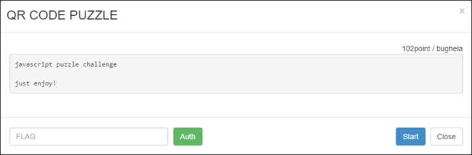
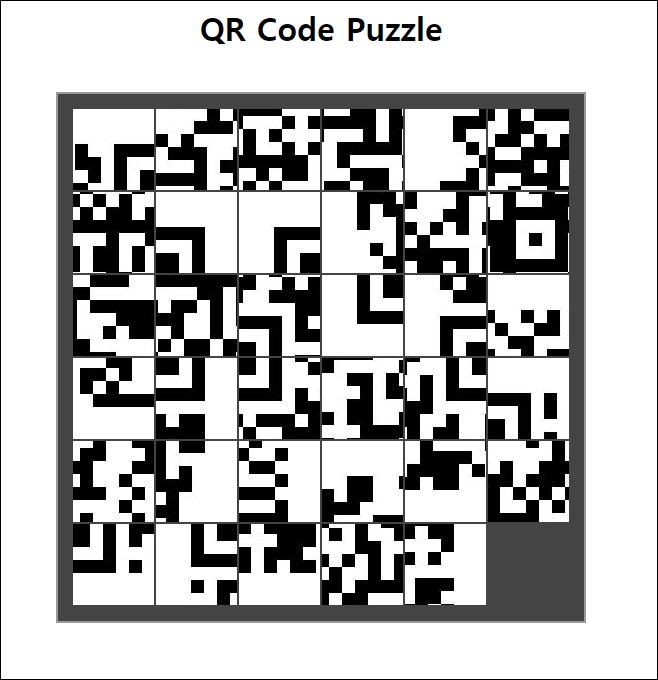
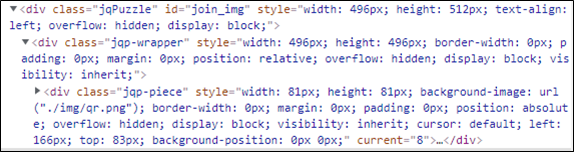
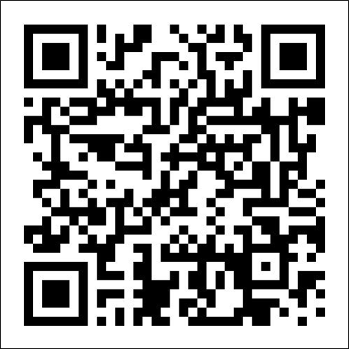
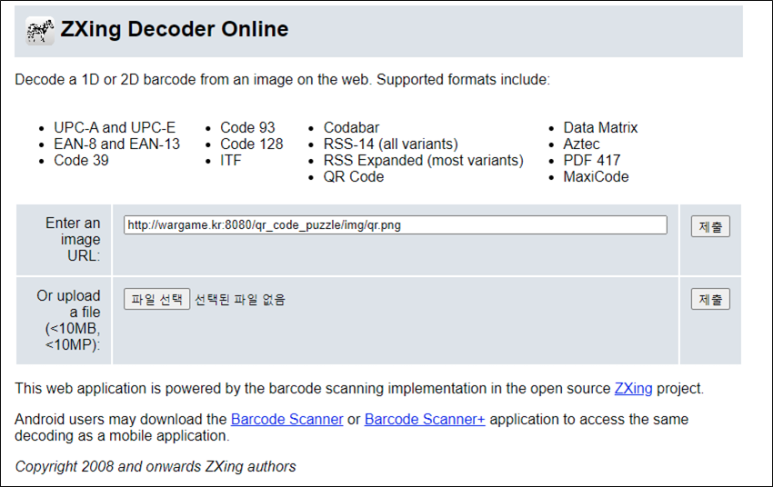
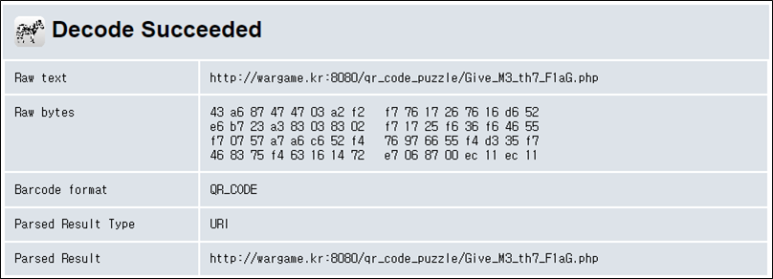
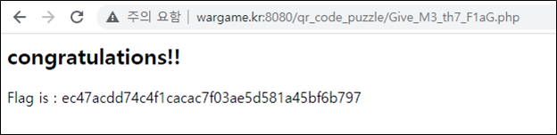

# [목차]
**1. [Description](#Description)**

**2. [Write-Up](#Write-Up)**

**3. [FLAG](#FLAG)**

***

# **Description**

# **Write-Up**

어떤 QR코드를 6x6으로 나눠서 무작위로 배치하였다. 원본 QR코드로 조립하여 QR코드를 인식하면 FLAG를 획득할 수 있을 것같다.

QR코드의 원본 이미지를 소스상에서 바로 확인할 수 있었다.

해당 url로 접속하면 원본 QR코드를 확인할 수 있다.

온라인 qr 디코더를 사용하여 메세지를 확인한다.

> [QR Decoder](https://zxing.org/w/decode.jspx)

파일로 전달하지 않고, 이미지가 나와있는 url로 전달하였다. QR코드의 메세지로는 다른 URL을 알려준다.

해당 url로 접속하면 FLAG를 획득할 수 있다.

# **FLAG**

**ec47acdd74c4f1cacac7f03ae5d581a45bf6b797**