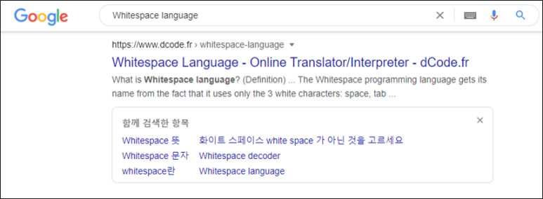
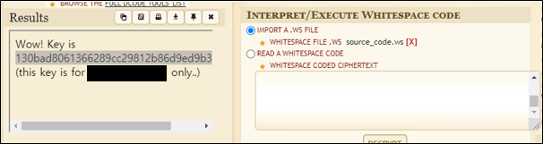

# [목차]
**1. [Description](#Description)**

**2. [Write-Up](#Write-Up)**

**3. [FLAG](#FLAG)**

***

# **Description**

# **Write-Up**

Start 버튼을 클릭 후 나오는 페이지에서 source_code.ws를 누르면 source_code.ws라는 파일을 다운로드 할 수 있다.

열어보면 space, tab, newline의 조합으로 이루어져 있다. 그런데 이게 소스코드란다. brain fuck이라고 바로 느낌이 왔다.

구글에 검색하면 Whitespace라는 언어로 추정된다.

Whitespace language로 검색하면 온라인 변환 사이트가 있다.

접속 후 파일 업로드로 라디오 버튼을 선택 후 파일을 업로드하여 DECRYPT버튼을 누르면 좌측에 FLAG가 나온다. 사용자(ip)마다 고유의 key가 있나보다.

> [Whitespace](https://www.dcode.fr/whitespace-language)

# **FLAG**

**130bad8061366289cc29812b86d9ed9b32f0b084**