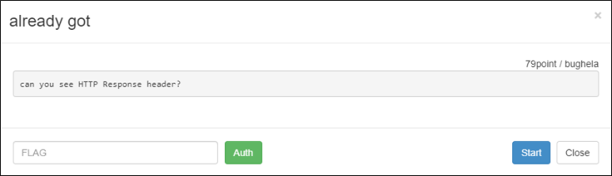
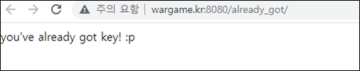
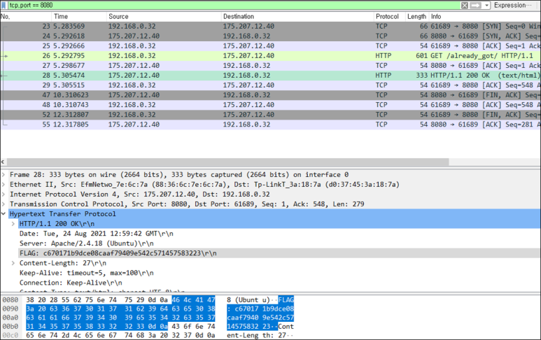

# [목차]
**1. [Description](#Description)**

**2. [Write-Up](#Write-Up)**

**3. [FLAG](#FLAG)**

***

# **Description**

# **Write-Up**

이미 key를 획득했다고 나온다.

문제가 HTTP 응답 헤더를 볼 수 있냐고 물으니 wireshark를 실행하고 새로고침하여 응답 헤더를 확인하면 FLAG를 획득할 수 있다.

# **FLAG**

**c670171b9dce08caaf79409e542c571457583223**