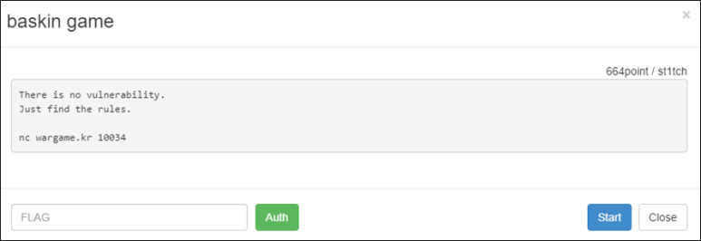

# [목차]
**1. [Description](#Description)**

**2. [Write-Up](#Write-Up)**

**3. [FLAG](#FLAG)**


***


# **Description**



# **Write-Up**

접속하면 규칙 등을 알려준다.

```
Welcome to STITCH's baskinrobbinsN game!
Your Purpose is to win Baskin Robbins31 game from AI.

Rule)
As you already know, it seems like real Baskin Robbins31 game. But maximum number is not 31.

ex) N=101 , count 10
It situation,  You can saying up to ten at a time of number. because count is 10.
if you speaking 101 faster than AI , you lose because N is 101

you will input smaller than count...
you will input the numbers in order.
... 생략 ...
```

베스킨라빈스31 게임은 1:1 대결 시 필승 수(마지막으로 말하는 숫자)의 법칙이 존재한다.

```
# 기존 베스킨라빈스 31
최대 말할 수 있는 수  = 3
마지막 수  = 31
(31 - 1) - (3 + 1)*0    = 30
(31 - 1) - (3 + 1)*1    = 26
(31 - 1) - (3 + 1)*2    = 22
(31 - 1) - (3 + 1)*3    = 18
(31 - 1) - (3 + 1)*4    = 14
(31 - 1) - (3 + 1)*5    = 10
(31 - 1) - (3 + 1)*6    = 6
(31 - 1) - (3 + 1)*7    = 2
```

해당 법칙을 다음과 같이 list로 구할 수 있다.

```python
# max_number = 31
# max_count = 3
magic_numbers   = []
i = 0
while True:
    magic_number    = int((max_number - 1) - (max_count + 1)*i)
    if magic_number <= 0: break
    magic_numbers.append(magic_number)
    i += 1
magic_numbers   = magic_numbers[::-1]
```

이를 해당 게임에 적용하면 FLAG를 획득할 수 있다.

```python
from pwn import *
#context.log_level = 'debug'
r = remote('wargame.kr', 10034)

r.recvuntil('Good luck~\n')
for round in range(1, 32):
    data    = r.recvuntil('\ninput your name -> ').decode().strip().split('\n')
    max_number  = int(data[0][data[0].find('N = ')+len('N = '):data[0].find(',')].strip())
    max_count   = int(data[0][data[0].find('count = ')+len('count = '):].strip())

    magic_numbers   = []
    i = 0
    while True:
        magic_number    = int((max_number - 1) - (max_count + 1)*i)
        if magic_number <= 0: break
        magic_numbers.append(magic_number)
        i += 1
    magic_numbers   = magic_numbers[::-1]

    enemy_number    = 0
    if magic_numbers[0] > max_count:
        import sys
        print('BUGGGGGGGGGGGGGGGGGGGGGGGGGGGGGG')
        sys.exit(0)
    else:
        r.sendline('2honrr')

    while True:
        payload = [str(i) for i in range(enemy_number + 1, magic_numbers[0] + 1)]
        del magic_numbers[0]
        r.recvuntil('input your number -> ')
        r.sendline(' '.join(payload))
        r.recvuntil('\n') # user say ->
        enemy_number    = r.recvuntil('\n').decode() # computer say ->
        if 'user win!' in enemy_number: break
        else: enemy_number    = int(enemy_number.split(' ')[-1].strip())
    round += 1
print(r.recv(1024).decode().strip())

[Output]
flag is wmkr{Very_EaSy_coding_and_math_prob!}
```

가끔 magic_numbers[0] 보다 max_count가 적으면 상대가 필승 수를 말해서 무조건 질 수 밖에 없다.

따라서 유저 이름을 입력할 때, 길이가 홀수이면 상대가 먼저 말하게 되는데.....

여기서 버그가 있다. 상대가 빈 값을 보낸다...

나도 빈 값을 보내면 잘 못된 데이터라고 꺼지란다...

# **FLAG**

**wmkr{Very_EaSy_coding_and_math_prob!}**