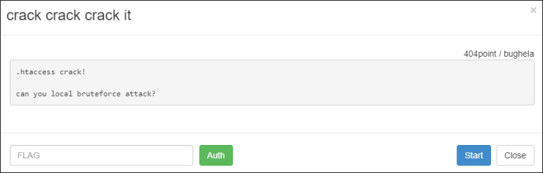
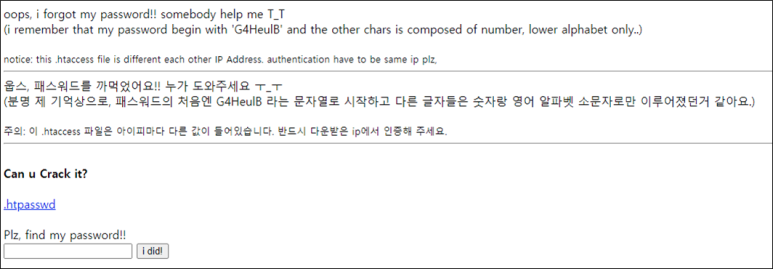
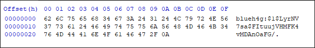
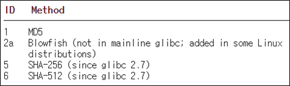
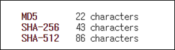

# [목차]
**1. [Description](#Description)**

**2. [Write-Up](#Write-Up)**

**3. [FLAG](#FLAG)**


***


# **Description**




# **Write-Up**

htpasswd파일을 크랙하라고 한다.



파일을 열어보면 shadow 파일 형식임을 알 수 있다.



shadow는 다음과 같은 형식을 가진다.

    $id$salt$encrypted

id는 다음과 같은 규칙이 있다.



encrypted는 다음과 같은 규칙이 있다.



문제에서 패스워드의 일부분(G4HeulB)과 나머지의 힌트(영문 소문자+숫자로 구성)를 알려줬으므로 시간이 많이 걸리지는 않을 것이다.

linux의 Python crypt라이브러리를 사용하여 Brute-Force를 시도한다. (3분 정도 소요)

```python
import crypt
import itertools
import string
import time
import sys

bruteforce_data	= string.digits+string.ascii_lowercase
known_passwd	= 'G4HeulB'
algorithm	= '$1'
salt		= '$LyrNV7sa'
hash_value	= '$FItuujVHMFK4vMDAnOaFG/'
shadow		= algorithm+salt+hash_value
for i in range(1, len(bruteforce_data)+1):
	s_t = time.time()
	for d in list(itertools.product(bruteforce_data, repeat=i)):
		passwd = known_passwd+''.join(d)
		if shadow == crypt.crypt(passwd, algorithm+salt):
			print(passwd)
            print('{}\t: {}'.format(i, time.time() - s_t))
			sys.exit(1)
	print('{}\t: {}'.format(i, time.time() - s_t))

[Output]
┌──(kali㉿kali)-[~/Desktop]
└─$ python test.py                                                       1 ⨯
1       : 0.00379395484924
2       : 0.139158010483
3       : 5.10334610939
G4HeulBz847
4       : 181.224247932
```

또한, Windows의 경우 passlib라이브러리를 이용할 수 있지만, crypt보다 속도차이가 심하다.

> [passlib](https://passlib.readthedocs.io/en/stable/lib/passlib.hash.md5_crypt.html)

```python
from passlib.hash import md5_crypt
import itertools
import string
import time
import sys

bruteforce_data	= string.digits+string.ascii_lowercase
known_passwd	= 'G4HeulB'
salt		    = 'LyrNV7sa'
shadow		    = '$1$LyrNV7sa$FItuujVHMFK4vMDAnOaFG/'
for i in range(1, len(bruteforce_data)+1):
    s_t = time.time()
    for d in list(itertools.product(bruteforce_data, repeat=i)):
        passwd = known_passwd+''.join(d)
        if shadow == md5_crypt.using(salt=salt).hash(passwd):
            print(passwd)
            print('{}\t: {}'.format(i, time.time() - s_t))
            sys.exit(1)
    print('{}\t: {}'.format(i, time.time() - s_t))
```

직접 혼자 코딩하는 것보다, 많은 사람들이 공들여서 만든 툴을 사용하는게 훨씬 효율적이다. john the ripper를 사용해본다.

```shell
┌──(kali㉿kali)-[~/Desktop]
└─$ /usr/sbin/john --format=md5crypt -1=[a-z0-9] --mask='G4HeulB?1?1?1?1?1' --min-length=8 --max-length=15 ./passwd.txt
Using default input encoding: UTF-8
Loaded 1 password hash (md5crypt, crypt(3) $1$ (and variants) [MD5 128/128 AVX 4x3])
Will run 4 OpenMP threads
Press 'q' or Ctrl-C to abort, almost any other key for status
0g 0:00:00:00  (9) 0g/s 0p/s 0c/s 0C/s
0g 0:00:00:00 2.41% (10) (ETA: 10:00:15) 0g/s 115200p/s 115200c/s 115200C/s G4HeulBa5..G4HeulBlaa
0g 0:00:00:00 2.77% (11) (ETA: 10:00:15) 0g/s 251621p/s 251621c/s 251621C/s G4HeulBa59..G4HeulBlaaa
G4HeulBz847      (blueh4g)
1g 0:00:00:06 DONE (11) (2021-09-03 10:00) 0.1552g/s 252760p/s 252760c/s 252760C/s G4HeulBy347..G4HeulB9847
Use the "--show" option to display all of the cracked passwords reliably
Session completed
```

크랙한 패스워드를 입력하면 FLAG를 얻을 수 있다.


# **FLAG**

**747baca3da898cc08a80ca5a34c347b12ed2102f**