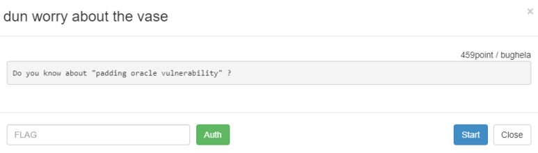
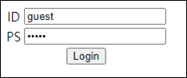
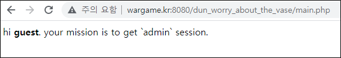
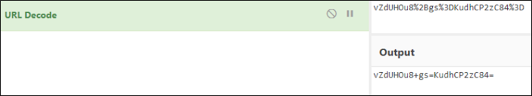

# [목차]
**1. [Description](#Description)**

**2. [Write-Up](#Write-Up)**

**3. [FLAG](#FLAG)**


***


# **Description**




# **Write-Up**

ID/PS가 guest/guest로 value로 박혀있고, Login하라고 나온다.



로그인 하면 main.php로 이동되고 admin session을 얻으라고 나온다.



정보가 없으니, 얻을 수 있는건 최대한 얻어보자. Cookie를 확인하면 L0g1n이라는 변수에 데이터가 들어있다.


URL decoding을 하면 Base64형식의 2개의 데이터가 붙어서 나온다.



자세하게 이유같은 걸 써가면서 풀이하려는데, 문제 서버자체가 약간 padding oracle attack에 억지로 껴맞춘 것이 있어서 이론내용과 부합함이 있어 설명하기가 까다롭다.

궁금한거 있으면 물어보시면 된다.

그냥 풀이 코드 올린다. 

```python
import urllib
import urllib.request
import base64

def get_cookie():
    url                 = 'http://wargame.kr:8080/dun_worry_about_the_vase/login_ok.php'
    headers             = {'User-Agent': 'Mozilla/5.0 (Windows NT 6.1; Win64; x64)', 'Content-Type': 'application/x-www-form-urlencoded'}
    data                = urllib.parse.urlencode({'id':'guest', 'ps':'guest'}).encode()
    request             = urllib.request.Request(url, headers = headers, data = data)
    response            = urllib.request.urlopen(request)
    cookie              = response.info().get_all('Set-Cookie')
    urldecoded_cookie   = urllib.parse.unquote(cookie[0][len('Log1n='):])
    return urldecoded_cookie


def pad(m):
    padding = chr(8 - len(m) % 8) * (8 - len(m) % 8)
    if type(m) is bytes: return m + padding.encode()
    else: return (m + padding).encode()

def hex_view(data):
    temp = data.hex()
    ret = ""
    for i in range(0, len(temp), 2): ret += temp[i:i+2] + " "
    return ret


########### solve
urldecoded_cookie   = get_cookie()
splited_index       = urldecoded_cookie.find('=') + len('=')
iv                  = base64.b64decode(urldecoded_cookie[:splited_index])
encrypted_id        = base64.b64decode(urldecoded_cookie[splited_index:])

intermediary        = [iv[i] ^ pad('guest')[i] for i in range(8)]
admin_iv            = bytes([intermediary[i] ^ pad('admin')[i] for i in range(8)])

admin_cookie        = base64.b64encode(admin_iv).decode() + base64.b64encode(encrypted_id).decode()

url                 = 'http://wargame.kr:8080/dun_worry_about_the_vase/main.php'
headers             = {'User-Agent': 'Mozilla/5.0 (Windows NT 6.1; Win64; x64)', 'Content-Type': 'application/x-www-form-urlencoded', 'Cookie':'L0g1n='+admin_cookie}
request             = urllib.request.Request(url, headers = headers)
response            = urllib.request.urlopen(request)
print(response.read().decode())

[Output]
wow!!! auth key is <b>d61d91b82a6edf2ab40556a46c526d14f83a5564</b>
```

왜 solve 로직이 나오는지

```python
import struct
################ OPA
urldecoded_cookie   = get_cookie()
url                 = 'http://wargame.kr:8080/dun_worry_about_the_vase/main.php'
splited_index       = urldecoded_cookie.find('=') + len('=')
iv                  = base64.b64decode(urldecoded_cookie[:splited_index]) # IV
encrypted_id        = base64.b64decode(urldecoded_cookie[splited_index:]) # encrypt(guest's id)
intermediary        = []

for i in range(1, len(iv) + 1):
    for j in range(0, 256):
        custom_iv   = iv[:-i] + struct.pack('<B', j) + bytes([inter^i for inter in intermediary][::-1])
        print(hex_view(custom_iv))

        new_cookie              = base64.b64encode(custom_iv).decode() + urldecoded_cookie[splited_index:]
        urlencoded_new_cookie   = urllib.parse.quote(new_cookie)
        headers                 = {'User-Agent': 'Mozilla/5.0 (Windows NT 6.1; Win64; x64)', 'Content-Type': 'application/x-www-form-urlencoded', 'Cookie':'L0g1n=' + urlencoded_new_cookie}
        request                 = urllib.request.Request(url, headers = headers)
        response                = urllib.request.urlopen(request).read().decode()
        if 'invalid user' in response:
            intermediary.append(j^i)
            print('[{}] {} -> {} ({})'.format(i, ' '.join([str(int) for int in intermediary[::-1]]), response, j))
            break
print(intermediary[::-1])
```


# **FLAG**

**d61d91b82a6edf2ab40556a46c526d14f83a5564**