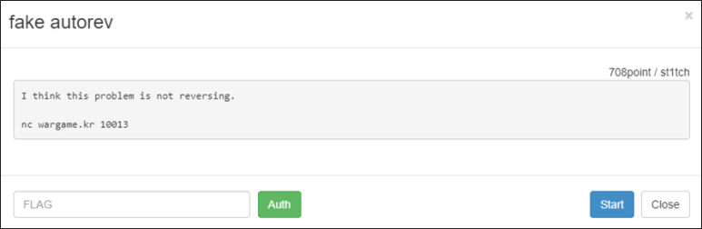
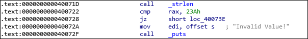
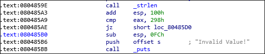
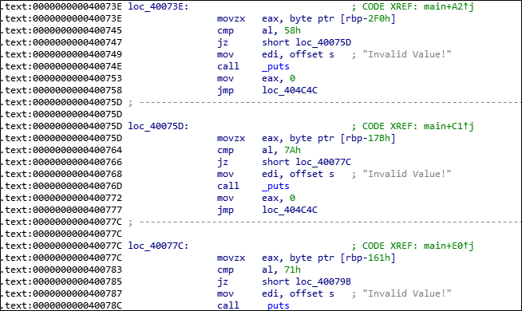
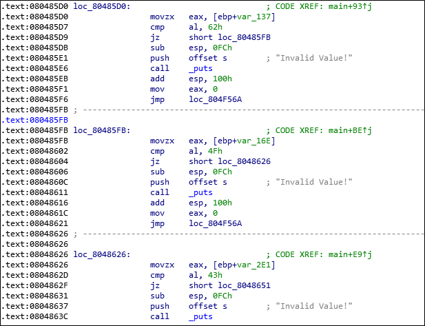
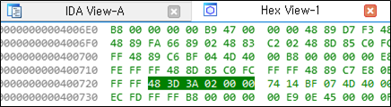
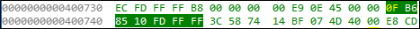
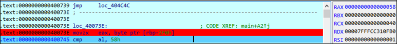

# [목차]
**1. [Description](#Description)**

**2. [Write-Up](#Write-Up)**

**3. [FLAG](#FLAG)**


***


# **Description**




# **Write-Up**

nc로 접속하면 바이너리 파일을 주고 답을 5초안에 달라고 한다.

```shell
Hello! This is simple reversing challenge.
I give you ELFbinary, then you give me Correct Key!
Match the correct key 50 times.
timeout = each stage 5sec
... 생략 ...
00000000487060000000000048700000000000001000000000000000000000000000000008000000000000000000000000000000fe00000008000000030000000000000058706000000000005870000000000000080000000000000000000000000000000100000000000000000000000000000003010000010000003000000000000000000000000000000058700000000000003500000000000000000000000000000001000000000000000100000000000000110000000300000000000000000000000000000000000000c9790000000000000c010000000000000000000000000000010000000000000000000000000000000100000002000000000000000000000000000000000000009070000000000000a8060000000000001e0000002f0000000800000000000000180000000000000009000000030000000000000000000000000000000000000038770000000000009102000000000000000000000000000001000000000000000000000000000000
Answer ->
```

데이터의 시그니처를 보면 ELF파일임을 알 수 있다.

```shell
7F 45 4C 46 01 01 01 00 00 00 00 00 00 00 00 00 .ELF............
```

ELF파일의 CPU 구조는 0x12 Offset에서 확인할 수 있다.

> [ELF](https://ko.wikipedia.org/wiki/ELF_%ED%8C%8C%EC%9D%BC_%ED%98%95%EC%8B%9D)

우선 ELF파일을 까보자, 바로보이는 건 데이터 길이를 확인한다. 아무래도, 매 라운드마다 값은 달라지는 것 같다.

(64bit)



(32bit)



로직을 살펴보자. 버퍼에서 특정 위치의 값을 비교하여 맞으면 똑같은 로직을 또 수행한다.

(64bit)



(32bit)



나의 풀이 공략은 이렇다.

1. 요구하는 문자열의 길이를 HEX 값으로 부터 추출하여 리스트로 생성

2. 버퍼크기를 구하여 HEX 값으로 부터 추출

3. 비교문 로직에서 버퍼위치를 HEX 값으로 부터 추출

4. 비교문 로직에서 요구하는 값을 HEX 값으로 부터 추출

5. 3 ~ 4번을 반복하며 1번에서 생성한 리스트에 넣기

먼저, 요구하는 문자열의 길이를 HEX 값으로 부터 구하자. 이 ELF기준으로는 0x23A(570)를 요구한다.

HEX View로 보면 48 3D 3A 02 00 00이라고 나와있다. 즉, HEX data에서 \x48\x3D를 찾고 그 뒤 4byte가 요구하는 문자열의 길이가 될 것이다. (little endian 주의 : 3A020000 -> 0000023A)



버퍼의 크기는 0x340(832)임을 알 수 있다.


HEX View로 보면 48 8D 85 C0 FC FF FF라고 나와있다. 즉, \x48\x8D\x85를 찾고 그 뒤 4byte가 버퍼의 크기가 될 것이다.(integer 부호 주의 : C0FCFFFF -> -832 -> 832)

> [Integer Encoder](https://cryptii.com/pipes/integer-encoder)

조건문에서 요구하는 버퍼위치는 rbp - 2F0이다. 이는 IDA가 계산한 값으로 HEX를 통해서 절대위치를 구해보자.


해당 위치를 HEX로 보면 0F B6 85 10 FD FF FF이다. \x0F\xB6은 OP code일테고, 0x85가 EAX일 것 같다. 그러면 버퍼의 크기(832) + 10 FD FF FF는(-752)하면 80이라는 값이 나온다.



그리고 해당 위치의 값과 0x58과 비교한다.


검증을 해보면 정확히 일치한다.

```python
test  = ['a' for i in range(570)]
test[80] = chr(0x58) # 832 - 752
print(''.join(test))

[Output]
aaaaaaaaaaaaaaaaaaaaaaaaaaaaaaaaaaaaaaaaaaaaaaaaaaaaaaaaaaaaaaaaaaaaaaaaaaaaaaaaXaaaaaaaaaaaaaaaaaaaaaaaaaaaaaaaaaaaaaaaaaaaaaaaaaaaaaaaaaaaaaaaaaaaaaaaaaaaaaaaaaaaaaaaaaaaaaaaaaaaaaaaaaaaaaaaaaaaaaaaaaaaaaaaaaaaaaaaaaaaaaaaaaaaaaaaaaaaaaaaaaaaaaaaaaaaaaaaaaaaaaaaaaaaaaaaaaaaaaaaaaaaaaaaaaaaaaaaaaaaaaaaaaaaaaaaaaaaaaaaaaaaaaaaaaaaaaaaaaaaaaaaaaaaaaaaaaaaaaaaaaaaaaaaaaaaaaaaaaaaaaaaaaaaaaaaaaaaaaaaaaaaaaaaaaaaaaaaaaaaaaaaaaaaaaaaaaaaaaaaaaaaaaaaaaaaaaaaaaaaaaaaaaaaaaaaaaaaaaaaaaaaaaaaaaaaaaaaaaaaaaaaaaaaaaaaaaaaaaaaaaaaaaaaaaaaaaaaaaaaaaaaaaaaaaaaaaaaaaaaaaaaaaaaaa
```



또한 항상 저 규칙이 아니다. 예를 들어 \x0F\xB6\x85 뒤 4byte가 꼭 버퍼위치가 아니라 \x0F\xB6\x45 뒤 1byte가 버퍼위치일 때도 있다.

64bit기준 KEY값을 구하는 코드이다.

```python
print('Round : {} / Architecture : 64 BIT'.format(i+1))
offset_compare_len  = binary_data.find(b'\x48\x3D') + 2
require_len         = int.from_bytes(binary_data[offset_compare_len:offset_compare_len+2], byteorder='little')
key = ['a' for i in range(require_len)]

offset_master   = binary_data.find(b'\x48\x8D\x85') + 3
master_len      = abs(struct.unpack('<i', binary_data[offset_master:offset_master+4])[0])

end_index = [m.end(0) for m in re.finditer(b'\x0F\xB6\x85', binary_data)]
for e in end_index:
    loc_len  = struct.unpack('<i', binary_data[e:e+4])[0]
    key[master_len+loc_len] = chr(binary_data[e + 5])

end_index = [m.end(0) for m in re.finditer(b'\x0F\xB6\x45', binary_data)]
for e in end_index:
    temp_data   = (binary_data[e]).to_bytes(1, byteorder="little")+b'\xff\xff\xff'
    loc_len  = struct.unpack('<i', temp_data)[0]
    key[master_len+loc_len] = chr(binary_data[e + 2])
```

32bit기준 KEY값을 구하는 코드이다. (기준이되는 byte값의 변수가 64bit보다 변동이 심하다. 하지만, KEY값을 구하는 방식은 똑같다.)

```python
offset_compare_len  = binary_data.find(b'\x00\x3D') + 2
if offset_compare_len == 1:
    offset_temp = [m.end(0) for m in re.finditer(b'\xFE\xFF\xFF\x83\xC4', binary_data)][1]
    require_len = int.from_bytes(binary_data[offset_temp + 2:offset_temp + 2 + 3], byteorder='little')
else:
    require_len = int.from_bytes(binary_data[offset_compare_len:offset_compare_len+2], byteorder='little')
key = ['a' for i in range(require_len)]

offset_master   = binary_data.find(b'\x8D\x85') + 2
master_len      = abs(struct.unpack('<i', binary_data[offset_master:offset_master+4])[0])
if binary_data[offset_master+5] != 80:
    offset_master   = binary_data.find(b'\x8D\x85', offset_master) + 2
    master_len      = abs(struct.unpack('<i', binary_data[offset_master:offset_master+4])[0])

end_index = [m.end(0) for m in re.finditer(b'\x0F\xB6\x85', binary_data)]
for e in end_index:
    loc_len  = struct.unpack('<i', binary_data[e:e+4])[0]
    key[master_len+loc_len] = chr(binary_data[e + 5])

end_index = [m.end(0) for m in re.finditer(b'\x0F\xB6\x45', binary_data)]
for e in end_index:
    temp_data   = (binary_data[e]).to_bytes(1, byteorder="little")+b'\xff\xff\xff'
    loc_len  = struct.unpack('<i', temp_data)[0]
    key[master_len+loc_len] = chr(binary_data[e + 2])
```

pwntools를 이용하여 wargame 서버와 접속하여 FLAG를 획득하자.

```python
from pwn import*
import struct
import re

r   = remote('wargame.kr', 10013)
for i in range(50):
    r.recvuntil('th...\n')
    data        = r.recvuntil('\n').decode().strip().upper()
    binary_data = binascii.a2b_hex(data)

    offset_architecture = binary_data[0x12]
    if offset_architecture == 0x03:
        print('Round : {} / Architecture : 32 BIT'.format(i+1))
        offset_compare_len  = binary_data.find(b'\x00\x3D') + 2
        if offset_compare_len == 1:
            offset_temp = [m.end(0) for m in re.finditer(b'\xFE\xFF\xFF\x83\xC4', binary_data)][1]
            require_len = int.from_bytes(binary_data[offset_temp + 2:offset_temp + 2 + 3], byteorder='little')
        else:
            require_len = int.from_bytes(binary_data[offset_compare_len:offset_compare_len+2], byteorder='little')
        key = ['a' for i in range(require_len)]

        offset_master   = binary_data.find(b'\x8D\x85') + 2
        master_len      = abs(struct.unpack('<i', binary_data[offset_master:offset_master+4])[0])
        if binary_data[offset_master+5] != 80:
            offset_master   = binary_data.find(b'\x8D\x85', offset_master) + 2
            master_len      = abs(struct.unpack('<i', binary_data[offset_master:offset_master+4])[0])

        end_index = [m.end(0) for m in re.finditer(b'\x0F\xB6\x85', binary_data)]
        for e in end_index:
            loc_len  = struct.unpack('<i', binary_data[e:e+4])[0]
            key[master_len+loc_len] = chr(binary_data[e + 5])

        end_index = [m.end(0) for m in re.finditer(b'\x0F\xB6\x45', binary_data)]
        for e in end_index:
            temp_data   = (binary_data[e]).to_bytes(1, byteorder="little")+b'\xff\xff\xff'
            loc_len  = struct.unpack('<i', temp_data)[0]
            key[master_len+loc_len] = chr(binary_data[e + 2])

    elif offset_architecture == 0x3E:
        print('Round : {} / Architecture : 64 BIT'.format(i+1))
        offset_compare_len  = binary_data.find(b'\x48\x3D') + 2
        require_len         = int.from_bytes(binary_data[offset_compare_len:offset_compare_len+2], byteorder='little')
        key = ['a' for i in range(require_len)]

        offset_master   = binary_data.find(b'\x48\x8D\x85') + 3
        master_len      = abs(struct.unpack('<i', binary_data[offset_master:offset_master+4])[0])

        end_index = [m.end(0) for m in re.finditer(b'\x0F\xB6\x85', binary_data)]
        for e in end_index:
            loc_len  = struct.unpack('<i', binary_data[e:e+4])[0]
            key[master_len+loc_len] = chr(binary_data[e + 5])

        end_index = [m.end(0) for m in re.finditer(b'\x0F\xB6\x45', binary_data)]
        for e in end_index:
            temp_data   = (binary_data[e]).to_bytes(1, byteorder="little")+b'\xff\xff\xff'
            loc_len  = struct.unpack('<i', temp_data)[0]
            key[master_len+loc_len] = chr(binary_data[e + 2])

    r.recvuntil('Answer -> ')
    r.sendline(''.join(key))
print(r.recv(1024).decode().strip())

[Output]
... 생략 ...
Round : 48 / Architecture : 32 BIT
Round : 49 / Architecture : 32 BIT
Round : 50 / Architecture : 32 BIT
Flag is wmkr{!@##@!ThIs_iS_Not_AUTO_ReV_PrObLeM@##@!}
```

strings를 이용하여 바이너리 뽑으면 c 코드 파일이름이 나오는데 그 해쉬값으로 키로 보내도 보고, angr라이브러리 사용도 해보려고 하고, 별ㅈㄹ다 해보고나서 KEY를 구하는게 답이였나 하고 ㅈㄴ 노가다 했음


# **FLAG**

**wmkr{!@##@!ThIs_iS_Not_AUTO_ReV_PrObLeM@##@!}**