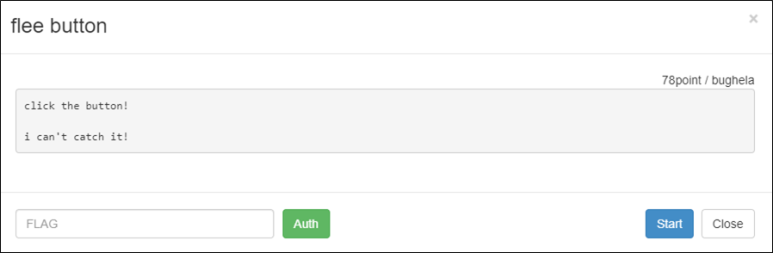
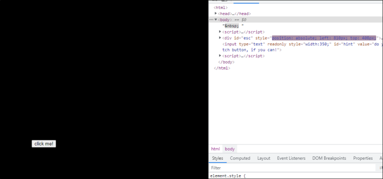

# [목차]
**1. [Description](#Description)**

**2. [Write-Up](#Write-Up)**

**3. [FLAG](#FLAG)**

***

# **Description**

# **Write-Up**

click me! 버튼을 클릭해야 하는 문제인 것 같다.

하지만 마우스 포인터를 이동하면 position이 변경되면서 클릭할 수 없게 한다.

div안에 input태그를 살펴보면 클릭 시 GET method로 key변수에 c29b를 전달한다.

다음과 같이 url를 넣어 직접참조를 해보면 FLAG를 획득 할 수 있다.

# **FLAG**

**f1d9d4f8988afd3a935847d41b65a7381fa53527**