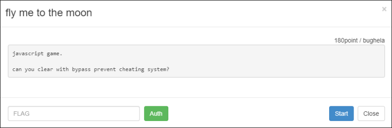
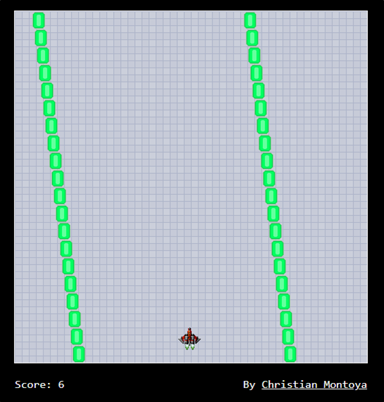
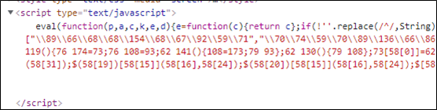
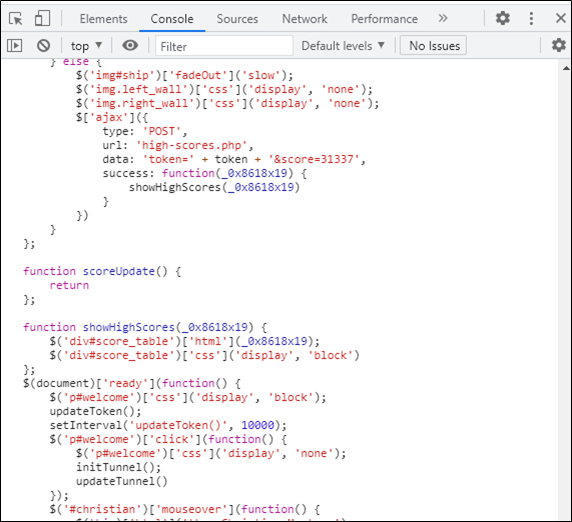
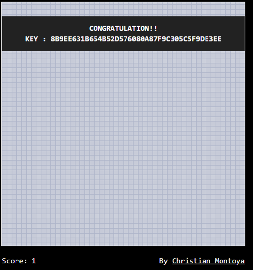

# [목차]
**1. [Description](#Description)**

**2. [Write-Up](#Write-Up)**

**3. [FLAG](#FLAG)**


***


# **Description**



# **Write-Up**

비행기 모양의 이미지가 초록색 네모 모양의 이미지(이하 벽)에 닿지 않게 쭉 진행하는 게임이다.



몇 점 얻지 않고 벽에 부딪히면 다음과 같이 31337점을 얻으라고 한다.


javascript game이라 하니 javascript를 보면 난독화가 되어 있다.



알아보기 쉽게 바꿔보면 다음과 같다.

> [JS 자동 정렬](https://beautifier.io/)

```javascript
function secureGame() {
    var _0x8618x2 = this;
    var _0x8618x3 = true;

    function _0x8618x4() {
        _0x8618x3 = false;
        return true
    };

    function _0x8618x5() {
        return _0x8618x3
    };
    this['killPlayer'] = function() {
        _0x8618x4();
        return true
    };
    this['checkLife'] = function() {
        return _0x8618x5()
    };
    var _0x8618x6 = 0;

    function _0x8618x7() {
        return _0x8618x6
    };

    function _0x8618x8() {
        if (_0x8618x3) {
            _0x8618x6++
        };
        return true
    };
    this['getScore'] = function() {
        return _0x8618x7()
    };
    this['BincScore'] = function() {
        _0x8618x8();
        return true
    };
    var _0x8618x9 = 320;

    function _0x8618xa() {
        _0x8618x9 -= 20;
        return true
    };

    function _0x8618xb() {
        return _0x8618x9
    };
    this['shrinkTunnel'] = function() {
        _0x8618xa();
        return true
    };
    this['widthTunnel'] = function() {
        return _0x8618xb()
    }
};
... 생략 ...
function updateTunnel() {
    bg_val = bg_val + 2;
    if (bg_val > 20) {
        bg_val = 0
    };
    $('div#tunnel')['css']('background-position', '50% ' + bg_val + 'px');
    if (ship_x + 32 < 500) {
        if (ship_x + 46 < pos_x) {
            ship_x += 4
        } else {
            if (ship_x + 16 < pos_x) {
                ship_x += 2
            }
        }
    };
    if (ship_x > 0) {
        if (ship_x - 14 > pos_x) {
            ship_x -= 4
        } else {
            if (ship_x + 16 > pos_x) {
                ship_x -= 2
            }
        }
    };
    $('img#ship')['css']('left', ship_x + 'px');
    c_r++;
    if (c_r > 60) {
        c_r = 0;
        t_state = Math['floor'](Math['random']() * 2)
    };
    if (left_wall[0] < 10) {
        t_state = 1
    } else {
        if (right_wall[0] > 470) {
            t_state = 0
        }
    };
    y = 0;
    for (y = 20; y > 0; y--) {
        left_wall[y] = left_wall[y - 1];
        right_wall[y] = right_wall[y - 1]
    };
    if (t_state == 0) {
        left_wall[0] -= 3
    };
    if (t_state == 1) {
        left_wall[0] += 3
    };
    right_wall[0] = left_wall[0] + BTunnelGame['widthTunnel']();
    $('img.left_wall')['each'](function(_0x8618x16) {
        $(this)['css']('left', '' + left_wall[_0x8618x16] + 'px')
    });
    $('img.right_wall')['each'](function(_0x8618x16) {
        $(this)['css']('left', '' + right_wall[_0x8618x16] + 'px')
    });
    if (BTunnelGame['widthTunnel']() >= 120) {
        c_w++;
        if (c_w > 100) {
            c_w = 0;
            BTunnelGame['shrinkTunnel']();
            left_wall[0] += 10
        }
    };
    c_s++;
    if (c_s > 20) {
        c_s = 0;
        BTunnelGame.BincScore();
        $('span#score')['text']('' + BTunnelGame['getScore']())
    };
    if (ship_x <= left_wall[18] + 20 || ship_x + 32 >= right_wall[18]) {
        BTunnelGame['killPlayer']()
    };
    if (BTunnelGame['checkLife']()) {
        setTimeout('updateTunnel()', 10)
    } else {
        $('img#ship')['fadeOut']('slow');
        $('img.left_wall')['css']('display', 'none');
        $('img.right_wall')['css']('display', 'none');
        $['ajax']({
            type: 'POST',
            url: 'high-scores.php',
            data: 'token=' + token + '&score=' + BTunnelGame['getScore'](),
            success: function(_0x8618x19) {
                showHighScores(_0x8618x19)
            }
        })
    }
};
... 생략 ...
```

high-scores.php로 BTunnelGame['getScore']함수의 리턴값을 보낸다.

```javascript
type: 'POST',
url: 'high-scores.php',
data: 'token=' + token + '&score=' + BTunnelGame['getScore'](),
```

즉, data의 score부분을 문자열로 바꿔주어 게임을 재시작하면 FLAG를 얻을 수 있을 것같다.

```javascript
... 생략 ...
data: 'token=' + token + '&score=31337',
... 생략 ...
```

Chrome의 개발자 도구를 이용하여 Console탭에서 변경한 전체 스크립트를 입력하고, 엔터를 입력하여 실행시킨다.



CLICK TO START를 눌른 후 게임 오버를 당하게 되면 FLAG를 획득할 수 있다.




# **FLAG**

**8b9ee631b654b52d576080a87f9c305c5f9de3ee**