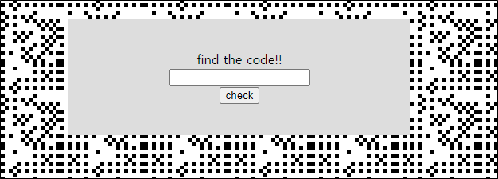

# [목차]
**1. [Description](#Description)**

**2. [Write-Up](#Write-Up)**

**3. [FLAG](#FLAG)**

***

# **Description**

# **Write-Up**

code라는 것을 찾으라고 한다.

문제에서 이미지를 복구하라고한다. 이미지를 다운 받아본다.

HxD로 열어보고 처음 바이트 보고, 본능적으로 맨 끝 바이트로 가보았다.

Japng라는 키워드가 핵심인것 같다. (웬만하면 다른 사람의 라업은 보지 않겠다는 자존심)

japng를 검색하자.

Java apng라고 한다. 가장 최신버전의 editor를 다운받아본다.

* APNG(Animated Portable Network Graphics)는 PNG를 확장한 이미지 파일 포맷으로 GIF와 비슷한 방법으로 애니메이션을 구현하면서 기존 PNG 파일과의 하위 호환성을 유지했기 때문에 GIF보다 더 높은 품질을 보여 준다.

압축을 해제하면 jpng-editor.jar파일이 나오는데 java -jar japng-editor.jar를 입력하여 실행시켜본다.

사이트에서 다운받은 이미지를 drag&drop으로 끌어넣거나 Load frames or animation...버튼을 클릭하여 이미지를 넣으면 다음과 같이 2개의 이미지가 나온다.

다음과 같이 설정을 변경하고, Apply to all를 클릭하면 우측 하단에 0_pattern.png와 1_pattern.png가 빠르게 서로 전환되면서 잔상이 남아 QR code가 보이는 것을 확인할 수 있다.

두개의 이미지를 우클릭을 통해 추출해본다.

두개의 이미지를 겹쳐서 QR code로 만든다.

> [이미지 겹치기](https://www.imgonline.com.ua/eng/impose-picture-on-another-picture.php)

processed image를 다운로드하면 다음과 같이 50%의 투명도가 적용된 QR code가 나온다.

QR code decoder를 사용하여 메세지를 뽑아낸다.(WHAT!@#$?)

> [QR Decoder](https://zxing.org/w/decode.jspx)

code로 가정하고 입력한며, FLAG를 획득할 수 있다.

# **FLAG**

**37f77478acabccd748b060fac27215404a1fc878**