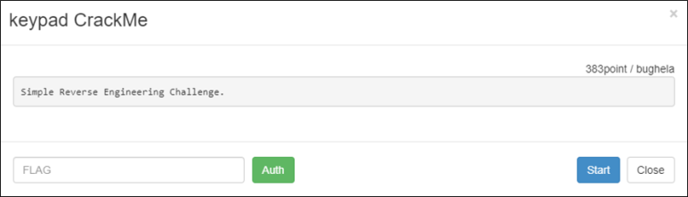
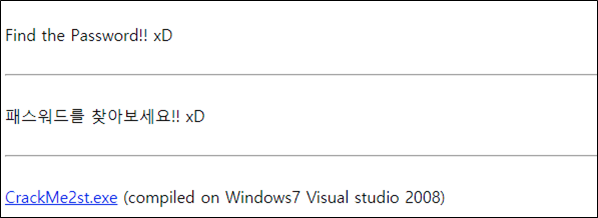
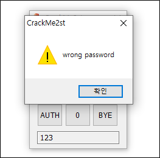
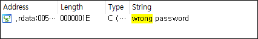
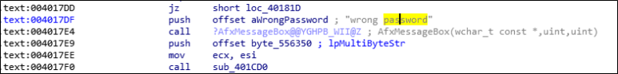
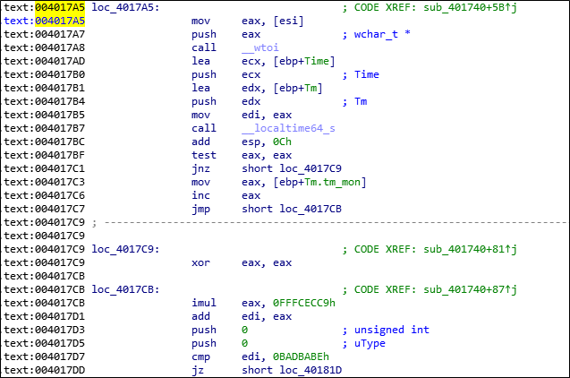
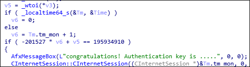
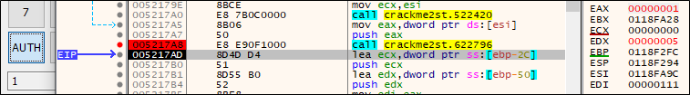
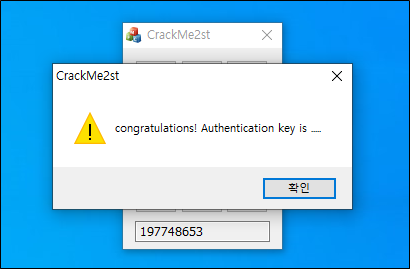
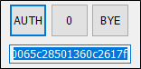

# [목차]
**1. [Description](#Description)**

**2. [Write-Up](#Write-Up)**

**3. [FLAG](#FLAG)**

***

# **Description**

# **Write-Up**

패스워드를 찾기위한 PE파일을 다운받는다.

프로그램의 흐름 및 힌트 문자열을 확인하기 위해 아무거나 입력 후 AUTH 버튼을 누른다.

wargame.kr의 EASY_CrackMe와 마찬가지로 틀렸다는 문자열을 찾는다.

해당 함수를 볼 수 있다.

그 위를 보면 바로 조건 식을 알 수 있다.

파악하기 쉽게 Pesudocode로 확인해보면 v3을 int형으로 변환한 값이 v5에 저장되고, v6는 tm_mon에 1을 더한 값이 들어간다.

그리고 -201527 * v6 + v5가 0xBADBABE가 되면 FLAG를 얻을 수 있다.

_locatime64_s를 통해 얻은 값에서 tm_mon은 1월이 0부터 시작하기 때문에 현재 글 작성일 기준 9월이기 때문에 8이되고, 여기에 1을 더해 v6는 9가 된다. 즉, 현재 월이다.

> [_locatime64_s](https://docs.microsoft.com/ko-kr/cpp/c-runtime-library/reference/localtime-s-localtime32-s-localtime64-s?view=msvc-160)

v5는 디버깅을하면 내가 입력한 값을 int형으로 바꾼 값이라는 것을 알 수 있다.

즉, 우리가 입력해야 하는 값은 195934910 + (201527 * "현재 월")이 된다. 글 작성일 기준 197748653이기 때문에 이 값을 입력하면 congratulations ~이라는 메세지가 팝업된다.

확인을 누르고 텍스트 박스창을 클릭하면 FLAG를 복사할 수 있다.

# **FLAG**

**8f4c5b6468967ef4462f50065c28501360c2617f**