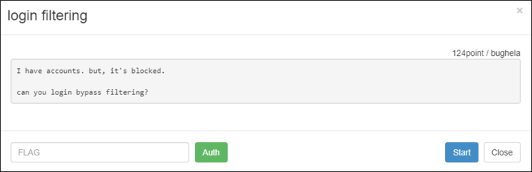
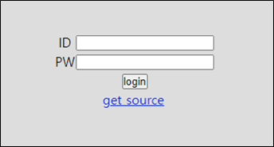
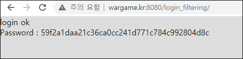

# [목차]
**1. [Description](#Description)**

**2. [Write-Up](#Write-Up)**

**3. [FLAG](#FLAG)**


***


# **Description**



# **Write-Up**

login하라고 나온다.



get source를 클릭하면 다음과 같이 로직을 확인할 수 있다. id가 guest이거나 blueh4g이면 block된다고 나온다.

```php
if(isset($_POST['id']) && isset($_POST['ps'])){
  include("../lib.php"); # include for auth_code function.

  mysql_connect("localhost","login_filtering","login_filtering_pz");
  mysql_select_db ("login_filtering");
  mysql_query("set names utf8");

  $key = auth_code("login filtering");

  $id = mysql_real_escape_string(trim($_POST['id']));
  $ps = mysql_real_escape_string(trim($_POST['ps']));

  $row=mysql_fetch_array(mysql_query("select * from user where id='$id' and ps=md5('$ps')"));

  if(isset($row['id'])){
   if($id=='guest' || $id=='blueh4g'){
    echo "your account is blocked";
   }else{
    echo "login ok"."<br />";
    echo "Password : ".$key;
   }
  }else{
   echo "wrong..";
  }
 }
```

맨 밑에는 block된 계정들을 확인할 수 있다.

```html
<!--

you have blocked accounts.

guest / guest
blueh4g / blueh4g1234ps

-->
```

MySQL에서는 문자열에 대한 대/소문자 구분이 없다. 따라서 guest 혹은 blueh4g중에 대문자 하나라도 섞여있으면 우회할 수 있으면 FLAG를 획득할 수 있다.

> [Online MySQL](https://paiza.io/en/projects/new?language=mysql)



# **FLAG**

**59f2a1daa21c36ca0cc241d771c784c992804d8c**