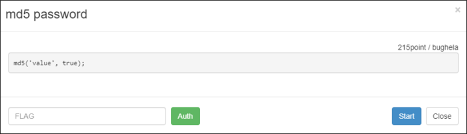
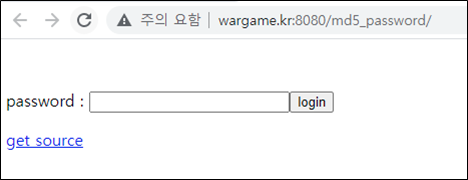
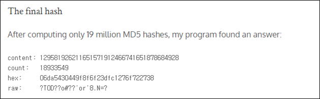
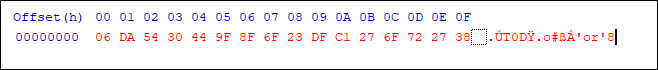
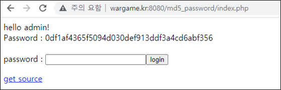

# [목차]
**1. [Description](#Description)**

**2. [Write-Up](#Write-Up)**

**3. [FLAG](#FLAG)**


***


# **Description**



# **Write-Up**

password를 입력하라고 나온다.



소스를 보면 md5 해쉬함수에 2번째 인자로 true주었다.

```php
<?php
 if (isset($_GET['view-source'])) {
  show_source(__FILE__);
  exit();
 }

 if(isset($_POST['ps'])){
  sleep(1);
  mysql_connect("localhost","md5_password","md5_password_pz");
  mysql_select_db("md5_password");
  mysql_query("set names utf8");
  /*
  
  create table admin_password(
   password char(64) unique
  );
  
  */

  include "../lib.php"; // include for auth_code function.
  $key=auth_code("md5 password");
  $ps = mysql_real_escape_string($_POST['ps']);
  $row=@mysql_fetch_array(mysql_query("select * from admin_password where password='".md5($ps,true)."'"));
  if(isset($row[0])){
   echo "hello admin!"."<br />";
   echo "Password : ".$key;
  }else{
   echo "wrong..";
  }
 }
?>
<style>
 input[type=text] {width:200px;}
</style>
<br />
<br />
<form method="post" action="./index.php">
password : <input type="text" name="ps" /><input type="submit" value="login" />
</form>
<div><a href='?view-source'>get source</a></div>
```

true를 주면 hex string값이 binary로 취급하여 반환된다는 점이 있다.

> [PHP MD5](https://www.php.net/manual/en/function.md5.php)

너무 막막하기 때문에 검색을 통해 한 블로그로에서 외국에서 2010년에 열린 CTF대회(Leet More CTF 2010)에서 매우 유사한 문제를 풀었던 링크를 제공하였다.

> [SQLi with raw MD5](https://cvk.posthaven.com/sql-injection-with-raw-md5-hashes)

그는 직접 프로그램을 돌려 " ' or ' "이 나오는 값을 찾아 냈다.



129581926211651571912466741651878684928의 MD5 해쉬 값은 06da5430449f8f6f23dfc1276f722738이고, 이를 binary 취급하면 ' or '8이라는 값이 들어 있어 SQLi를 성공시킬 수 있다.



즉, 129581926211651571912466741651878684928을 넣으면 FLAG를 획득할 수 있다.



# **FLAG**

**0df1af4365f5094d030def913ddf3a4cd6abf356**