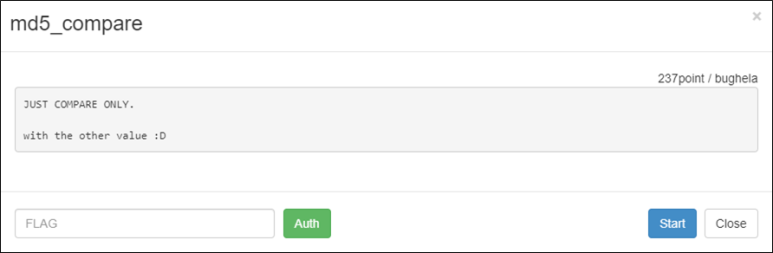
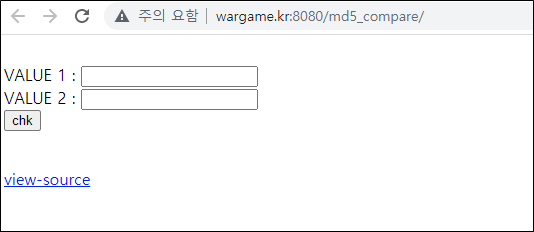
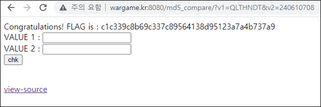

# [목차]
**1. [Description](#Description)**

**2. [Write-Up](#Write-Up)**

**3. [FLAG](#FLAG)**


***


# **Description**



# **Write-Up**

VALUE 1과 VALUE 2를 입력하고 chk버튼을 누르는 것 같다.



view-source를 보면 chk가 true가 되어야 함을 알 수 있다.

```php
<?php
    if (isset($_GET['view-source'])) {
         show_source(__FILE__);
         exit();
    }

    if (isset($_GET['v1']) && isset($_GET['v2'])) {
        sleep(3); // anti brute force

        $chk = true;
        $v1 = $_GET['v1'];
        $v2 = $_GET['v2'];

        if (!ctype_alpha($v1)) {$chk = false;}
        if (!is_numeric($v2) ) {$chk = false;}
        if (md5($v1) != md5($v2)) {$chk = false;}

        if ($chk){
            include("../lib.php");
            echo "Congratulations! FLAG is : ".auth_code("md5_compare");
        } else {
            echo "Wrong...";
        }
    }
?>
<br />
<form method="GET">
    VALUE 1 : <input type="text" name="v1" /><br />
    VALUE 2 : <input type="text" name="v2" /><br />
    <input type="submit" value="chk" />
</form>
<br />
<a href="?view-source">view-source</a>
```

첫번째 chk 조건문은 v1은 모두 문자([A-Za-z])여야 한다.

> [PHP ctype_alpha](https://www.php.net/manual/en/function.ctype-alpha.php)

두번째 chk 조건문은 v2는 숫자여야 한다.

> [PHP is_numeric](https://www.php.net/manual/en/function.is-numeric.php)

세번째 chk 조건문은 v1의 MD5 해쉬 값과 v2의 MD5 해쉬 값이 같아야 한다.

즉, MD5 Magic Hash 문제이다.

> [PHP md5](https://github.com/spaze/hashes/blob/master/md5.md)

v1에 QLTHNDT를 입력하고 v2에 240610708를 입력한 후 chk버튼을 클릭하면 FLAG를 획득할 수 있다.



# **FLAG**

**c1c339c8b69c337c89564138d95123a7a4b737a9**